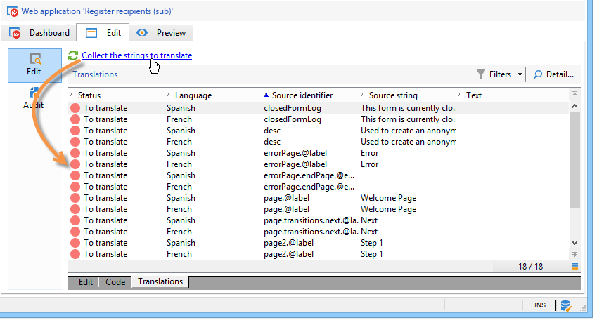

# 翻譯網路表單{#translating-a-web-form}


您可以將網頁應用程式當地化為數種語言。

您可以直接在Adobe Campaign主控台中執行翻譯（請參閱[在編輯器中管理翻譯](#managing-translations-in-the-editor)），或匯出和匯入字串以將翻譯外部化（請參閱[將翻譯外部化](#externalizing-translation)）。

預設可用的翻譯語言清單在[變更表單顯示語言](#changing-forms-display-language)中有詳細說明。

網頁應用程式是以編輯語言設計：這是用來輸入標籤和其他要翻譯內容的參考語言。

如果未將語言設定新增至其存取URL，預設語言為Web應用程式顯示的語言。

>[!NOTE]
>
>依預設，編輯語言和預設語言與主控台語言相同。

## 選擇語言 {#choosing-languages}

若要定義一或多個翻譯語言，請按一下Web應用程式的&#x200B;**[!UICONTROL Properties]**&#x200B;按鈕，然後按一下&#x200B;**[!UICONTROL Localization]**&#x200B;標籤。 按一下&#x200B;**[!UICONTROL Add]**&#x200B;按鈕，為Web應用程式定義新的翻譯語言。

>[!NOTE]
>
>此視窗也可讓您變更預設語言和編輯語言。


當您新增網頁應用程式的翻譯語言時（或預設語言與編輯語言不同時），**[!UICONTROL Edit]**&#x200B;標籤中會新增&#x200B;**[!UICONTROL Translation]**&#x200B;子標籤以管理翻譯。

Adobe Campaign包含翻譯及管理多語言翻譯的工具。 此編輯器可讓您檢視要翻譯或核准的字串、直接在介面中輸入翻譯，或匯入/匯出字元字串以將翻譯外部化。

## 在編輯器中管理翻譯 {#managing-translations-in-the-editor}

### 收集字串 {#collecting-strings}

**[!UICONTROL Translations]**&#x200B;索引標籤可讓您為構成Web應用程式的字元字串輸入翻譯。

第一次開啟此索引標籤時，不會包含任何資料。 按一下&#x200B;**[!UICONTROL Collect the strings to translate]**&#x200B;連結以更新網頁應用程式中的字串。

Adobe Campaign會收集在所有靜態元素的&#x200B;**[!UICONTROL Texts]**&#x200B;索引標籤中定義的欄位和字串標籤：HTML區塊、Javascript等。 靜態元素在網頁表單](static-elements-in-a-web-form.md)中的[靜態元素中有詳細的說明。



>[!CAUTION]
>
>視要處理的資料量而定，此程式可能需要幾分鐘的時間。
> 
>如果警告顯示系統字典中缺少某些翻譯，請參考[翻譯系統字串](#translating-the-system-strings)。

每次翻譯字串時，其翻譯都會新增至翻譯字典。

當收集程式偵測到轉譯已經存在時，此轉譯會顯示在字串的&#x200B;**[!UICONTROL Text]**&#x200B;欄中。 字串的狀態已變成&#x200B;**[!UICONTROL Translated]**。

對於從未翻譯過的字元字串，**[!UICONTROL Text]**&#x200B;欄位是空的，狀態為&#x200B;**[!UICONTROL To translate]**。

### 篩選字串 {#filtering-strings}

依預設，會顯示Web應用程式的每種翻譯語言。 預設篩選器有兩種：語言和狀態。 按一下&#x200B;**[!UICONTROL Filters]**&#x200B;按鈕，然後按一下&#x200B;**[!UICONTROL By language or status]**&#x200B;以顯示相符的下拉式方塊。 您也可以建立進階篩選。 如需詳細資訊，請參閱[此頁面](../../platform/using/creating-filters.md#creating-an-advanced-filter)。


移至&#x200B;**[!UICONTROL Language]**&#x200B;下拉式方塊以選取翻譯語言。

若要只顯示未翻譯的字串，請在&#x200B;**[!UICONTROL Status]**&#x200B;下拉式方塊中選取&#x200B;**[!UICONTROL To translate]**。 您也可以只顯示翻譯或核准的字串。

### 轉譯字串 {#translating-strings}

1. 若要翻譯單字，請在字串清單上連按兩下其行。

   

   來源字串會顯示在視窗的上半部分。

1. 在下半部輸入其翻譯。 若要核准，請核取&#x200B;**[!UICONTROL Translation approved]**&#x200B;選項。

   >[!NOTE]
   >
   >翻譯核准為選用，不會阻礙此程式。

   未核准的翻譯會顯示為&#x200B;**[!UICONTROL Translated]**。 核准的翻譯會顯示為&#x200B;**[!UICONTROL Approved]**。

## 外部化翻譯 {#externalizing-translation}

您可以使用Adobe Campaign以外的工具匯出和匯入字元字串以翻譯字元。

>[!CAUTION]
>
>匯出字串後，請勿使用整合工具執行任何翻譯。 當您重新匯入翻譯時，這會導致衝突，而且這些翻譯將會遺失。

### 匯出檔案 {#exporting-files}

1. 選取您要匯出其字串的Web應用程式，按一下滑鼠右鍵，然後選取&#x200B;**[!UICONTROL Actions > Export strings for translation...]**

   

1. 選取&#x200B;**[!UICONTROL Export strategy]** ：

   * **[!UICONTROL One file per language]**：匯出將會針對每種翻譯語言產生一個檔案。 每個檔案對於所有選取的Web應用程式都是通用的。
   * **[!UICONTROL One file per Web application]**：匯出將會為每個選取的Web應用程式產生一個檔案。 每個檔案都會包含所有翻譯語言。

     >[!NOTE]
     >
     >此型別的匯出不適用於XLIFF匯出。

   * **[!UICONTROL One file per language and per Web application]**：匯出將會產生數個檔案。 每個檔案將包含每個網頁應用程式的一種翻譯語言。
   * **[!UICONTROL One file for all]**：匯出將會為所有Web應用程式產生單一多語言檔案。 它會包含所有選取之網頁應用程式的所有翻譯語言。

     >[!NOTE]
     >
     >此型別的匯出不適用於XLIFF匯出。

1. 然後選擇要記錄檔案的&#x200B;**[!UICONTROL Target folder]**。
1. 選取檔案格式（ **[!UICONTROL CSV]**&#x200B;或&#x200B;**[!UICONTROL XLIFF]** ）並按一下&#x200B;**[!UICONTROL Start]**。


>[!NOTE]
>
>匯出檔案的名稱會自動產生。 如果多次執行相同的匯出，則會以新的檔案取代現有的檔案。 如果您需要保留先前的檔案，請變更&#x200B;**[!UICONTROL Target folder]**，然後再次按一下「**[!UICONTROL Start]**」以執行匯出。

當您匯出&#x200B;**CSV格式**&#x200B;的檔案時，每種語言都會連結到狀態和核准狀態。 **核准？**&#x200B;欄可讓您核准翻譯。 此資料行可能包含值&#x200B;**是**&#x200B;或&#x200B;**否**。 至於整合編輯器（請參閱[在編輯器中管理翻譯](#managing-translations-in-the-editor)），核准翻譯為選擇性作業，不會阻礙程式。

### 正在匯入檔案 {#importing-files}

外部翻譯完成後，您可以匯入已翻譯檔案。

1. 移至Web應用程式清單，按一下滑鼠右鍵，然後選取&#x200B;**[!UICONTROL Actions > Import translated strings...]**

   >[!NOTE]
   >
   >不需要選取翻譯所關心的網頁應用程式。 將游標置於Web應用程式清單上的任何位置。

   

1. 選取要匯入的檔案，然後按一下&#x200B;**[!UICONTROL Upload]**。

   

>[!NOTE]
>
>外部翻譯總是比內部翻譯優先。 如果發生衝突，內部翻譯將由外部翻譯覆寫。

## 變更表單顯示語言 {#changing-forms-display-language}

Web表單會以Web應用程式屬性之&#x200B;**[!UICONTROL Localization]**&#x200B;索引標籤中指定的預設語言顯示。 若要變更語言，您必須在URL的結尾加上下列字元（其中&#x200B;**xx**&#x200B;是該語言的符號）：

```
?lang=xx
```

語言是URL的第一個或唯一引數。 例如： **https://myserver/webApp/APP34**

```
&lang=xx
```

如果URL中的語言之前有其他引數。 例如： **https://myserver/webApp/APP34?status=1&amp;lang=en**

以下列出預設可用的翻譯語言和字典。

**預設系統字典**：某些語言包含預設字典，其中包含系統字串的翻譯。 如需詳細資訊，請參閱[轉譯系統字串](#translating-the-system-strings)。

**行事曆管理**： Web應用程式的頁面可以包含用於輸入日期的行事曆。 依預設，此行事曆提供數種語言版本（日翻譯、日期格式）。

<table> 
 <tbody> 
  <tr> 
   <td> <strong>語言（符號）</strong><br /> </td> 
   <td> <strong>預設系統字典</strong><br /> </td> 
   <td> <strong>行事曆管理</strong><br /> </td> 
  </tr> 
  <tr> 
   <td> 德文(de)<br /> </td> 
   <td> 是<br /> </td> 
   <td> 是<br /> </td> 
  </tr> 
  <tr> 
   <td> 英文(en)<br /> </td> 
   <td> 是<br /> </td> 
   <td> 是<br /> </td> 
  </tr> 
  <tr> 
   <td> 英文（美國） (en_US)<br /> </td> 
   <td> </td> 
   <td> </td> 
  </tr> 
  <tr> 
   <td> 英文（英國） (en_GB)<br /> </td> 
   <td> </td> 
   <td> </td> 
  </tr> 
  <tr> 
   <td> 阿拉伯文(ar)<br /> </td> 
   <td> </td> 
   <td> </td> 
  </tr> 
  <tr> 
   <td> 中文(zh)<br /> </td> 
   <td> </td> 
   <td> </td> 
  </tr> 
  <tr> 
   <td> 韓文(ko)<br /> </td> 
   <td> </td> 
   <td> </td> 
  </tr> 
  <tr> 
   <td> 丹麥文(da)<br /> </td> 
   <td> 是<br /> </td> 
   <td> 是<br /> </td> 
  </tr> 
  <tr> 
   <td> 西班牙文(es)<br /> </td> 
   <td> 是<br /> </td> 
   <td> 是<br /> </td> 
  </tr> 
  <tr> 
   <td> 愛沙尼亞文(et)<br /> </td> 
   <td> </td> 
   <td> </td> 
  </tr> 
  <tr> 
   <td> 芬蘭文(fi)<br /> </td> 
   <td> </td> 
   <td> 是<br /> </td> 
  </tr> 
  <tr> 
   <td> 法文(fr)<br /> </td> 
   <td> 是<br /> </td> 
   <td> 是<br /> </td> 
  </tr> 
  <tr> 
   <td> 法文（比利時） (fr_BE)<br /> </td> 
   <td> </td> 
   <td> </td> 
  </tr> 
  <tr> 
   <td> 法文（法國） (fr_FR)<br /> </td> 
   <td> </td> 
   <td> </td> 
  </tr> 
  <tr> 
   <td> 希臘文(el)<br /> </td> 
   <td> </td> 
   <td> 是<br /> </td> 
  </tr> 
  <tr> 
   <td> 希伯來文(he)<br /> </td> 
   <td> </td> 
   <td> </td> 
  </tr> 
  <tr> 
   <td> 匈牙利文(hu)<br /> </td> 
   <td> </td> 
   <td> 是<br /> </td> 
  </tr> 
  <tr> 
   <td> 印尼文（識別碼）<br /> </td> 
   <td> </td> 
   <td> </td> 
  </tr> 
  <tr> 
   <td> 愛爾蘭文(ga)<br /> </td> 
   <td> </td> 
   <td> </td> 
  </tr> 
  <tr> 
   <td> 義大利文(it)<br /> </td> 
   <td> 是<br /> </td> 
   <td> 是<br /> </td> 
  </tr> 
  <tr> 
   <td> 義大利文（義大利） (it_IT)<br /> </td> 
   <td> </td> 
   <td> </td> 
  </tr> 
  <tr> 
   <td> 義大利文（瑞士） (it_CH)<br /> </td> 
   <td> </td> 
   <td> </td> 
  </tr> 
  <tr> 
   <td> 日文(ja)<br /> </td> 
   <td> </td> 
   <td> </td> 
  </tr> 
  <tr> 
   <td> 拉脫維亞文(lv)<br /> </td> 
   <td> </td> 
   <td> 是<br /> </td> 
  </tr> 
  <tr> 
   <td> 立陶宛文(lt)<br /> </td> 
   <td> </td> 
   <td> </td> 
  </tr> 
  <tr> 
   <td> 馬爾他文(mt)<br /> </td> 
   <td> </td> 
   <td> </td> 
  </tr> 
  <tr> 
   <td> 荷蘭文(nl)<br /> </td> 
   <td> </td> 
   <td> 是<br /> </td> 
  </tr> 
  <tr> 
   <td> 荷蘭文（比利時） (nl_BE)<br /> </td> 
   <td> </td> 
   <td> </td> 
  </tr> 
  <tr> 
   <td> 荷蘭文（荷蘭） (nl_NL)<br /> </td> 
   <td> </td> 
   <td> </td> 
  </tr> 
  <tr> 
   <td> 挪威文（挪威） (no_NO)<br /> </td> 
   <td> </td> 
   <td> 是<br /> </td> 
  </tr> 
  <tr> 
   <td> 波蘭文(pl)<br /> </td> 
   <td> </td> 
   <td> 是<br /> </td> 
  </tr> 
  <tr> 
   <td> 葡萄牙文(pt)<br /> </td> 
   <td> </td> 
   <td> 是<br /> </td> 
  </tr> 
  <tr> 
   <td> 葡萄牙文（巴西） (pt_BR)<br /> </td> 
   <td> </td> 
   <td> </td> 
  </tr> 
  <tr> 
   <td> 葡萄牙文（葡萄牙） (pt_PT)<br /> </td> 
   <td> </td> 
   <td> </td> 
  </tr> 
  <tr> 
   <td> 俄文(ru)<br /> </td> 
   <td> </td> 
   <td> 是<br /> </td> 
  </tr> 
  <tr> 
   <td> 斯洛維尼亞文(sl)<br /> </td> 
   <td> </td> 
   <td> </td> 
  </tr> 
  <tr> 
   <td> 斯洛伐克文(sk)<br /> </td> 
   <td> </td> 
   <td> </td> 
  </tr> 
  <tr> 
   <td> 瑞典文(sv)<br /> </td> 
   <td> 是<br /> </td> 
   <td> 是<br /> </td> 
  </tr> 
  <tr> 
   <td> 瑞典文（芬蘭） (sv_FI)<br /> </td> 
   <td> </td> 
   <td> </td> 
  </tr> 
  <tr> 
   <td> 瑞典文（瑞典） (sv_SE)<br /> </td> 
   <td> </td> 
   <td> </td> 
  </tr> 
  <tr> 
   <td> 捷克文(cs)<br /> </td> 
   <td> </td> 
   <td> </td> 
  </tr> 
  <tr> 
   <td> 泰文(th)<br /> </td> 
   <td> </td> 
   <td> </td> 
  </tr> 
  <tr> 
   <td> 越南文(vi)<br /> </td> 
   <td> </td> 
   <td> </td> 
  </tr> 
  <tr> 
   <td> 瓦隆(wa)<br /> </td> 
   <td> </td> 
   <td> </td> 
  </tr> 
 </tbody> 
</table>

>[!NOTE]
>
>若要新增預設語言以外的其他語言，請參閱[新增翻譯語言](#adding-a-translation-language)

## 範例：以數種語言顯示網頁應用程式 {#example--displaying-a-web-application-in-several-languages}

下列網路表單提供四種語言版本：英文、法文、德文和西班牙文。 字元字串已透過Web表單的&#x200B;**[!UICONTROL Translation]**&#x200B;索引標籤全部轉譯。 由於預設語言為英文，因此發佈調查表時，請使用標準URL以英文顯示。


在URL結尾新增&#x200B;**？lang=fr**，以法文顯示：

>[!NOTE]
>
>每種語言的符號清單在[變更表單顯示語言](#changing-forms-display-language)中詳細說明。


您可以新增&#x200B;**？lang=es**&#x200B;或&#x200B;**？lang=de**&#x200B;以西班牙文或德文顯示。

>[!NOTE]
>
>如果此Web應用程式已使用其他引數，請新增&#x200B;**&amp;lang=**。\
>例如： **https://myserver/webApp/APP34?status=1&amp;lang=en**

## 進階翻譯設定 {#advanced-translation-configuration}

>[!CAUTION]
>
>本區段僅供專家使用者使用。

### 轉譯系統字串 {#translating-the-system-strings}

系統字串是所有Web應用程式所使用的現成可用的字元字串。 例如： **[!UICONTROL Next]**、**[!UICONTROL Previous]**、**[!UICONTROL Approve]**&#x200B;按鈕、**[!UICONTROL Loading]**&#x200B;則訊息等。 依預設，某些語言會包含字典，其中包含這些字串的翻譯。 語言清單在[變更表單顯示語言](#changing-forms-display-language)中有詳細說明。

如果您將Web應用程式翻譯成系統字典未翻譯的語言，則會出現警告訊息，通知您缺少部分翻譯。


若要新增語言，請套用下列步驟：

1. 前往Adobe Campaign樹狀結構，然後按一下「**[!UICONTROL Administration > Configuration > Global dictionary > System dictionary]**」。
1. 在視窗的上半部分，選取要翻譯的系統字串，然後按一下下半部分的&#x200B;**[!UICONTROL Add]**。

   

1. 選取翻譯語言並輸入字串的翻譯。 您可以核取&#x200B;**[!UICONTROL Translation approved]**&#x200B;選項以核准翻譯。

   

   >[!NOTE]
   >
   >翻譯核准為選用，不會阻礙此程式。

>[!CAUTION]
>
>請勿刪除現成可用的系統字串。

### 新增翻譯語言 {#adding-a-translation-language}

若要將Web應用程式翻譯成預設語言以外的語言（請參閱[變更表單顯示語言](#changing-forms-display-language)），您必須新增翻譯語言。

1. 按一下Adobe Campaign樹狀結構的&#x200B;**[!UICONTROL Administration > Platform > Enumerations]**&#x200B;節點，然後從清單中選取&#x200B;**[!UICONTROL Languages available for translation]**。 可用翻譯的清單會顯示在視窗的下方。

   

1. 按一下&#x200B;**[!UICONTROL Add]**&#x200B;按鈕，然後輸入影像的&#x200B;**[!UICONTROL Internal name]**、**[!UICONTROL Label]**&#x200B;和識別碼（標幟）。 若要新增影像，請聯絡您的管理員。

   
