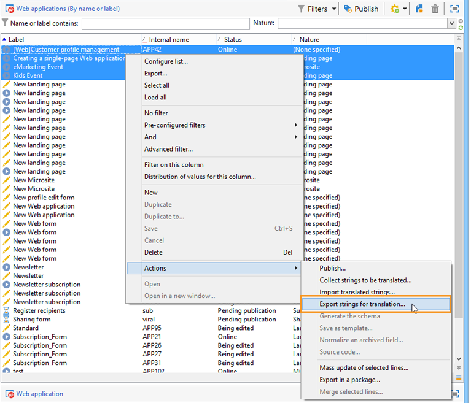

# 轉譯Web表格{#translating-a-web-form}

將Web應用程式當地語系化為多種語言是可能的。

您可以直接在Adobe Campaign主控台中執行翻譯(請參閱編輯器中的 [Managing translations](#managing-translations-in-the-editor))，或匯出和匯入字串以外部化翻譯(請參閱 [Externalizing translation](#externalizing-translation))。

預設情況下可用的翻譯語言清單在更改表單顯 [示語言中有詳細說明](#changing-forms-display-language)。

Web應用程式是以編輯語言設計：這是用於輸入標籤和其他要翻譯內容的參考語言。

預設語言是Web應用程式在未新增語言設定至其存取URL時，所顯示的語言。

>[!NOTE]
>
>依預設，編輯語言和預設語言與主控台語言相同。

## 選擇語言 {#choosing-languages}

要定義一種或多種翻譯語言，請按一下Web **[!UICONTROL Properties]** 應用程式的按鈕，然後按一下 **[!UICONTROL Localization]** 頁籤。 按一下該 **[!UICONTROL Add]** 按鈕可為Web應用程式定義新的翻譯語言。

>[!NOTE]
>
>此視窗也可讓您變更預設語言和編輯語言。


當您為Web應用程式新增翻譯語言（或當預設語言和編輯語言不同時）時，會在標籤中新增子標籤，以管理 **[!UICONTROL Translation]****[!UICONTROL Edit]** 翻譯。

Adobe Campaign包含翻譯和管理多語言翻譯的工具。 此編輯器可讓您檢視要翻譯或核准的字串、直接在介面中輸入翻譯，或匯入／匯出字元字串以將翻譯外部化。

## 在編輯器中管理翻譯 {#managing-translations-in-the-editor}

### 收集字串 {#collecting-strings}

該選 **[!UICONTROL Translations]** 項卡允許您輸入構成Web應用程式的字串的翻譯。

第一次開啟此標籤時，它將不包含任何資料。 按一下 **[!UICONTROL Collect the strings to translate]** 連結以更新Web應用程式中的字串。

Adobe Campaign會收集所有靜態元素標籤中所定義之欄 **[!UICONTROL Texts]** 位和字串的標籤：HTML區塊、Javascript等 靜態元素在Web表單 [的靜態元素中詳述](../../web/using/static-elements-in-a-web-form.md)。


>[!CAUTION]
>
>根據要處理的資料量，此過程可能需要幾分鐘的時間。
> 
>如果出現警告，指出系統字典中缺少某些翻譯，請參 [閱Transling the system strings](#translating-the-system-strings)。

每次翻譯字串時，其翻譯都會添加到翻譯字典中。

當收集進程檢測到翻譯已存在時，該翻譯將顯示在字 **[!UICONTROL Text]** 符串的列中。 字串的狀態會轉換為 **[!UICONTROL Translated]**。

對於從未翻譯過的字元字串， **[!UICONTROL Text]** 欄位為空，狀態為 **[!UICONTROL To translate]**。

### 篩選字串 {#filtering-strings}

依預設，會顯示Web應用程式的每種翻譯語言。 有兩個預設篩選：語言和狀態。 按一下 **[!UICONTROL Filters]** 按鈕，然後按一 **[!UICONTROL By language or status]** 下以顯示符合的下拉式方塊。 您也可以建立進階篩選。 有關詳細資訊，請參見[此頁面](../../platform/using/creating-filters.md#creating-an-advanced-filter)。


前往下拉 **[!UICONTROL Language]** 式方塊以選取翻譯語言。

若要只顯示未翻譯的字串， **[!UICONTROL To translate]** 請在下拉 **[!UICONTROL Status]** 式方塊中選取。 您也可以只顯示已翻譯或已核准的字串。

### 翻譯字串 {#translating-strings}

1. 若要翻譯單字，請連按兩下字串清單上的行。

   

   源字串顯示在窗口的上部部分。

1. 在下部分輸入其翻譯。 若要核准，請勾選 **[!UICONTROL Translation approved]** 選項。

   >[!NOTE]
   >
   >翻譯批准是可選的，不會阻止該過程。

   未批准的翻譯將顯示為 **[!UICONTROL Translated]**。 批准的翻譯將顯示為 **[!UICONTROL Approved]**。

## 外部翻譯 {#externalizing-translation}

您可以使用Adobe Campaign以外的工具匯出和匯入字元字串以翻譯字元字串。

>[!CAUTION]
>
>在導出字串後，不要使用整合工具執行任何翻譯。 如果您重新匯入翻譯，這會導致衝突，而這些翻譯將會遺失。

### 匯出檔案 {#exporting-files}

1. 選取您要匯入其字串的Web應用程式，按一下滑鼠右鍵，然後選取 **[!UICONTROL Actions > Export strings for translation...]**

   

1. 選取 **[!UICONTROL Export strategy]** :

   * **[!UICONTROL One file per language]**:導出將為每個翻譯語言生成一個檔案。 每個檔案都是所有選取之Web應用程式的共用檔案。
   * **[!UICONTROL One file per Web application]**:導出將為每個選定的Web應用程式生成一個檔案。 每個檔案都包含所有翻譯語言。

      >[!NOTE]
      >
      >此類導出不適用於XLIFF導出。

   * **[!UICONTROL One file per language and per Web application]**:導出將生成多個檔案。 每個檔案都包含一個Web應用程式的翻譯語言。
   * **[!UICONTROL One file for all]**:匯出將針對所有Web應用程式產生單一多語言檔案。 它將包含所有選定Web應用程式的所有翻譯語言。

      >[!NOTE]
      >
      >此類導出不適用於XLIFF導出。

1. 然後選擇 **[!UICONTROL Target folder]** 要記錄檔案的位置。
1. 選擇檔案格式( **[!UICONTROL CSV]** 或 **[!UICONTROL XLIFF]** )並按一下 **[!UICONTROL Start]**。


>[!NOTE]
>
>導出檔案的名稱會自動生成。 如果您執行多次相同的匯出作業，則會以新檔案取代現有檔案。 如果您需要保留先前的檔案，請變更 **[!UICONTROL Target folder]** ，然後再按 **[!UICONTROL Start]** 一下以執行匯出。

當您以 **CSV格式匯出檔案**，每種語言都會連結至狀態和核准狀態。 是否 **批准？** 欄可讓您核准轉譯。 此列可包含值 **Yes** 或 **No**。 對於整合編輯器(請參 [閱「在編輯器中管理翻譯](#managing-translations-in-the-editor)」)，批准翻譯是可選的，不會阻止該過程。

### 匯入檔案 {#importing-files}

完成外部翻譯後，您可以導入翻譯的檔案。

1. 前往Web應用程式清單，按一下滑鼠右鍵，然後選取 **[!UICONTROL Actions > Import translated strings...]**

   >[!NOTE]
   >
   >無需選擇與翻譯相關的Web應用程式。 將游標置於Web應用程式清單的任意位置。

   

1. 選取要匯入的檔案，然後按一下 **[!UICONTROL Upload]**。

   

>[!NOTE]
>
>外部翻譯始終優先於內部翻譯。 如果發生衝突，內部翻譯將被外部翻譯覆蓋。

## 變更表格顯示語言 {#changing-forms-display-language}

Web表單以Web應用程式屬性頁籤中指定的默 **[!UICONTROL Localization]** 認語言顯示。 若要變更語言，您必須在URL的結尾加入下列字元(其中 **xx** 為語言的符號):

```
?lang=xx
```

如果語言是URL的第一個或唯一參數。 例如： **https://myserver/webApp/APP34?lang=en**

```
&lang=xx
```

如果URL中語言之前有其他參數。 例如： **https://myserver/webApp/APP34?status=1&amp;lang=en**

以下列出預設可用的翻譯語言和字典。

**預設系統字典**:有些語言包含預設字典，其中包含系統字串的翻譯。 有關詳細資訊，請參 [閱轉換系統字串](#translating-the-system-strings)。

**日曆管理**:網頁應用程式的頁面可以包含用於輸入日期的日曆。 依預設，此日曆有幾種語言版本（日期轉換、日期格式）。

<table> 
 <tbody> 
  <tr> 
   <td> <strong>語言（符號）</strong><br /> </td> 
   <td> <strong>預設系統字典</strong><br /> </td> 
   <td> <strong>日曆管理</strong><br /> </td> 
  </tr> 
  <tr> 
   <td> 德文(de)<br /> </td> 
   <td> yes<br /> </td> 
   <td> yes<br /> </td> 
  </tr> 
  <tr> 
   <td> English (en)<br /> </td> 
   <td> yes<br /> </td> 
   <td> yes<br /> </td> 
  </tr> 
  <tr> 
   <td> 英文（美國）(en_US)<br /> </td> 
   <td> </td> 
   <td> </td> 
  </tr> 
  <tr> 
   <td> 英文（英國）(en_GB)<br /> </td> 
   <td> </td> 
   <td> </td> 
  </tr> 
  <tr> 
   <td> 阿拉伯文(ar)<br /> </td> 
   <td> </td> 
   <td> </td> 
  </tr> 
  <tr> 
   <td> 中文(zh)<br /> </td> 
   <td> </td> 
   <td> </td> 
  </tr> 
  <tr> 
   <td> 韓文(ko)<br /> </td> 
   <td> </td> 
   <td> </td> 
  </tr> 
  <tr> 
   <td> 丹麥文(da)<br /> </td> 
   <td> yes<br /> </td> 
   <td> yes<br /> </td> 
  </tr> 
  <tr> 
   <td> 西班牙文(es)<br /> </td> 
   <td> yes<br /> </td> 
   <td> yes<br /> </td> 
  </tr> 
  <tr> 
   <td> 愛沙尼亞文（等）<br /> </td> 
   <td> </td> 
   <td> </td> 
  </tr> 
  <tr> 
   <td> 芬蘭文(fi)<br /> </td> 
   <td> </td> 
   <td> yes<br /> </td> 
  </tr> 
  <tr> 
   <td> 法文(fr)<br /> </td> 
   <td> yes<br /> </td> 
   <td> yes<br /> </td> 
  </tr> 
  <tr> 
   <td> 法文（比利時）(fr_BE)<br /> </td> 
   <td> </td> 
   <td> </td> 
  </tr> 
  <tr> 
   <td> 法文（法國）(fr_FR)<br /> </td> 
   <td> </td> 
   <td> </td> 
  </tr> 
  <tr> 
   <td> 希臘文(el)<br /> </td> 
   <td> </td> 
   <td> yes<br /> </td> 
  </tr> 
  <tr> 
   <td> 希伯來文(he)<br /> </td> 
   <td> </td> 
   <td> </td> 
  </tr> 
  <tr> 
   <td> 匈牙利文(hu)<br /> </td> 
   <td> </td> 
   <td> yes<br /> </td> 
  </tr> 
  <tr> 
   <td> 印尼文(id)<br /> </td> 
   <td> </td> 
   <td> </td> 
  </tr> 
  <tr> 
   <td> 愛爾蘭文(ga)<br /> </td> 
   <td> </td> 
   <td> </td> 
  </tr> 
  <tr> 
   <td> 義大利文(it)<br /> </td> 
   <td> yes<br /> </td> 
   <td> yes<br /> </td> 
  </tr> 
  <tr> 
   <td> 義大利文（義大利）(it_IT)<br /> </td> 
   <td> </td> 
   <td> </td> 
  </tr> 
  <tr> 
   <td> 義大利文（瑞士）(it_CH)<br /> </td> 
   <td> </td> 
   <td> </td> 
  </tr> 
  <tr> 
   <td> 日文(ja)<br /> </td> 
   <td> </td> 
   <td> </td> 
  </tr> 
  <tr> 
   <td> 拉脫維亞文(lv)<br /> </td> 
   <td> </td> 
   <td> yes<br /> </td> 
  </tr> 
  <tr> 
   <td> 立陶宛文(lt)<br /> </td> 
   <td> </td> 
   <td> </td> 
  </tr> 
  <tr> 
   <td> 馬爾他文(mt)<br /> </td> 
   <td> </td> 
   <td> </td> 
  </tr> 
  <tr> 
   <td> 荷蘭文(nl)<br /> </td> 
   <td> </td> 
   <td> yes<br /> </td> 
  </tr> 
  <tr> 
   <td> 荷蘭文（比利時）(nl_BE)<br /> </td> 
   <td> </td> 
   <td> </td> 
  </tr> 
  <tr> 
   <td> 荷蘭文（荷蘭）(nl_NL)<br /> </td> 
   <td> </td> 
   <td> </td> 
  </tr> 
  <tr> 
   <td> 挪威文（挪威）(no_NO)<br /> </td> 
   <td> </td> 
   <td> yes<br /> </td> 
  </tr> 
  <tr> 
   <td> 波蘭文(pl)<br /> </td> 
   <td> </td> 
   <td> yes<br /> </td> 
  </tr> 
  <tr> 
   <td> 葡萄牙文(pt)<br /> </td> 
   <td> </td> 
   <td> yes<br /> </td> 
  </tr> 
  <tr> 
   <td> 葡萄牙文（巴西）(pt_BR)<br /> </td> 
   <td> </td> 
   <td> </td> 
  </tr> 
  <tr> 
   <td> 葡萄牙文（葡萄牙）(pt_PT)<br /> </td> 
   <td> </td> 
   <td> </td> 
  </tr> 
  <tr> 
   <td> 俄文(ru)<br /> </td> 
   <td> </td> 
   <td> yes<br /> </td> 
  </tr> 
  <tr> 
   <td> Slovene(sl)<br /> </td> 
   <td> </td> 
   <td> </td> 
  </tr> 
  <tr> 
   <td> 斯洛伐克文(sk)<br /> </td> 
   <td> </td> 
   <td> </td> 
  </tr> 
  <tr> 
   <td> 瑞典文(sv)<br /> </td> 
   <td> yes<br /> </td> 
   <td> yes<br /> </td> 
  </tr> 
  <tr> 
   <td> 瑞典文（芬蘭）(sv_FI)<br /> </td> 
   <td> </td> 
   <td> </td> 
  </tr> 
  <tr> 
   <td> 瑞典文（瑞典）(sv_SE)<br /> </td> 
   <td> </td> 
   <td> </td> 
  </tr> 
  <tr> 
   <td> 捷克文(cs)<br /> </td> 
   <td> </td> 
   <td> </td> 
  </tr> 
  <tr> 
   <td> 泰文(th)<br /> </td> 
   <td> </td> 
   <td> </td> 
  </tr> 
  <tr> 
   <td> 越南文（六）<br /> </td> 
   <td> </td> 
   <td> </td> 
  </tr> 
  <tr> 
   <td> Waloon(wa)<br /> </td> 
   <td> </td> 
   <td> </td> 
  </tr> 
 </tbody> 
</table>

>[!NOTE]
>
>要添加預設提供的語言以外的其他語言，請參 [閱添加翻譯語言](#adding-a-translation-language)

## 範例：以多種語言顯示Web應用程式 {#example--displaying-a-web-application-in-several-languages}

下列Web表格提供4種語言：英文、法文、德文和西班牙文。 所有字元字串都已透過Web表 **[!UICONTROL Translation]** 單的索引標籤翻譯。 由於預設語言為英文，因此在發佈調查時，請使用標準URL以英文顯示。


將 **?lang=fr新增至URL結尾** ，以法文顯示：

>[!NOTE]
>
>每種語言的符號清單在變更表格顯示 [語言中詳述](#changing-forms-display-language)。


您可以新 **增？lang=es** 或 **?lang=de** ，以西班牙文或德文顯示。

>[!NOTE]
>
>如果此Web應用程式已使用其他參數，請添加 **&amp;lang=**。\
>例如： **https://myserver/webApp/APP34?status=1&amp;lang=en**

## 高級翻譯配置 {#advanced-translation-configuration}

>[!CAUTION]
>
>本節僅適用於專家使用者。

### 轉換系統字串 {#translating-the-system-strings}

系統字串是所有Web應用程式使用的現成可用字串。 例如： **[!UICONTROL Next]** 、 **[!UICONTROL Previous]****[!UICONTROL Approve]** 、按鈕、 **[!UICONTROL Loading]** 訊息等。 根據預設，有些語言包含含有這些字串翻譯的字典。 語言清單在「變更表單顯 [示語言」中詳述](#changing-forms-display-language)。

如果您將Web應用程式翻譯成系統字典未翻譯的語言，會出現警告訊息，告知您有些翻譯遺失。


若要新增語言，請套用下列步驟：

1. 前往Adobe Campaign樹狀結構，然後按一下 **[!UICONTROL Administration > Configuration > Global dictionary > System dictionary]** 。
1. 在窗口的上部部分，選擇要翻譯的系統字串，然後按一下 **[!UICONTROL Add]** 下部部分。

   

1. 選擇翻譯語言，然後輸入字串的翻譯。 您可以勾選選項來核准轉 **[!UICONTROL Translation validated]** 譯。

   

   >[!NOTE]
   >
   >翻譯批准是可選的，不會阻止該過程。

>[!CAUTION]
>
>不要刪除現成可用的系統字串。

### 添加翻譯語言 {#adding-a-translation-language}

若要將Web應用程式翻譯成預設語言以外的語言(請參閱「變更表格顯示語言 [](#changing-forms-display-language)」)，您必須新增翻譯語言。

1. 按一下 **[!UICONTROL Administration > Platform > Itemized lists]** Adobe Campaign樹狀結構的節點，然後從清單 **[!UICONTROL Languages available for translation]** 中選取。 可用翻譯的清單將顯示在窗口的下部。

   

1. 按一 **[!UICONTROL Add]** 下按鈕，然後輸 **[!UICONTROL Internal name]**&#x200B;入影 **[!UICONTROL Label]** 像的識別碼（標幟）。 若要新增影像，請連絡您的管理員。

   

