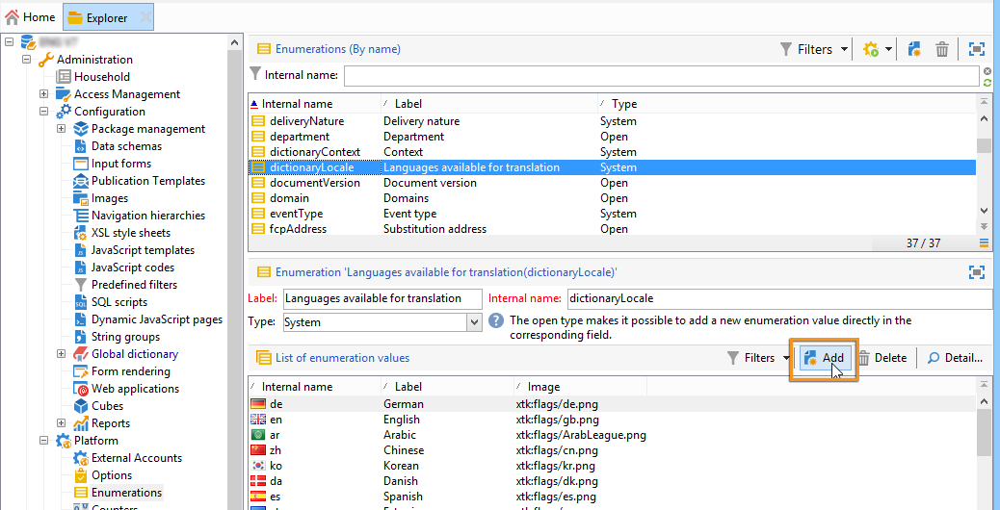

# 翻譯網路表單{#translating-a-web-form}


將Web應用程式本地化為多種語言是可能的。

您可以直接在Adobe Campaign主控台中執行翻譯(請參閱 [在編輯器中管理翻譯](#managing-translations-in-the-editor))，或匯出並匯入字串以將轉譯外部化(請參閱 [外部化翻譯](#externalizing-translation))。

預設可用的翻譯語言清單在 [變更表單顯示語言](#changing-forms-display-language).

Web應用程式是以編輯語言設計的：這是用於輸入要翻譯的標籤和其他內容的參考語言。

預設語言是Web應用程式在未將語言設定添加到其訪問URL時將顯示的語言。

>[!NOTE]
>
>依預設，編輯語言和預設語言與主控台語言相同。

## 選擇語言 {#choosing-languages}

要定義一個或多個翻譯語言，請按一下 **[!UICONTROL Properties]** 按鈕，然後 **[!UICONTROL Localization]** 標籤。 按一下 **[!UICONTROL Add]** 按鈕來定義Web應用程式的新翻譯語言。

>[!NOTE]
>
>此視窗也可讓您變更預設語言和編輯語言。


當您為Web應用程式添加翻譯語言時（或當預設語言和編輯語言不同時）, **[!UICONTROL Translation]** 子標籤 **[!UICONTROL Edit]** 標籤來管理翻譯。

Adobe Campaign包含翻譯和管理多語言翻譯的工具。 此編輯器可讓您檢視要翻譯或核准的字串、直接將翻譯輸入介面，或匯入/匯出字元字串以將翻譯外部化。

## 在編輯器中管理翻譯 {#managing-translations-in-the-editor}

### 收集字串 {#collecting-strings}

此 **[!UICONTROL Translations]** 頁簽可讓您輸入組成Web應用程式的字元字串的翻譯。

您第一次開啟此標籤時，該標籤不會包含任何資料。 按一下 **[!UICONTROL Collect the strings to translate]** 連結以更新Web應用程式中的字串。

Adobe Campaign會收集中定義之欄位和字串的標籤 **[!UICONTROL Texts]** 所有靜態元素的索引標籤：HTML區塊、JavaScript等 靜態元素在 [網路表單中的靜態元素](static-elements-in-a-web-form.md).


>[!CAUTION]
>
>根據要處理的資料量，此程式可能需要數分鐘。
> 
>如果出現警告，指出系統字典中缺少某些翻譯，請參閱 [轉換系統字串](#translating-the-system-strings).

每次翻譯字串時，其翻譯都會新增至翻譯字典。

當收集程式偵測到翻譯已存在時，此翻譯會顯示在 **[!UICONTROL Text]** 欄。 字串的狀態會轉為 **[!UICONTROL Translated]**.

若為從未翻譯的字元字串， **[!UICONTROL Text]** 欄位為空，狀態為 **[!UICONTROL To translate]**.

### 篩選字串 {#filtering-strings}

預設情況下，將顯示Web應用程式的每種翻譯語言。 有兩個預設篩選器：語言和狀態。 按一下 **[!UICONTROL Filters]** 按鈕，然後按一下 **[!UICONTROL By language or status]** 以顯示相符的下拉式方塊。 您也可以建立進階篩選。 如需詳細資訊，請參閱[此頁面](../../platform/using/creating-filters.md#creating-an-advanced-filter)。


前往 **[!UICONTROL Language]** 下拉式方塊中選取翻譯語言。

若只要顯示未翻譯的字串，請選取 **[!UICONTROL To translate]** 在 **[!UICONTROL Status]** 下拉框。 您也可以只顯示已翻譯或已核准的字串。

### 轉譯字串 {#translating-strings}

1. 若要翻譯單字，請連按兩下字串清單上的行。

   

   源字串顯示在窗口的上部。

1. 在下部輸入其翻譯。 若要核准，請核取 **[!UICONTROL Translation approved]** 選項。

   >[!NOTE]
   >
   >翻譯核准是選用項目，不會封鎖程式。

   未批准的翻譯顯示為 **[!UICONTROL Translated]**. 批准的翻譯顯示為 **[!UICONTROL Approved]**.

## 外部化翻譯 {#externalizing-translation}

您可以匯出和匯入字元字串，使用Adobe Campaign以外的工具進行翻譯。

>[!CAUTION]
>
>匯出字串後，請勿使用整合工具執行任何翻譯。 這會在重新導入翻譯時導致衝突，並且這些翻譯將丟失。

### 匯出檔案 {#exporting-files}

1. 選擇要導出其字串的Web應用程式，按一下右鍵，然後選擇 **[!UICONTROL Actions > Export strings for translation...]**

   

1. 選取 **[!UICONTROL Export strategy]** :

   * **[!UICONTROL One file per language]**:導出將生成每個翻譯語言的一個檔案。 每個檔案都是所有選定Web應用程式的共用檔案。
   * **[!UICONTROL One file per Web application]**:導出將為每個選定的Web應用程式生成一個檔案。 每個檔案都包含所有翻譯語言。

      >[!NOTE]
      >
      >此類導出不適用於XLIFF導出。

   * **[!UICONTROL One file per language and per Web application]**:匯出將產生數個檔案。 每個檔案將包含每個Web應用程式的一種翻譯語言。
   * **[!UICONTROL One file for all]**:導出將為所有Web應用程式生成單個多語言檔案。 它將包含所有選定Web應用程式的所有翻譯語言。

      >[!NOTE]
      >
      >此類導出不適用於XLIFF導出。

1. 然後選擇 **[!UICONTROL Target folder]** 將記錄檔案的位置。
1. 選取檔案格式( **[!UICONTROL CSV]** 或 **[!UICONTROL XLIFF]** )，然後按一下 **[!UICONTROL Start]**.


>[!NOTE]
>
>導出檔案的名稱將自動生成。 如果執行相同的導出多次，將用新檔案替換現有檔案。 如果您需要保留先前的檔案，請變更 **[!UICONTROL Target folder]** ，然後按一下 **[!UICONTROL Start]** 執行匯出。

將檔案匯出至 **CSV格式**，每種語言都會連結至狀態和核准狀態。 此 **批准？** 欄可讓您核准翻譯。 此欄可包含值 **是** 或 **否**. 對於整合編輯器(請參閱 [在編輯器中管理翻譯](#managing-translations-in-the-editor))，核准翻譯是選用項目，不會封鎖程式。

### 匯入檔案 {#importing-files}

完成外部翻譯後，您可以匯入翻譯的檔案。

1. 轉到Web應用程式清單，按一下右鍵，然後選擇 **[!UICONTROL Actions > Import translated strings...]**

   >[!NOTE]
   >
   >不需要選擇翻譯涉及的Web應用程式。 將游標放在Web應用程式清單上的任意位置。

   

1. 選取要匯入的檔案，然後按一下 **[!UICONTROL Upload]**.

   

>[!NOTE]
>
>外部翻譯優先於內部翻譯。 如果發生衝突，內部翻譯將被外部翻譯覆蓋。

## 變更表單顯示語言 {#changing-forms-display-language}

網路表單會以 **[!UICONTROL Localization]** 頁簽。 若要變更語言，您必須在URL的結尾處新增下列字元(其中 **x** 是語言的符號):

```
?lang=xx
```

如果語言是URL的第一個或唯一參數。 例如： **https://myserver/webApp/APP34?lang=en**

```
&lang=xx
```

如果URL中語言之前有其他參數。 例如： **https://myserver/webApp/APP34?status=1&amp;lang=en**

預設可用的翻譯語言和字典列於下方。

**預設系統字典**:有些語言包括包含系統字串翻譯的預設字典。 有關詳細資訊，請參閱 [轉換系統字串](#translating-the-system-strings).

**日曆管理**:Web應用程式的頁面可以包含輸入日期的日曆。 依預設，此日曆提供多種語言（日翻譯、日期格式）。

<table> 
 <tbody> 
  <tr> 
   <td> <strong>語言（符號）</strong><br /> </td> 
   <td> <strong>預設系統字典</strong><br /> </td> 
   <td> <strong>日曆管理</strong><br /> </td> 
  </tr> 
  <tr> 
   <td> 德文(de)<br /> </td> 
   <td> 是<br /> </td> 
   <td> 是<br /> </td> 
  </tr> 
  <tr> 
   <td> 英語(en)<br /> </td> 
   <td> 是<br /> </td> 
   <td> 是<br /> </td> 
  </tr> 
  <tr> 
   <td> 英語（美國）(en_US)<br /> </td> 
   <td> </td> 
   <td> </td> 
  </tr> 
  <tr> 
   <td> 英語（英國）(en_GB)<br /> </td> 
   <td> </td> 
   <td> </td> 
  </tr> 
  <tr> 
   <td> 阿拉伯語(ar)<br /> </td> 
   <td> </td> 
   <td> </td> 
  </tr> 
  <tr> 
   <td> 中文(zh)<br /> </td> 
   <td> </td> 
   <td> </td> 
  </tr> 
  <tr> 
   <td> 韓文(ko)<br /> </td> 
   <td> </td> 
   <td> </td> 
  </tr> 
  <tr> 
   <td> 丹麥文(da)<br /> </td> 
   <td> 是<br /> </td> 
   <td> 是<br /> </td> 
  </tr> 
  <tr> 
   <td> 西班牙文(es)<br /> </td> 
   <td> 是<br /> </td> 
   <td> 是<br /> </td> 
  </tr> 
  <tr> 
   <td> 愛沙尼亞文（等）<br /> </td> 
   <td> </td> 
   <td> </td> 
  </tr> 
  <tr> 
   <td> 芬蘭文(fi)<br /> </td> 
   <td> </td> 
   <td> 是<br /> </td> 
  </tr> 
  <tr> 
   <td> 法文(fr)<br /> </td> 
   <td> 是<br /> </td> 
   <td> 是<br /> </td> 
  </tr> 
  <tr> 
   <td> 法語（比利時）(fr_BE)<br /> </td> 
   <td> </td> 
   <td> </td> 
  </tr> 
  <tr> 
   <td> 法語（法國）(fr_FR)<br /> </td> 
   <td> </td> 
   <td> </td> 
  </tr> 
  <tr> 
   <td> 希臘語(el)<br /> </td> 
   <td> </td> 
   <td> 是<br /> </td> 
  </tr> 
  <tr> 
   <td> 希伯來語(he)<br /> </td> 
   <td> </td> 
   <td> </td> 
  </tr> 
  <tr> 
   <td> 匈牙利文(hu)<br /> </td> 
   <td> </td> 
   <td> 是<br /> </td> 
  </tr> 
  <tr> 
   <td> 印度尼西亞文(id)<br /> </td> 
   <td> </td> 
   <td> </td> 
  </tr> 
  <tr> 
   <td> 愛爾蘭語(ga)<br /> </td> 
   <td> </td> 
   <td> </td> 
  </tr> 
  <tr> 
   <td> 義大利文(it)<br /> </td> 
   <td> 是<br /> </td> 
   <td> 是<br /> </td> 
  </tr> 
  <tr> 
   <td> 義大利文（義大利）(it_IT)<br /> </td> 
   <td> </td> 
   <td> </td> 
  </tr> 
  <tr> 
   <td> 義大利文（瑞士）(it_CH)<br /> </td> 
   <td> </td> 
   <td> </td> 
  </tr> 
  <tr> 
   <td> 日文(ja)<br /> </td> 
   <td> </td> 
   <td> </td> 
  </tr> 
  <tr> 
   <td> 拉脫維亞文(lv)<br /> </td> 
   <td> </td> 
   <td> 是<br /> </td> 
  </tr> 
  <tr> 
   <td> 立陶宛文(lt)<br /> </td> 
   <td> </td> 
   <td> </td> 
  </tr> 
  <tr> 
   <td> 馬爾他語(mt)<br /> </td> 
   <td> </td> 
   <td> </td> 
  </tr> 
  <tr> 
   <td> 荷蘭文(nl)<br /> </td> 
   <td> </td> 
   <td> 是<br /> </td> 
  </tr> 
  <tr> 
   <td> 荷蘭文（比利時）(nl_BE)<br /> </td> 
   <td> </td> 
   <td> </td> 
  </tr> 
  <tr> 
   <td> 荷蘭語（荷蘭）(nl_NL)<br /> </td> 
   <td> </td> 
   <td> </td> 
  </tr> 
  <tr> 
   <td> 挪威文（挪威）(no_NO)<br /> </td> 
   <td> </td> 
   <td> 是<br /> </td> 
  </tr> 
  <tr> 
   <td> 波蘭文(pl)<br /> </td> 
   <td> </td> 
   <td> 是<br /> </td> 
  </tr> 
  <tr> 
   <td> 葡萄牙文(pt)<br /> </td> 
   <td> </td> 
   <td> 是<br /> </td> 
  </tr> 
  <tr> 
   <td> 葡萄牙語（巴西）(pt_BR)<br /> </td> 
   <td> </td> 
   <td> </td> 
  </tr> 
  <tr> 
   <td> 葡萄牙語（葡萄牙）(pt_PT)<br /> </td> 
   <td> </td> 
   <td> </td> 
  </tr> 
  <tr> 
   <td> 俄文(ru)<br /> </td> 
   <td> </td> 
   <td> 是<br /> </td> 
  </tr> 
  <tr> 
   <td> 斯洛維尼亞語(sl)<br /> </td> 
   <td> </td> 
   <td> </td> 
  </tr> 
  <tr> 
   <td> 斯洛伐克文(sk)<br /> </td> 
   <td> </td> 
   <td> </td> 
  </tr> 
  <tr> 
   <td> 瑞典文(sv)<br /> </td> 
   <td> 是<br /> </td> 
   <td> 是<br /> </td> 
  </tr> 
  <tr> 
   <td> 瑞典文（芬蘭）(sv_FI)<br /> </td> 
   <td> </td> 
   <td> </td> 
  </tr> 
  <tr> 
   <td> 瑞典文（瑞典）(sv_SE)<br /> </td> 
   <td> </td> 
   <td> </td> 
  </tr> 
  <tr> 
   <td> 捷克文(cs)<br /> </td> 
   <td> </td> 
   <td> </td> 
  </tr> 
  <tr> 
   <td> 泰語(th)<br /> </td> 
   <td> </td> 
   <td> </td> 
  </tr> 
  <tr> 
   <td> 越南文（六）<br /> </td> 
   <td> </td> 
   <td> </td> 
  </tr> 
  <tr> 
   <td> 華侖(wa)<br /> </td> 
   <td> </td> 
   <td> </td> 
  </tr> 
 </tbody> 
</table>

>[!NOTE]
>
>若要新增預設提供的語言以外的其他語言，請參閱 [新增翻譯語言](#adding-a-translation-language)

## 範例：以多種語言顯示Web應用程式 {#example--displaying-a-web-application-in-several-languages}

下列網路表單提供四種語言：英語、法語、德語和西班牙語。 字元字串已透過 **[!UICONTROL Translation]** 頁簽。 由於預設語言為英文，因此在發佈調查時，請使用標準URL以英文顯示。


新增 **?lang=fr** 到URL的結尾，以法文顯示：

>[!NOTE]
>
>每種語言的符號清單在 [變更表單顯示語言](#changing-forms-display-language).


您可以新增 **?lang=es** 或 **?lang=de** 以西班牙文或德文顯示。

>[!NOTE]
>
>如果此Web應用程式已使用其他參數，請添加 **&amp;lang=**.\
>例如： **https://myserver/webApp/APP34?status=1&amp;lang=en**

## 高級翻譯配置 {#advanced-translation-configuration}

>[!CAUTION]
>
>本節僅適用於專家使用者。

### 轉換系統字串 {#translating-the-system-strings}

系統字串是所有Web應用程式使用的現成可用字串。 例如： **[!UICONTROL Next]** , **[!UICONTROL Previous]**, **[!UICONTROL Approve]** 按鈕， **[!UICONTROL Loading]** 訊息等 根據預設，某些語言包含包含這些字串翻譯的字典。 語言清單詳見 [變更表單顯示語言](#changing-forms-display-language).

如果您將Web應用程式翻譯成未翻譯系統字典的語言，則會出現警告訊息，通知您缺少某些翻譯。


若要新增語言，請套用下列步驟：

1. 前往Adobe Campaign樹，然後按一下 **[!UICONTROL Administration > Configuration > Global dictionary > System dictionary]** .
1. 在視窗的上方區段中，選取要轉換的系統字串，然後按一下 **[!UICONTROL Add]** 中。

   

1. 選擇翻譯語言並輸入字串的翻譯。 您可以核准翻譯，方法是檢查 **[!UICONTROL Translation approved]** 選項。

   

   >[!NOTE]
   >
   >翻譯核准是選用項目，不會封鎖程式。

>[!CAUTION]
>
>請勿刪除現成可用的系統字串。

### 新增翻譯語言 {#adding-a-translation-language}

要將Web應用程式翻譯成預設應用程式以外的語言(請參閱 [變更表單顯示語言](#changing-forms-display-language))，您需要新增翻譯語言。

1. 按一下 **[!UICONTROL Administration > Platform > Enumerations]** Adobe Campaign樹的節點，並選取 **[!UICONTROL Languages available for translation]** 從清單中。 可用翻譯的清單顯示在窗口的下部。

   

1. 按一下 **[!UICONTROL Add]** 按鈕，然後輸入 **[!UICONTROL Internal name]**, **[!UICONTROL Label]** 和影像的識別碼（標幟）。 要添加新映像，請與管理員聯繫。

   
