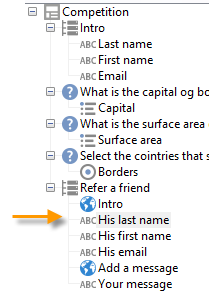

# 使用案例：建立轉介表單{#use-case-creating-a-refer-a-friend-form}

在此範例中，我們想為資料庫中的收件者提供競賽。 Web表單將包含輸入答案的章節，另一個章節則透過輸入朋友的電子郵件地址來參照朋友。


使用先前描述的過程建立標識和競爭塊。

若要設定並建立反向連結區塊，請套用下列步驟：

1. 建立競爭Web表格，其中包含問題和欄位，以輸入朋友的連絡資訊，如下所示：

   

   **您的訊息**&#x200B;欄位可讓您輸入裁判的訊息。 反向連結也必須輸入&#x200B;**姓氏**、**名字**&#x200B;和&#x200B;**電子郵件**。

   在欄位中輸入的資訊會儲存在稱為訪客表格的特定表格中。

   >[!NOTE]
   >
   >只要收件者未經同意，您就無法將他們儲存在資料庫中。 它們會暫時儲存在專為病毒式行銷促銷活動所設計的&#x200B;**visitor**&#x200B;表格(**nms:visitor**)中。 由於&#x200B;**清洗**&#x200B;操作，該表定期被清除。
   >
   >在此範例中，我們希望定位收件者建議他們參與其反向連結建議的競賽。 不過，在此訊息中，我們也希望提供他們訂閱我們的其中一項資訊服務。 如果訂閱，則可將其儲存在資料庫中。

   

   裁判所關注的欄位內容將用於描述檔建立指令碼，以及傳送給裁判的訊息中。

1. 首先，建立指令碼，將反向連結至裁判。

   它包含下列指示：

   

   ```
   ctx.recipient.visitor.@id = xtk.session.GetNewIds(1)
   ctx.recipient.visitor.@forwardUrl = "APP5"
   ctx.recipient.visitor.@referrerEmail = ctx.recipient.@email
   ctx.recipient.visitor.@referrerFirstName = ctx.recipient.@firstName
   ctx.recipient.visitor.@referrerLastName = ctx.recipient.@lastName
   ```

   在頁面識別區塊中輸入的姓氏、名字和電子郵件地址被識別為反向連結的姓氏、名字和電子郵件地址。 這些田地將重新注入發給裁判的資訊的身體。

   APP5值與Web表單的內部名稱相符：這項資訊可讓您找出裁判的來源，即將訪客連結至根據其建立的Web表格。

1. 儲存框允許您收集資訊並將其儲存在資料庫中。

   

1. 然後，建立連結至步驟1中建立之資訊服務的傳送範本。 它將在資訊服務的&#x200B;**[!UICONTROL Choose scenario]**&#x200B;欄位中選擇。

   用於建立反向連結選件訊息的傳送範本包含下列資訊：

   

   此範本具有下列特性：

   * 選取訪客表格作為目標對應。

      

   * 裁判的聯絡資訊以及反向連結的資訊都取自訪客表格。 它會使用個人化按鈕插入。

      

   * 此範本包含競賽表單的連結，以及裁判訂閱電子報的訂閱連結。

      通過個人化塊插入訂閱連結。 依預設，它可讓您將描述檔訂閱至&#x200B;**newsletter**&#x200B;服務。 此個人化區塊可依您的需求而變更，例如，將收件者訂閱至不同的服務。

   * 內部名稱（此處為&#39;referrer&#39;）將用於訊息傳送指令檔，如下所示。
   >[!NOTE]
   >
   >如需傳送範本的詳細資訊，請參閱[本頁](../../delivery/using/about-templates.md)。

1. 建立傳送訂閱訊息的第二個指令碼。

   

   ```
   // Updtate visitor to have a link to the referrer recipient
   ctx.recipient.visitor.@referrerId = ctx.recipient.@id
   ctx.recipient.visitor.@xtkschema = "nms:visitor"
   ctx.recipient.visitor.@_operation = "update" 
   ctx.recipient.visitor.@_key = "@id" 
   xtk.session.Write(ctx.recipient.visitor)
   
   // Send email to friend
   nms.delivery.QueueNotification("referrer",
   <delivery>
   <targets>
     <deliveryTarget>
       <targetPart type='query' exclusion='false' ignoreDeleteStatus='false'>
         <where>
           <condition expr={'@id IN ('+ ctx.recipient.visitor.@id +')' }/>
         </where>
       </targetPart>
      </deliveryTarget>
     </targets>
    </delivery>)
   ```

1. 發佈競賽表單，並傳送邀請給初始目標的收件者。 當其中一個邀請朋友時，會建立以&#x200B;**轉介選件**&#x200B;範本為基礎的傳送。

   

   裁判會新增至&#x200B;**[!UICONTROL Administration > Visitors node]**&#x200B;中的訪客資料夾：

   

   其描述檔包含其反向連結所輸入的資訊。 它會根據在表單指令碼中輸入的組態來儲存。 如果他們決定訂閱電子報，則會儲存在收件者表格中。

