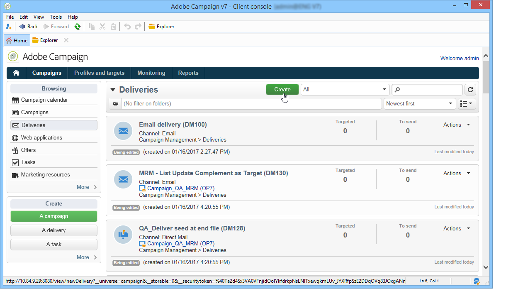
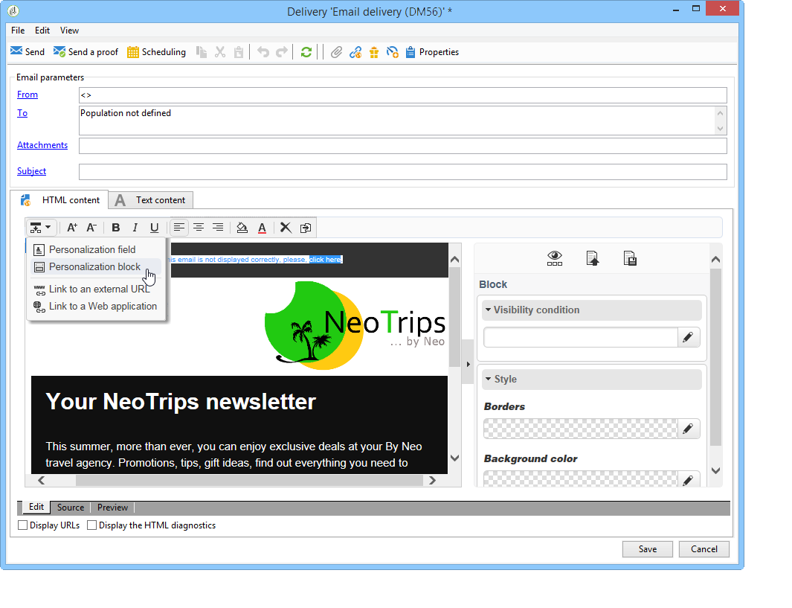

# 使用實例：建立電子郵件傳遞{#use-case-creating-an-email-delivery}

在此使用情形中，您將學習使用Adobe Campaign數字內容編輯器(DCE)設計電子郵件傳送的步驟。

我們的最終目標是建立包含以下內容的個性化模板的交付：

* 收件人的直接地址（使用第一名和第二名）
* 到外部URL的兩種連結
* 鏡像頁
* 指向Web應用程式的連結

>[!NOTE]
>
>在開始之前，您必須至少擁有 **HTML模板** 已配置為承載將來交付的內容。
>
>在交貨中 **[!UICONTROL Properties]**，確保 **[!UICONTROL Content editing mode]** (在 **[!UICONTROL Advanced]** )設定為 **[!UICONTROL DCE]**。 要確保編輯器的最佳操作，請參閱 [內容編輯最佳做法](content-editing-best-practices.md)。

## 步驟1 — 建立交貨 {#step-1---creating-a-delivery}

要建立新傳遞，請將游標置於 **市場活動** 頁籤 **交貨**。 下一步按一下 **建立** 按鈕。 有關建立交貨的詳細資訊，請參閱 [此頁](../../delivery/using/about-email-channel.md)。

## 步驟2 — 選擇模板 {#step-2---selecting-a-template}

選擇交貨模板，然後將交貨名稱命名。 此名稱僅對Adobe Campaign控制台的用戶可見，而不對收件人可見，但此標題將顯示在您的交貨清單中。 按一下&#x200B;**[!UICONTROL Continue]**。

## 步驟3 — 選擇內容 {#step-3---selecting-a-content}

「數字內容編輯器」附帶了各種具有不同結構（列、文本區域等）的現成模板。

選擇要使用的內容模板，然後按一下 **[!UICONTROL Start with the selected content]** 按鈕，在建立的交貨中顯示模板。

也可以通過選擇在Adobe Campaign之外建立的HTML內容來導入 **[!UICONTROL From a file]**。

您可以將此內容另存為模板，以備將來使用。 建立個性化內容模板後，可以從模板清單中預覽它。 有關此內容的詳細資訊，請參閱 [模板管理](template-management.md)。

>[!CAUTION]
>
>如果使用 **Adobe CampaignWeb介面**，必須導入包含HTML內容和相關映像的.zip檔案。

## 步驟4 — 設計消息 {#step-4---designing-the-message}

* 顯示收件人的第一名和第二名

   要將收件人的第一名和第二名插入遞送中的文本欄位，請按一下所選文本欄位，然後將游標置於要顯示它們的位置。 按一下彈出工具欄中的第一個表徵圖，然後按一下 **[!UICONTROL Personalization block]**。 選擇 **[!UICONTROL Greetings]**，然後按一下 **[!UICONTROL OK]**。

   

* 將連結插入影像

   要通過影像將遞送收件人帶到外部地址，請按一下相關影像以顯示彈出工具欄，將游標放在第一個表徵圖上，然後按一下 **[!UICONTROL Link to an external URL]**。 有關此內容的詳細資訊，請參閱 [添加連結](editing-content.md#adding-a-link)。

   

   在中輸入連結的URL **URL** 欄位 **https://www.myURL.com**，然後確認。

   可以使用窗口右側的部分隨時更改連結。

* 將連結插入文本

   要將外部連結整合到交付文本中，請選擇一些文本或一組文本，然後按一下彈出工具欄中的第一個表徵圖。 按一下 **[!UICONTROL Link to an external URL]**，在 **[!UICONTROL URL]** 的子菜單。 有關此內容的詳細資訊，請參閱 [添加連結](editing-content.md#adding-a-link)。

   可以使用窗口右側的部分隨時更改連結。

   >[!CAUTION]
   >
   >在 **[!UICONTROL Label]** 欄位將替換原始文本。

* 添加鏡像頁

   要允許您的收件人在Web瀏覽器中查看您的傳遞內容，您可以將指向鏡像頁面的連結整合到您的傳遞中。

   按一下要在其中查看已發佈連結的文本欄位。 按一下彈出工具欄中的第一個表徵圖，選擇 **[!UICONTROL Personalization block]**，則 **[!UICONTROL Link to Mirror Page (MirrorPage)]**。 按一下 **[!UICONTROL Save]** 確認。

   

   >[!CAUTION]
   >
   >個性化塊標籤會自動替換交貨中的原始文本。

* 整合指向Web應用程式的連結

   通過數字內容編輯器，您可以整合從Adobe Campaign控制台到Web應用程式的連結，如登錄頁或表單頁。 有關此內容的詳細資訊，請參閱 [連結到Web應用程式](editing-content.md#link-to-a-web-application)。

   為指向Web應用程式的連結選擇一個文本欄位，然後按一下第一個表徵圖。 選擇 **[!UICONTROL Link to a Web application]**，然後按一下 **Web應用程式** 的子菜單。

   

   按一下 **保存** 確認。

   >[!NOTE]
   >
   >此步驟要求您預先至少保存一個Web應用程式。 可在 **[!UICONTROL Campaigns > Web applications]** 頁籤。

## 步驟5 — 保存交貨 {#step-5---saving-the-delivery}

整合內容後，通過按一下 **保存**。 它現在將顯示在您的交貨清單中， **[!UICONTROL Campaigns > Deliveries]** 頁籤。
