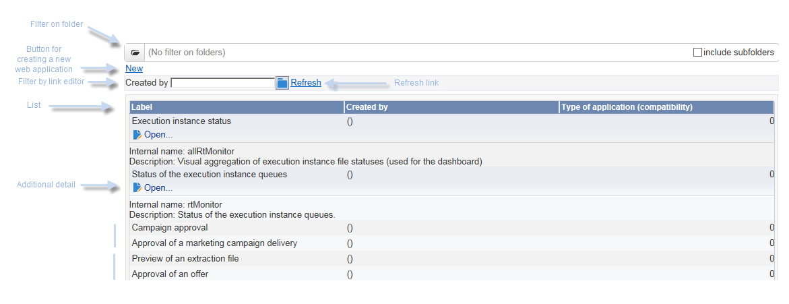
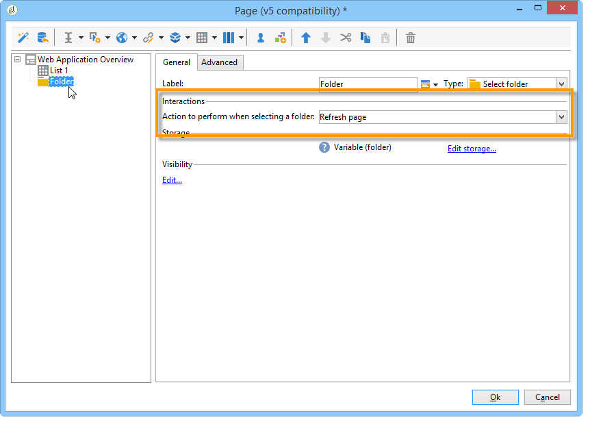

# 使用案例：建立概述頁面{#use-cases-creating-overviews}


在以下示例中，我們將建立概述類型的Web應用程式，以顯示資料庫中的所有Web應用程式。 設定下列元素：

* 資料夾的篩選器（請參閱[在資料夾上新增篩選器](#adding-a-filter-on-a-folder)）,
* 用於建立新Web應用程式的按鈕（請參閱[添加按鈕以配置新Web應用程式](#adding-a-button-to-configure-a-new-web-application)）,
* 清單中每個條目的詳細資訊顯示（請參閱[將詳細資訊添加到清單](#adding-detail-to-a-list)）,
* 每個連結編輯工具一個篩選器（請參閱[使用連結編輯器建立篩選器](#creating-a-filter-using-a-link-editor)）,
* 刷新連結（請參閱[建立刷新連結](#creating-a-refresh-link)）。



## 建立單頁Web應用程式 {#creating-a-single-page-web-application}

1. 建立單一&#x200B;**[!UICONTROL Page]** Web應用程式，並停用出站轉變和轉變至下一頁。

   

1. 變更頁面標題。

   此標題將出現在概述標題和Web應用程式概述中。

1. 在Web應用程式屬性中，通過選擇&#x200B;**[!UICONTROL Single-page Web application]**&#x200B;模板來修改應用程式的呈現。

   

1. 開啟Web應用程式的&#x200B;**[!UICONTROL Page]**&#x200B;活動並開啟清單(**[!UICONTROL Static element > List]**)。
1. 在清單的&#x200B;**[!UICONTROL Data]**&#x200B;標籤中，選擇&#x200B;**[!UICONTROL Web applications]**&#x200B;文檔類型以及&#x200B;**[!UICONTROL Label]** 、 **[!UICONTROL Creation date]**&#x200B;和&#x200B;**[!UICONTROL Type of application]**&#x200B;輸出列。
1. 在&#x200B;**[!UICONTROL Filter]**&#x200B;子標籤中，建立以下篩選器，如下所示，以便僅顯示Web應用程式並從您的視圖中排除模板。

   

1. 關閉頁面的設定視窗，然後按一下&#x200B;**[!UICONTROL Preview]**。

   將顯示資料庫中可用的Web應用程式清單。

   

## 在資料夾上新增篩選器 {#adding-a-filter-on-a-folder}

在概觀中，您可以根據資料在Adobe Campaign樹狀結構中的位置來選擇存取資料。 這是資料夾上的篩選器。 套用下列程式，將其新增至您的概覽。

1. 將游標放在Web應用程式的&#x200B;**[!UICONTROL Page]**&#x200B;節點上，並添加&#x200B;**[!UICONTROL Select folder]**&#x200B;元素(**[!UICONTROL Advanced controls > Select folder]**)。
1. 在出現的&#x200B;**[!UICONTROL Storage]**&#x200B;視窗中，按一下&#x200B;**[!UICONTROL Edit variables]**&#x200B;連結。
1. 變更變數標籤以符合您的需求。
1. 使用&#x200B;**folder**&#x200B;值變更變數名稱。

   >[!NOTE]
   >
   >變數的名稱必須符合連結至資料夾的元素名稱（在架構中定義），即&#x200B;**資料夾**。 引用表時，必須重新使用此名稱。

1. 將&#x200B;**[!UICONTROL XML]**&#x200B;類型套用至變數。

   

1. 選擇&#x200B;**[!UICONTROL Refresh page]**&#x200B;交互。

   

1. 將游標放在清單上，在&#x200B;**[!UICONTROL Advanced]**&#x200B;標籤中，引用先前在清單的&#x200B;**[!UICONTROL Folder filter XPath]**&#x200B;標籤中建立的變數。 您必須使用資料夾連結所關注元素的名稱，即&#x200B;**資料夾**。

   

   >[!NOTE]
   >
   >在此階段，Web應用程式不在其應用程式上下文中，因此無法在資料夾上測試篩選器。

## 添加按鈕以配置新的Web應用程式 {#adding-a-button-to-configure-a-new-web-application}

1. 將游標放在&#x200B;**[!UICONTROL Page]**&#x200B;元素上並新增連結(**[!UICONTROL Static elements > Link]**)。
1. 修改連結標籤，因為它將出現在概述的按鈕上。

   在我們的範例中，標籤為&#x200B;**New**。

1. 在URL欄位中插入下列URL:**xtk://open/?schema=nms:webApp&amp;form=nms:newWebApp**。

   >[!NOTE]
   >
   >**nms:** webApp與Web應用程式方案一致。
   >
   >**nms:** newWebApp與新的Web應用程式建立嚮導一致。

1. 選擇在同一視窗中顯示URL。
1. 在影像欄位中新增Web應用程式圖示：**/nms/img/webApp.png**。

   此表徵圖將顯示在&#x200B;**[!UICONTROL New]**&#x200B;按鈕上。

1. 在&#x200B;**[!UICONTROL Style]**&#x200B;欄位中輸入&#x200B;**按鈕**。

   此樣式在先前選擇的&#x200B;**[!UICONTROL Single-page Web application]**&#x200B;模板中引用。

   

## 將詳細資訊添加到清單 {#adding-detail-to-a-list}

當您在概覽中設定清單時，可以選擇顯示清單上每個項目的其他詳細資訊。

1. 將游標置於先前建立的清單元素上。
1. 在&#x200B;**[!UICONTROL General]**&#x200B;標籤中，從下拉清單中選擇&#x200B;**[!UICONTROL Columns and additional detail]**&#x200B;顯示模式。

   

1. 在&#x200B;**[!UICONTROL Data]**&#x200B;標籤中，新增&#x200B;**[!UICONTROL Primary key]** 、 **[!UICONTROL Internal name]**&#x200B;和&#x200B;**[!UICONTROL Description]**&#x200B;欄，並為每個欄選取&#x200B;**[!UICONTROL Hidden field]**&#x200B;選項。

   

   這樣，此資訊只會顯示在每個項目的詳細資訊中。

1. 在&#x200B;**[!UICONTROL Additional detail]**&#x200B;標籤中，新增下列程式碼：

   ```
   <div class="detailBox">
     <div class="actionBox">
       <span class="action"><a title="Open" class="linkAction" href="xtk://open/?schema=nms:webApp&form=nms:webApp&pk=
       <%=webApp.id%>">Open...</a></span>
       <% 
       if( webApp.@appType == 1 ) { //survey
       %>
       <span class="action"><a target="_blank" title="Reports" class="linkAction" href="/xtk/report.jssp?_context=selection&
         _schema=nms:webApp&_selection=<%=webApp.@id%>
         &__sessiontoken=<%=document.controller.getSessionToken()%>">Reports</a></span>
       <% 
       } 
       %>
     </div>
     <div>
       Internal name: <%= webApp.@internalName %>
     </div>
     <%
     if( webApp.desc != "" )
     {
     %>
     <div>
       Description: <%= webApp.desc %>
     </div>
     <% 
     } 
     %>
   </div>
   ```

>[!NOTE]
>
>伺服器上重新整理JavaScript程式庫需要5分鐘。 您可以重新啟動伺服器，以避免等待此延遲。

## 篩選和更新清單 {#filtering-and-updating-the-list}

在本節中，您將建立一個篩選器，用於顯示由特定運算子建立的Web應用程式的概觀。 此篩選器是使用連結編輯器建立。 選取運算子後，重新整理清單以套用篩選器；這需要建立重新整理連結。

這兩個元素將分組在相同的容器中，以便以圖形方式在概覽中分組。

1. 將游標放在&#x200B;**[!UICONTROL Page]**&#x200B;元素上，然後選取&#x200B;**[!UICONTROL Container > Standard]**。
1. 將欄數設為&#x200B;**2**，使連結編輯器和連結彼此相鄰。

   

   有關元素佈局的資訊，請參閱[此部分](about-web-forms.md)。

1. 套用&#x200B;**dottedFilter**。

   此樣式在先前選擇的&#x200B;**[!UICONTROL Single-page Web application]**&#x200B;模板中引用。

   

### 使用連結編輯器建立篩選 {#creating-a-filter-using-a-link-editor}

1. 將游標置於上一階段建立的容器上，並透過&#x200B;**[!UICONTROL Advanced controls]**&#x200B;功能表插入連結編輯器。
1. 在自動開啟的儲存窗口中，選擇&#x200B;**[!UICONTROL Variables]**&#x200B;選項，然後按一下&#x200B;**[!UICONTROL Edit variables]**&#x200B;連結，並建立用於篩選資料的XML變數。

   

1. 修改標籤。

   它會出現在概述的&#x200B;**[!UICONTROL Filter]**&#x200B;欄位旁。

1. 選擇運算子表作為應用程式方案。

   

1. 將游標放在清單元素上，並透過&#x200B;**[!UICONTROL Data > Filter]**&#x200B;索引標籤建立篩選器：

   * **運算式：** 「建立者」連結的外鍵
   * **運算子：** 等於
   * **值：** 變數（變數）
   * **考量if:** &#39;$(var2/@id)&#39;!=&quot;

   

>[!CAUTION]
>
>Web應用程式用戶必須是已標識的操作員，具有訪問資訊的適當Adobe Campaign權限。 此類型的配置對匿名Web應用程式無效。

### 建立重新整理連結 {#creating-a-refresh-link}

1. 將游標放在容器上，並通過&#x200B;**[!UICONTROL Static elements]**&#x200B;菜單插入&#x200B;**[!UICONTROL Link]**。
1. 修改標籤。
1. 選取 **[!UICONTROL Refresh data in a list]**。
1. 新增先前建立的清單。

   

1. 在&#x200B;**[!UICONTROL Image]**&#x200B;欄位上新增重新整理圖示：**/xtk/img/refresh.png**。
1. 使用排序順序箭頭，重新組織Web應用程式的各種元素，如下所示。

   

現在已配置Web應用程式。 您可以按一下&#x200B;**[!UICONTROL Preview]**&#x200B;標籤來預覽。


