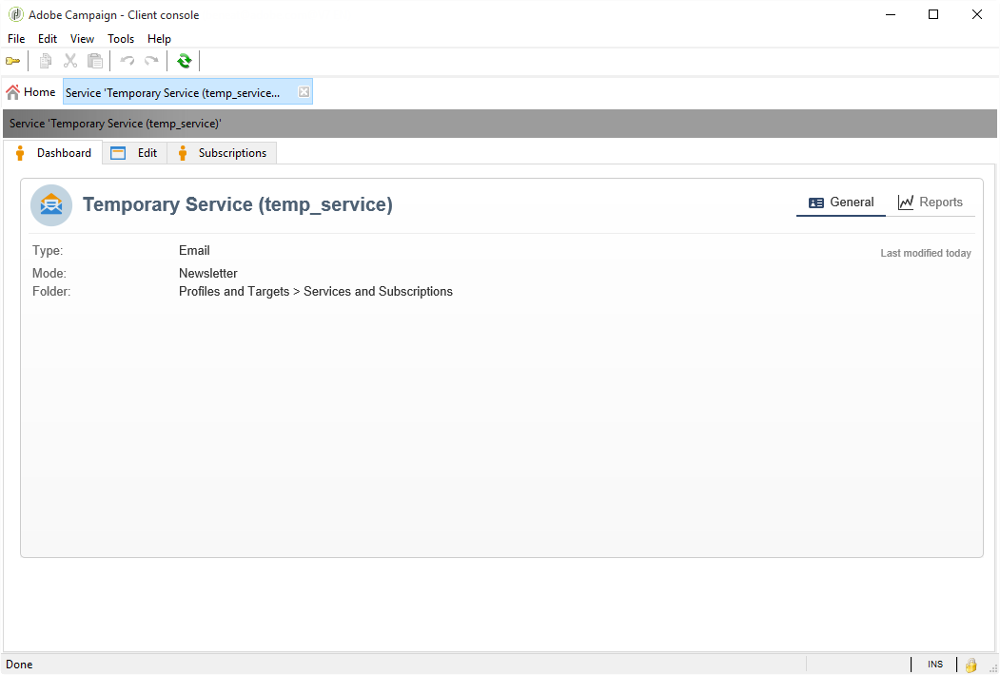
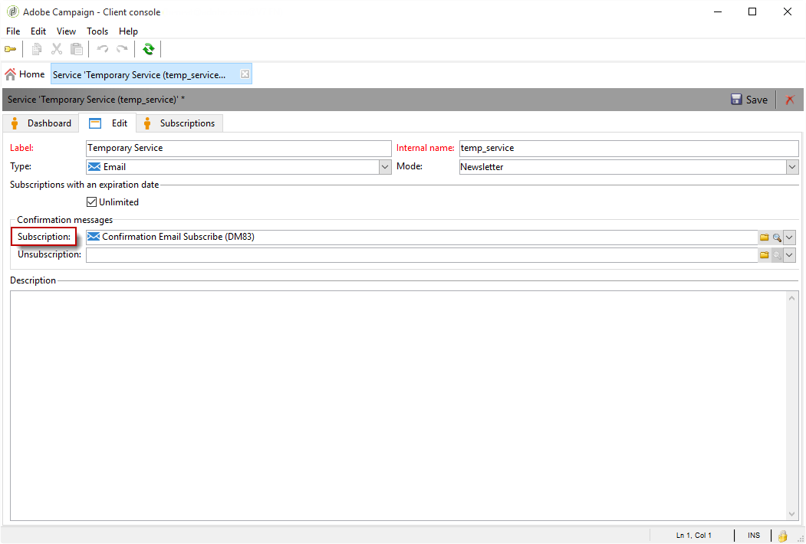
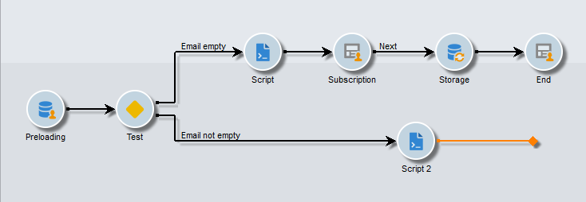
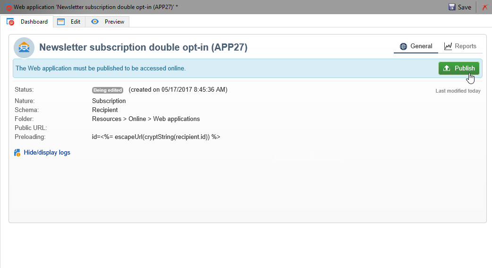
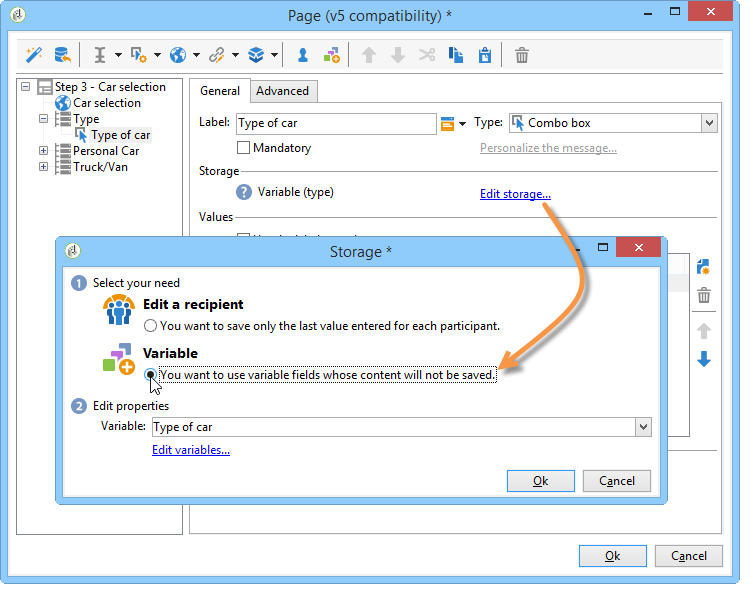

# 使用實例：網路表單{#use-cases-web-forms}


## 使用雙重加入建立訂閱表單 {#create-a-subscription--form-with-double-opt-in}

當您提供資訊服務時，收件者需要訂閱才能接收所有連結的通訊。 為避免不當通訊並確保收件者有意訂閱，我們建議傳送訂閱確認請求以建立雙重加入。 只有當使用者按一下確認訊息中包含的連結時，訂閱才會生效。

此範例以下列案例為基礎：

1. 在包含訂閱暫時服務核取方塊的網站上建立電子報訂閱表單。 此服務可讓您傳送訂閱確認訊息。
1. 使用連結至Web表單的傳遞範本建立訂閱確認傳送。 它包含的確認連結會呼叫電子報訂閱的表單，並顯示訂閱核准訊息。

### 步驟1 — 建立資訊服務 {#step-1---creating-information-services}

1. 建立要提供給收件者的電子報訂閱服務。 如需如何建立電子報的詳細資訊，請參閱[本區段](../../delivery/using/about-services-and-subscriptions.md)。

   

1. 建立第二資訊服務，連結到傳送訂閱確認消息的傳送模板的臨時服務。

   

### 步驟2 — 建立確認訊息 {#step-2---creating-confirmation-messages}

確認訊息會透過臨時服務層級參考的專用傳送範本傳送。

1. 在&#x200B;**[!UICONTROL Explorer]**&#x200B;中，選取&#x200B;**[!UICONTROL Resources > Templates > Delivery templates]**。
1. 建立傳送訂閱確認訊息的傳送範本。
1. 按一下&#x200B;**[!UICONTROL Email parameters]**&#x200B;中的&#x200B;**[!UICONTROL To]**&#x200B;按鈕，將傳遞範本與訂閱目標對應（而非收件者）建立關聯。

   

1. 由於此傳送的收件者尚未確認其核准，因此他們仍在資料庫封鎖清單中。 若要讓他們收到此通訊，您需要根據此範本授權傳送，以封鎖清單上的收件者為目標。

   要執行此操作，請按一下&#x200B;**[!UICONTROL Exclusions]**&#x200B;標籤。

1. 按一下&#x200B;**[!UICONTROL Edit...]**&#x200B;連結，並取消勾選&#x200B;**[!UICONTROL Exclude recipients who no longer want to be contacted]**&#x200B;選項。

   <!-- -->

   >[!IMPORTANT]
   >
   >只能在此類型的上下文中禁用此選項。

1. 個人化您的傳送，並將確認連結插入訊息內容中。 此連結可讓您存取Web表單以記錄訂閱確認。

   

1. 使用DCE將URL連結到Web表單。 由於尚未建立Web表單，因此當您建立該表單時，請立即替換該值。

   

1. 最後，將此範本連結至先前建立的臨時服務。

   

### 步驟3 — 建立訂閱表單 {#step-3---creating-the-subscription-form}

Web表單可啟用收件者訂閱和訂閱確認。

網路表單工作流程將包含下列活動：


要執行此操作，請遵循下列步驟：

1. 建立Web表單並選擇模板&#x200B;**[!UICONTROL Newsletter subscription (subNewsletter)]**。

   

1. 在&#x200B;**[!UICONTROL Edit]**&#x200B;索引標籤中，我們需要設定現有的工作流程，因為我們想要向要訂閱的收件者新增確認訊息。

   若要這麼做，請連按兩下&#x200B;**[!UICONTROL Preloading]**&#x200B;方塊，並依下列方式進行設定。

   

   這表示，如果使用者透過確認訊息中的連結存取此表單，將會載入其設定檔資訊。 如果使用者透過網站的頁面存取網路表單，則不會載入任何資訊。

1. 將&#x200B;**[!UICONTROL Test]**&#x200B;活動新增至工作流程。

   

   **[!UICONTROL Test]**&#x200B;活動可能與收件者電子郵件有關。 在此情況下，請依下列方式設定：

   

1. 將兩個&#x200B;**[!UICONTROL Script]**&#x200B;活動新增至您的工作流程。

   

   第一個&#x200B;**[!UICONTROL Script]**&#x200B;活動會將收件者新增至封鎖清單，直到他們確認訂閱電子報為止。 其內容必須如下：

   ```
   ctx.recipient.@blackList=1
   ```

   

   第二個&#x200B;**[!UICONTROL Script]**&#x200B;活動會授權傳送給使用者，並將其訂閱電子報。 指令碼的最後兩行將可讓您將收件者從臨時資料夾傳輸至另一個資料夾，並在他們確認訂閱後立即與現有設定檔調解。

   ```
   ctx.recipient.@blackList=0
   nms.subscription.Subscribe("INTERNAL_NAME_OF_THE_NEWSLETTER", ctx.recipient, false)
   ctx.recipient.folder = <folder name="nmsRootRecipient"/>
   nms.subscription.Unsubscribe("TEMP", ctx.recipient)
   ```

   >[!NOTE]
   >
   >**[!UICONTROL Temp]**&#x200B;分區也可以使用工作流定期清除。

   

1. 連按兩下&#x200B;**[!UICONTROL Subscription]**&#x200B;活動以個人化訂閱表單，並將核取方塊連結至先前建立的臨時服務。

   

1. 設定&#x200B;**[!UICONTROL Storage]**&#x200B;活動以儲存在表單頁面中輸入的資訊。

   此活動可讓您在專用的臨時資料夾中建立收件者設定檔，以將其與資料庫中的設定檔分開，而資料庫中的通訊可傳送給這些設定檔。

   

   >[!NOTE]
   >
   >您不得定義任何調解選項。

1. 新增兩個&#x200B;**[!UICONTROL End]**&#x200B;活動以顯示使用者的訊息。

   訂閱完成後，第二個&#x200B;**[!UICONTROL End]**&#x200B;方塊將顯示確認訊息。

   

1. 建立並設定Web表單後，您現在可以在傳遞範本中參考該表單，以傳送確認訊息。

   

### 步驟4 — 發佈和測試表單 {#step-4---publishing-and-testing-the-form}

您現在可以發佈表單，讓使用者可存取。



訂閱電子報需執行下列步驟：

1. 網站的使用者登入訂閱頁面並核准表單。

   

   他們會透過瀏覽器中的訊息收到通知，告知已考慮其要求。

   

   使用者會新增至&#x200B;**[!UICONTROL Temp]**&#x200B;資料夾中的Adobe Campaign資料庫，且其設定檔會列在封鎖清單中，直到他們透過電子郵件確認訂閱為止。

   

1. 系統會傳送確認訊息，其中包含核准訂閱的連結。

   

1. 當使用者按一下此連結時，核准頁面會顯示在其瀏覽器中。

   

   在Adobe Campaign中，會更新使用者設定檔：

   * 他們不再列入封鎖名單，
   * 他們訂閱了資訊服務。

      

## 根據所選值顯示不同的選項 {#displaying-different-options-depending-on-the-selected-values}

在以下範例中，會要求使用者選取車輛類型。 您可以根據所選類型顯示可用的車輛類別。 這表示右側欄中顯示的項目取決於使用者的選取項目：


* 當用戶選擇「私家車」時，提供「緊湊」和「小型車」之間的選擇。

   

* 當用戶選擇「商用車」時，選擇將顯示在下拉清單中：

   

在此範例中，車輛類型不會儲存在資料庫中。 下拉式清單的設定如下：


此資訊會儲存在本機變數中。

右側欄的條件式顯示會在容器中設定：



* 專用車輛欄位的條件可見性：

   

* 商業車輛的欄位條件可見性：

   
