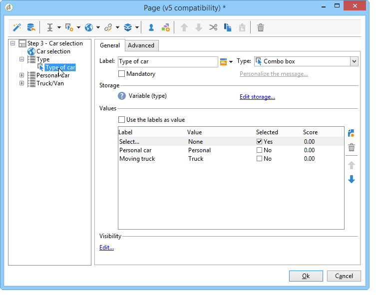

# 使用實例：網路表單{#use-cases-web-forms}


## 建立雙選擇加入的訂閱表單 {#create-a-subscription--form-with-double-opt-in}

當您提供資訊服務時，收件人需要訂閱以接收所有連結的通信。 為避免通信不當，並確保收件人有意訂閱，我們建議發送訂閱確認請求以建立雙重選擇加入。 僅當用戶按一下確認消息中包含的連結時，訂閱才有效。

此示例基於以下方案：

1. 在包含訂閱臨時服務複選框的網站上建立新聞簡報訂閱表單。 此服務將允許您傳遞訂閱確認消息。
1. 使用連結到Web表單的傳遞模板建立訂閱確認傳遞。 它包含確認連結，該連結調用新聞稿訂閱的表單並顯示訂閱批准消息。

### 步驟1 — 建立資訊服務 {#step-1---creating-information-services}

1. 建立要提供給您的收件人的新聞稿訂閱服務。 有關如何建立新聞簡報的詳細資訊，請參閱 [此部分](../../delivery/using/about-services-and-subscriptions.md)。

   

1. 建立第二資訊服務，即連結到用於發送訂閱確認消息的傳遞模板的臨時服務。

   

### 步驟2 — 建立確認消息 {#step-2---creating-confirmation-messages}

確認消息通過在臨時服務級別上引用的專用傳遞模板發送。

1. 在 **[!UICONTROL Explorer]** 選中 **[!UICONTROL Resources > Templates > Delivery templates]**。
1. 建立用於發送訂閱確認消息的傳遞模板。
1. 按一下 **[!UICONTROL To]** 按鈕 **[!UICONTROL Email parameters]** 將傳遞模板與訂閱目標映射而不是收件人關聯。

   

1. 由於此傳遞的收件人尚未確認其批准，因此他們仍在資料庫denylist中。 要接收此通信，您需要根據此模板授權遞送到denylist上的目標收件人。

   要執行此操作，請按一下 **[!UICONTROL Exclusions]** 頁籤。

1. 按一下 **[!UICONTROL Edit...]** 連結並取消選中 **[!UICONTROL Exclude recipients who no longer want to be contacted]** 的雙曲餘切值。

   <!-- -->

   >[!IMPORTANT]
   >
   >只能在此類型的上下文中禁用此選項。

1. 個性化您的傳遞並將確認連結插入消息內容。 此連結允許您訪問Web表單以記錄訂閱確認。

   

1. 使用DCE將URL連結到Web表單。 由於尚未建立Web表單，因此在建立該表單後立即替換它。

   

1. 最後，將此模板連結到先前建立的臨時服務。

   

### 步驟3 — 建立訂閱表單 {#step-3---creating-the-subscription-form}

Web表單同時啟用收件人訂閱和訂閱確認。

Web表單工作流將包括以下活動：


要執行此操作，請遵循下列步驟：

1. 建立Web表單並選擇模板 **[!UICONTROL Newsletter subscription (subNewsletter)]**。

   

1. 在 **[!UICONTROL Edit]** 頁籤，由於我們要向要訂閱的收件人添加確認消息，因此需要配置現有工作流。

   為此，請按兩下 **[!UICONTROL Preloading]** 按如下方式配置。

   

   這意味著，如果用戶通過確認消息中的連結訪問此表單，則將載入其配置檔案資訊。 如果他們通過網站的頁面訪問Web表單，則不會載入任何資訊。

1. 添加 **[!UICONTROL Test]** 活動。

   

   的 **[!UICONTROL Test]** 活動可能與收件人電子郵件有關。 在這種情況下，按如下方式配置：

   

1. 添加兩個 **[!UICONTROL Script]** 活動。

   

   第一個 **[!UICONTROL Script]** 活動將在denylist上添加收件人，直到他們確認訂閱了新聞稿。 其內容必須如下：

   ```
   ctx.recipient.@blackList=1
   ```

   

   第二 **[!UICONTROL Script]** 活動授權將遞送發送給用戶並訂閱新聞稿。 指令碼的最後兩行將允許您將收件人從臨時資料夾轉移到另一個資料夾，並在他們確認訂閱後立即與現有配置檔案進行協調。

   ```
   ctx.recipient.@blackList=0
   nms.subscription.Subscribe("INTERNAL_NAME_OF_THE_NEWSLETTER", ctx.recipient, false)
   ctx.recipient.folder = <folder name="nmsRootRecipient"/>
   nms.subscription.Unsubscribe("TEMP", ctx.recipient)
   ```

   >[!NOTE]
   >
   >的 **[!UICONTROL Temp]** 也可以使用工作流定期清除分區。

   

1. 按兩下 **[!UICONTROL Subscription]** 活動：個性化訂閱表單並將複選框與先前建立的臨時服務連結。

   

1. 配置 **[!UICONTROL Storage]** 的子菜單。

   通過本練習，您可以在專用臨時資料夾中建立收件人配置檔案，以將其與資料庫中的配置檔案分開，這些配置檔案可以將通信發送到資料庫中。

   

   >[!NOTE]
   >
   >不能定義任何協調選項。

1. 添加兩個 **[!UICONTROL End]** 活動以顯示用戶的消息。

   第二 **[!UICONTROL End]** 訂閱完成後，將顯示確認消息。

   

1. 建立和配置Web表單後，您現在可以在傳遞模板中引用它來發送確認消息。

   

### 步驟4 — 發佈和測試表單 {#step-4---publishing-and-testing-the-form}

您現在可以發佈表單，使用戶能夠訪問該表單。


訂閱新聞稿涉及以下步驟：

1. 網站的用戶登錄到訂閱頁面並批准表單。

   

   他們通過瀏覽器中的一條消息得知他們的請求已經得到考慮。

   

   用戶將添加到中的Adobe Campaign資料庫 **[!UICONTROL Temp]** 資料夾，並且其配置檔案在denylist上，直到他們確認其通過電子郵件訂閱。

   

1. 向其發送包括批准其訂閱的連結的確認消息。

   

1. 當他們按一下此連結時，其瀏覽器中將顯示批准頁面。

   

   在Adobe Campaign，更新用戶配置檔案：

   * 他們不再在密友名單上，
   * 他們訂閱了資訊服務。

      

## 根據所選值顯示不同的選項 {#displaying-different-options-depending-on-the-selected-values}

在下例中，系統會要求用戶選擇一種車輛類型。 您可以根據所選類型顯示可用的車輛類別。 這意味著在右側列中顯示的項目取決於用戶的選擇：


* 當用戶選擇「私家車」時，提供「緊湊型」和「小型車」之間的選擇。

   

* 當用戶選擇「商用車」時，在下拉清單中顯示選擇：

   

在本示例中，車輛類型未儲存在資料庫中。 下拉清單的配置如下：



此資訊儲存在局部變數中。

右欄的條件顯示在容器中配置：


* 私有車輛的欄位的條件可見性：

   

* 商用車欄位的條件可見性：

   
