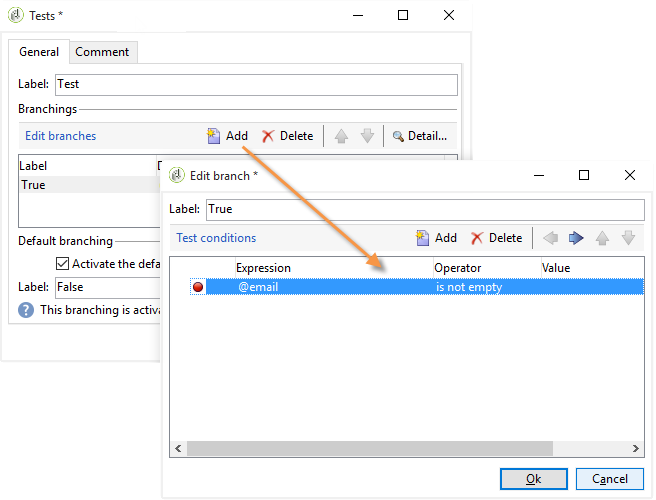

# 使用案例： 網路表單{#use-cases-web-forms}

## 建立包含雙重選擇加入的訂閱表單 {#create-a-subscription--form-with-double-opt-in}

當您提供資訊服務時，收件者必須訂閱才能接收所有連結的通訊資料。 為避免不當通訊並確保收件者有意訂閱，我們建議傳送訂閱確認要求以建立雙重選擇加入。 只有當使用者按一下確認訊息中包含的連結時，訂閱才會生效。

此範例以下列案例為基礎：

1. 在網站上建立電子報訂閱表單，其中包含訂閱暫時服務的核取方塊。 本服務可讓您傳送訂閱確認訊息。
1. 使用連結至Web表單的傳送範本建立訂閱確認傳送。 它包含確認連結，可呼叫電子報訂閱的表單，並顯示訂閱核准訊息。

### 步驟1 —— 建立資訊服務 {#step-1---creating-information-services}

1. 建立要提供給收件者的電子報訂閱服務。 如需如何建立電子報的詳細資訊，請參閱 [本節](../../delivery/using/about-services-and-subscriptions.md)。

   

1. 建立第二資訊服務，即連結到發送訂閱確認消息的發送模板的臨時服務。

   

### 步驟2 —— 建立確認消息 {#step-2---creating-confirmation-messages}

確認消息通過臨時服務級別引用的專用傳送模板發送。

1. 在中 **[!UICONTROL Explorer]** ，選擇 **[!UICONTROL Resources > Templates > Delivery templates]**。
1. 建立傳送訂閱確認訊息的傳送範本。
1. 按一下 **[!UICONTROL To]** 中的按鈕， **[!UICONTROL Email parameters]** 將傳送範本與「訂閱」目標對應（而非收件者）建立關聯。

   

1. 由於此遞送的收件者尚未確認其批准，因此他們仍在資料庫區塊清單中。 若要接收此通訊，您必鬚根據此範本授權傳送給區塊清單上的目標收件者。

   若要這麼做，請按一下標 **[!UICONTROL Exclusions]** 簽。

1. 按一下連 **[!UICONTROL Edit...]** 結並取消勾選 **[!UICONTROL Exclude recipients who no longer want to be contacted (blocklist)]** 選項。

   <!-- -->

   >[!CAUTION]
   >
   >此選項只能在此類上下文中禁用。

1. 個人化您的傳送，並將確認連結插入訊息內容。 此連結可讓您存取Web表格以記錄訂閱確認。

   

1. 使用DCE將URL連結到Web表單。 由於尚未建立Web表格，因此當您建立表格時，請立即取代該值。

   

1. 最後，將此範本連結至先前建立的臨時服務。

   

### 步驟3 —— 建立訂閱表單 {#step-3---creating-the-subscription-form}

Web表格可讓收件者訂閱和訂閱確認。

Web表單工作流程將包含下列活動：


要執行此操作，請遵循下列步驟：

1. 建立Web表格並選擇範本 **[!UICONTROL Newsletter subscription (subNewsletter)]**。

   

1. 在標籤 **[!UICONTROL Edit]** 中，我們需要設定現有的工作流程，因為我們要新增確認訊息給想要訂閱的收件者。

   若要這麼做，請按兩下方 **[!UICONTROL Preloading]** 塊並依下列設定。

   

   這表示如果使用者透過確認訊息中的連結存取此表單，則會載入其描述檔資訊。 如果他們透過網站的頁面存取Web表格，則不會載入任何資訊。

1. 新增活 **[!UICONTROL Test]** 動至工作流程。

   

   活動 **[!UICONTROL Test]** 可能與收件者電子郵件有關。 在這種情況下，請按如下方式配置：

   

1. 將兩個活 **[!UICONTROL Script]** 動新增至工作流程。

   

   第一個活 **[!UICONTROL Script]** 動會將收件者新增至區塊清單，直到他們確認訂閱電子報為止。 其內容必須如下：

   ```
   ctx.recipient.@blockList=1
   ```

   

   第二個活 **[!UICONTROL Script]** 動會授權傳送給使用者，並訂閱電子報。 指令碼的最後兩行將允許您將收件人從臨時資料夾轉移到另一個資料夾，並在收件人確認訂閱後立即與現有配置檔案進行協調。

   ```
   ctx.recipient.@blockList=0
   nms.subscription.Subscribe("INTERNAL_NAME_OF_THE_NEWSLETTER", ctx.recipient, false)
   ctx.recipient.folder = <folder name="nmsRootRecipient"/>
   nms.subscription.Unsubscribe("TEMP", ctx.recipient)
   ```

   >[!NOTE]
   >
   >也 **[!UICONTROL Temp]** 可以使用工作流定期清除分區。

   

1. 連按兩下活 **[!UICONTROL Subscription]** 動以個人化訂閱表單，並將核取方塊連結至先前建立的臨時服務。

   

1. 設定活 **[!UICONTROL Storage]** 動以儲存在表單頁面中輸入的資訊。

   本練習可讓您在專用的臨時檔案中建立收件人配置檔案，以便將其與資料庫中的配置檔案分開，以便將通信發送到這些配置檔案。

   

   >[!NOTE]
   >
   >您不能定義任何協調選項。

1. 新增兩 **[!UICONTROL End]** 個活動以顯示使用者的訊息。

   訂閱完 **[!UICONTROL End]** 成後，第二個方塊會顯示確認訊息。

   

1. 在建立並設定Web表格後，您現在可以在傳送範本中參考它，以傳送確認訊息。

   

### 步驟4 —— 發佈和測試表單 {#step-4---publishing-and-testing-the-form}

您現在可以發佈表格，讓使用者可以存取。


訂閱電子報需執行下列步驟：

1. 網站的使用者登入訂閱頁面並核准表單。

   

   他們會在瀏覽器中收到訊息，通知他們已考慮到他們的要求。

   

   使用者會新增至資料夾中的Adobe Campaign資料庫， **[!UICONTROL Temp]** 其個人檔案會新增至區塊清單，直到他們以電子郵件確認訂閱為止。

   

1. 系統會傳送確認訊息給他們，其中包含核准訂閱的連結。

   

1. 當他們按一下此連結時，核准頁面會顯示在其瀏覽器中。

   

   在Adobe Campaign中，使用者設定檔已更新：

   * 他們不再在區塊清單上，
   * 他們訂閱了資訊服務。

      

## 根據所選值顯示不同的選項 {#displaying-different-options-depending-on-the-selected-values}

在下列範例中，系統會要求使用者選擇車輛類型。 您可以根據所選類型顯示可用的車輛類別。 這表示右側欄中顯示的項目取決於使用者的選擇：


* 當用戶選擇「私用車」時，提供「緊湊型」和「小型車」的選擇。

   

* 當用戶選擇「商用車」時，選擇將顯示在下拉式清單中：

   

在此示例中，車輛類型不儲存在資料庫中。 下拉式清單的設定如下：


此資訊會儲存在本機變數中。

右側欄的條件顯示設定在容器中：


* 私人車輛欄位的條件可見性：

   

* 商業車輛欄位的條件可見度：

   

