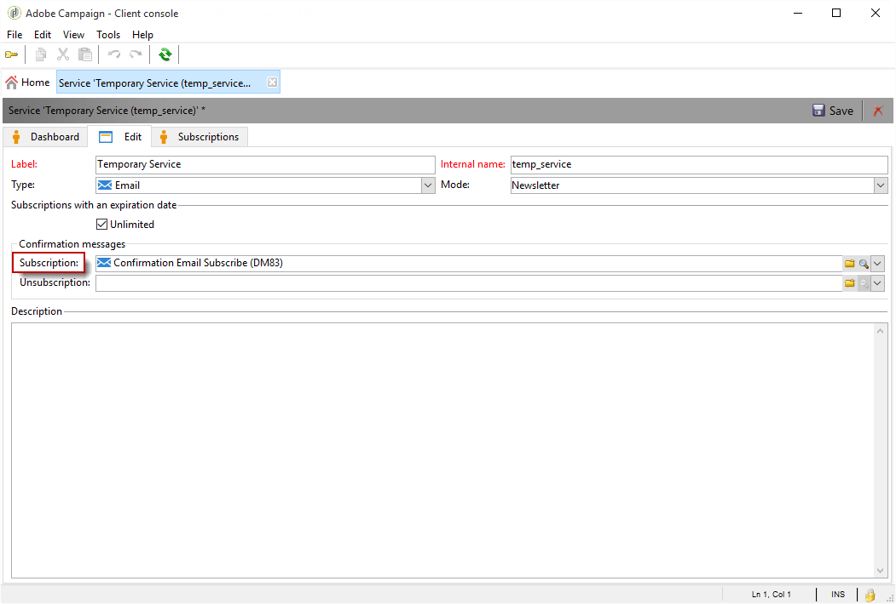
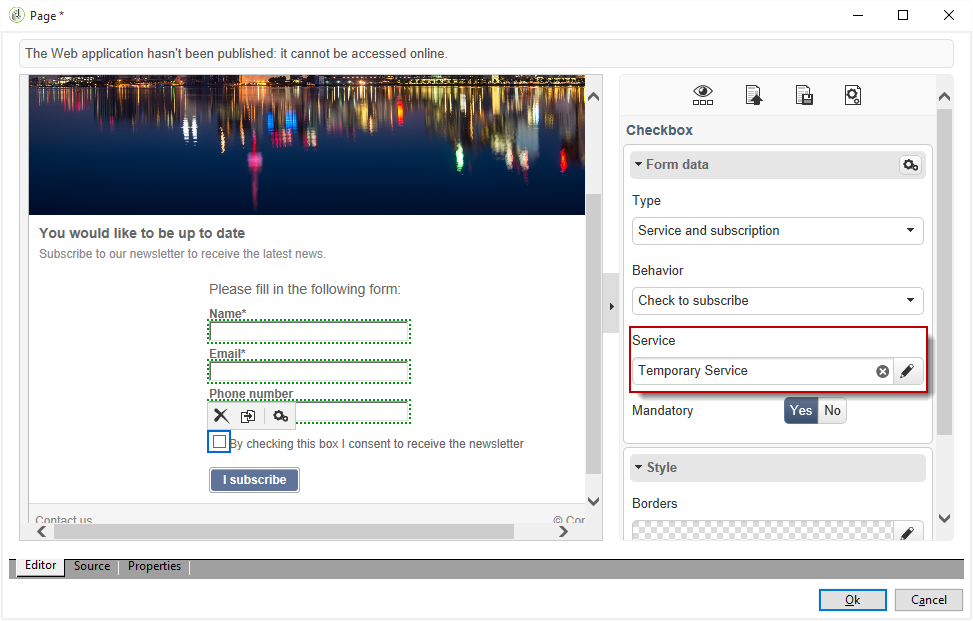

# 使用實例：網路表單{#use-cases-web-forms}


## 建立包含雙重選擇加入的訂閱表單 {#create-a-subscription--form-with-double-opt-in}

提供資訊服務時，收件者必須訂閱才能接收所有連結的通訊。 為避免通訊不當並確保收件者刻意訂閱，建議您傳送訂閱確認請求以建立雙重選擇加入。 只有當使用者按一下確認訊息中包含的連結時，訂閱才會生效。

此範例根據下列情境而定：

1. 在包含訂閱暫時服務核取方塊的網站上建立電子報訂閱表單。 此服務可讓您傳遞訂閱確認訊息。
1. 使用連結至網頁表單的傳遞範本建立訂閱確認傳遞。 其中包含確認連結，可呼叫電子報訂閱的表單，並顯示訂閱核准訊息。

### 步驟1 — 建立資訊服務 {#step-1---creating-information-services}

1. 建立要提供給收件者的電子報訂閱服務。 如需如何建立Newsletter的詳細資訊，請參閱[本節](../../delivery/using/about-services-and-subscriptions.md)。

   

1. 建立第二個資訊服務，此服務是連結至傳遞範本的暫時服務，用於傳送訂閱確認訊息。

   

### 步驟2 — 建立確認訊息 {#step-2---creating-confirmation-messages}

確認訊息會透過在臨時服務層級參考的專用傳遞範本傳送。

1. 在&#x200B;**[!UICONTROL Explorer]**&#x200B;中，選取&#x200B;**[!UICONTROL Resources > Templates > Delivery templates]**。
1. 建立傳送訂閱確認訊息的傳遞範本。
1. 按一下&#x200B;**[!UICONTROL Email parameters]**&#x200B;中的&#x200B;**[!UICONTROL To]**&#x200B;按鈕，將傳遞範本與訂閱目標對應而非收件者建立關聯。

   

1. 由於此傳遞的收件者尚未確認其核准，因此他們仍位於資料庫封鎖清單中。 為了讓收件者接收此通訊，您必須根據此範本授權傳遞至封鎖清單上的目標收件者。

   若要這麼做，請按一下&#x200B;**[!UICONTROL Exclusions]**&#x200B;標籤。

1. 按一下&#x200B;**[!UICONTROL Edit...]**&#x200B;連結，並取消勾選&#x200B;**[!UICONTROL Exclude recipients who no longer want to be contacted]**&#x200B;選項。

   <!-- -->

   >[!IMPORTANT]
   >
   >此選項只能在此型別的內容中停用。

1. 個人化您的傳遞，並將確認連結插入訊息內容。 此連結可讓您存取網路表單，以記錄訂閱確認。

   

1. 使用DCE，將您的URL連結至網頁表單。 由於尚未建立網頁表單，請在建立後立即取代值。

   

1. 最後，將此範本連結至先前建立的臨時服務。

   

### 步驟3 — 建立訂閱表單 {#step-3---creating-the-subscription-form}

網頁表單會同時啟用收件者訂閱和訂閱確認。

網路表單工作流程將包含下列活動：


要執行此操作，請遵循下列步驟：

1. 建立網路表單並選擇範本&#x200B;**[!UICONTROL Newsletter subscription (subNewsletter)]**。

   

1. 在&#x200B;**[!UICONTROL Edit]**&#x200B;索引標籤中，我們需要設定現有的工作流程，因為我們要新增確認訊息給要訂閱的收件者。

   若要這麼做，請連按兩下&#x200B;**[!UICONTROL Preloading]**&#x200B;方塊並按如下方式設定。

   

   這表示如果使用者透過確認訊息中的連結存取此表單，則會載入其設定檔資訊。 如果他們透過網站的頁面存取網頁表單，則不會載入任何資訊。

1. 將&#x200B;**[!UICONTROL Test]**&#x200B;活動新增至工作流程。

   

   **[!UICONTROL Test]**&#x200B;活動可能涉及收件者電子郵件。 在此情況下，請依照以下方式設定：

   

1. 新增兩個&#x200B;**[!UICONTROL Script]**&#x200B;活動至您的工作流程。

   

   前&#x200B;**[!UICONTROL Script]**&#x200B;個活動會將收件者新增至封鎖清單中，直到他們確認訂閱電子報為止。 其內容必須如下：

   ```
   ctx.recipient.@blackList=1
   ```

   

   第二個&#x200B;**[!UICONTROL Script]**&#x200B;活動會授權傳送給使用者，並訂閱電子報。 指令碼的最後兩行將可讓您將收件者從暫存資料夾轉移至另一個資料夾，並在他們確認訂閱後立即與現有設定檔進行調解。

   ```
   ctx.recipient.@blackList=0
   nms.subscription.Subscribe("INTERNAL_NAME_OF_THE_NEWSLETTER", ctx.recipient, false)
   ctx.recipient.folder = <folder name="nmsRootRecipient"/>
   nms.subscription.Unsubscribe("TEMP", ctx.recipient)
   ```

   >[!NOTE]
   >
   >也可以使用工作流程定期清除&#x200B;**[!UICONTROL Temp]**&#x200B;資料分割。

   

1. 連按兩下&#x200B;**[!UICONTROL Subscription]**&#x200B;活動以個人化訂閱表單，並將核取方塊與先前建立的臨時服務連結。

   

1. 設定&#x200B;**[!UICONTROL Storage]**&#x200B;活動以儲存表單頁面中輸入的資訊。

   此活動可讓您在專用的臨時資料夾中建立收件者設定檔，將它們與資料庫中可傳送通訊的設定檔區分開。

   

   >[!NOTE]
   >
   >您不得定義任何調解選項。

1. 新增兩個&#x200B;**[!UICONTROL End]**&#x200B;活動來為使用者顯示訊息。

   訂閱完成後，第二個&#x200B;**[!UICONTROL End]**&#x200B;方塊將顯示確認訊息。

   

1. 建立及設定網頁表單後，您現在可以在傳送範本中參考該表單，以傳送確認訊息。

   

### 步驟4 — 發佈和測試表單 {#step-4---publishing-and-testing-the-form}

您現在可以發佈表單，讓使用者能夠存取。


訂閱電子報涉及以下步驟：

1. 網站使用者登入訂閱頁面並核准表單。

   

   使用者會透過瀏覽器中的訊息收到通知，告知其請求已納入考量。

   

   使用者已新增至&#x200B;**[!UICONTROL Temp]**&#x200B;資料夾中的Adobe Campaign資料庫，且他們的設定檔已加入封鎖清單，直到他們透過電子郵件確認訂閱為止。

   

1. 系統會將確認訊息（包含核准其訂閱的連結）傳送給他們。

   

1. 當使用者按一下此連結時，其瀏覽器中會顯示核准頁面。

   

   在Adobe Campaign中，使用者設定檔已更新：

   * 他們不再位於封鎖清單中，
   * 他們訂閱了資訊服務。

     

## 根據選取的值顯示不同的選項 {#displaying-different-options-depending-on-the-selected-values}

在下列範例中，系統會要求使用者選取車輛型別。 您可以根據選取的型別顯示可用的車輛類別。 這表示右側欄中顯示的專案取決於使用者的選擇：


* 當使用者選擇「私家車」時，可選擇「緊密」和「小貨車」。

  

* 當使用者選擇「商用車輛」時，選擇專案會顯示在下拉式清單中：

  

在此範例中，車輛型別不會儲存在資料庫中。 下拉式清單的設定如下：


此資訊儲存在區域變數中。

在容器中設定右側欄的條件式顯示：


* 適用於私人車輛的條件式欄位可見性：

  

* 商用車輛的條件式欄位可見性：

  
