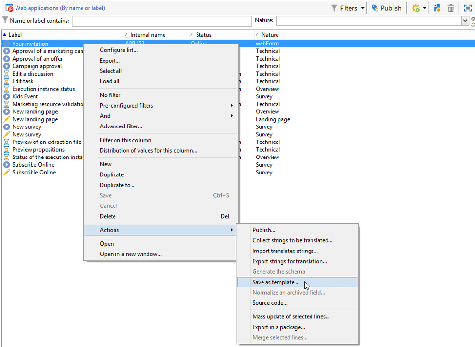

# 使用網路表單範本{#using-a-web-form-template}

表單模板是可重用的配置，使您可以建立新表單。 預設情況下，表單模板與Web應用程式模板一起儲存在 **[!UICONTROL Resources > Templates > Web application templates]** 的下界。

在此，您可以建立新模板或將現有表單轉換為模板。

## 將現有表單轉換為模板 {#convert-an-existing-form-into-a-template}

可以將表單更改為模板並重新使用其配置。 要執行此操作，請選擇表單，按一下右鍵並選擇 **[!UICONTROL Actions > Save as template...]**。

此操作將開啟建立Web應用程式的窗口。 您可以輸入模板的名稱和說明，並選擇將保存該模板的資料夾。

## 建立新表單模板 {#create-a-new-form-template}

要建立Web表單模板，請按一下右鍵Web應用程式模板清單並選擇 **[!UICONTROL New]**。 您還可以使用 **[!UICONTROL New]** 按鈕。

輸入模板的名稱。 在 **[!UICONTROL Instance folder]** 欄位，選擇保存基於此模板建立的Web表單的資料夾。 的 **[!UICONTROL Nature]** 欄位中，您可以添加描述性資訊來對各種Web應用程式模板進行排序和/或篩選。

按一下 **[!UICONTROL Save]** 按鈕，然後生成此模板的內容並定義其參數。

現在，在建立新表單時，可以選擇此模板。
