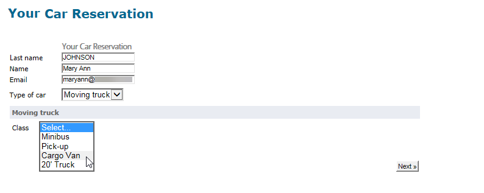

# Web表格解答{#web-forms-answers}

## 響應儲存欄位 {#response-storage-fields}

表單答案可儲存在資料庫的欄位中，或暫時儲存在本機變數中。 欄位建立期間會選擇答案的儲存模式。 您可透過連結編輯 **[!UICONTROL Edit storage...]** 它。

對於表單中的每個輸入欄位，可使用以下儲存選項：


* **[!UICONTROL Edit a recipient]**

   可以選擇資料庫的欄位：使用者的答案會儲存在此欄位中。 對於每個用戶，僅保存最後輸入的值：新增至其設定檔：請參閱 [在資料庫中儲存資料](#storing-data-in-the-database)。

* **[!UICONTROL Variable]**

   如果您不想將資訊儲存在資料庫中，則可使用變數。 局部變數可宣告在上游。 請參閱將 [資料儲存在本機變數中](#storing-data-in-a-local-variable)。

### 在資料庫中儲存資料 {#storing-data-in-the-database}

要將資料保存在資料庫的現有欄位中，請按一下該圖 **[!UICONTROL Edit expression]** 標並從可用欄位清單中選擇它。


>[!NOTE]
>
>預設參考文檔是 **nms:recipient** schema。 要查看或選擇新表單，請從清單中選擇表單，然後按一下按 **[!UICONTROL Properties]** 鈕。

### 將資料儲存在本機變數中 {#storing-data-in-a-local-variable}

您可以使用局部變數，以便即使資料未儲存在資料庫中，也能在頁面或其他頁面上重複使用資料，例如在顯示欄位時放置條件或個人化訊息。

這表示您可以使用未儲存欄位的值，授權在頁面上顯示一組選項。 在以下頁面中，車輛類型不儲存在資料庫中：


它會儲存在變數中，此變數在建立下拉式方塊時必須選取，或透過連結 **[!UICONTROL Edit storage...]** 選取。


您可以透過連結顯示現有變數並建立新 **[!UICONTROL Edit variables...]** 變數。 按一下 **[!UICONTROL Add]** 按鈕以建立新變數。


建立頁面的輸入欄位時，新增的變數將可在本機變數清單中使用。

>[!NOTE]
>
>您可以針對每個表單在上游建立變數。 若要這麼做，請選取表單，然後按一下 **[!UICONTROL Properties]** 按鈕。 該選 **[!UICONTROL Variables]** 項卡包含表單的本地變數。

**具有條件的本地儲存示例**

在上述範例中，只有從下拉式清單中選取選項（如可見性條件所指示）時，才會顯示包含私人車輛相關資料的容器： **[!UICONTROL Private]**


如果使用者選擇私用車輛，Web表格會提供下列選項：


如果選擇「專業版」選項，則顯示保存與商用車相關資料的容器，如可見性條件所示：


這表示，如果使用者選擇商業車輛，表單會提供下列選項：



## 使用收集的資訊 {#using-collected-information}

對於每個表單，所提供的答案都可在欄位或標籤中重複使用。 必須使用下列語法：

* 對於儲存在資料庫欄位中的內容：

   ```
   <%=ctx.recipient.@field name%
   ```

* 若是儲存在本機變數中的內容：

   ```
   <%= ctx.vars.variable name %
   ```

* 對於儲存在HTML文字欄位中的內容：

   ```
   <%== HTML field name %
   ```

   >[!NOTE]
   >
   >與其他字元被逸 `<%=` 出字元取代的欄位不同，HTML內容會使用語法以原樣儲存 `<%==` 。

## 儲存Web表格答案 {#saving-web-forms-answers}

要保存在表單頁面中收集的資訊，您需要在圖中放置一個儲存框。


使用此方塊有兩種方式：

* 如果Web表單是透過電子郵件中傳送的連結來存取，而且存取應用程式的使用者已在資料庫中，您可以勾選該選 **[!UICONTROL Update the preloaded record]** 項。 如需詳細資訊，請參閱「透 [過電子郵件傳送表格」](../../web/using/publishing-a-web-form.md#delivering-a-form-via-email)。

   在這種情況下，Adobe Campaign會使用使用者設定檔的加密主要金鑰，這是Adobe Campaign指派給每個設定檔的唯一識別碼。 您需要設定資訊，以透過預載方塊預載。 如需詳細資訊，請參 [閱預先載入表單資料](../../web/using/publishing-a-web-form.md#pre-loading-the-form-data)。

   >[!CAUTION]
   >
   >此選項會覆寫使用者資料，如果有欄位要輸入，則包括電子郵件地址。 它無法用於建立新配置檔案，並需要在表單中使用預載入框。

* 要豐富資料庫中收件人的資料，請編輯儲存框並選擇協調密鑰。 對於內部使用（通常是內部網路系統）或用於建立新配置檔案（例如）的表單，您可以選擇協調欄位。 該框提供Web應用程式各頁中所用資料庫的所有欄位：

   

預設情況下，資料通過以下操作導入到數 **[!UICONTROL Update or insertion]** 據庫：如果元素存在於資料庫中，則會更新元素（例如，選取的電子報或輸入的電子郵件地址）。 如果不存在，則會添加資訊。

不過，您可以變更此行為。 要執行此操作，請選擇元素的根，然後從下拉清單中選擇要執行的操作：


您可以選擇協調的搜索資料夾和新配置檔案的建立資料夾。 如果這些欄位為空白，則會在運算子的預設資料夾中搜尋並建立描述檔。

>[!NOTE]
>
>可能的操作包括： **[!UICONTROL Simple reconciliation]**, **[!UICONTROL Update or insertion]****[!UICONTROL Insertion]**, **[!UICONTROL Update]**, **[!UICONTROL Deletion]**。\
>操作員的預設資料夾是操作員具有寫權限的第一個資料夾。\
>Refer to [this section](../../platform/using/access-management.md).

