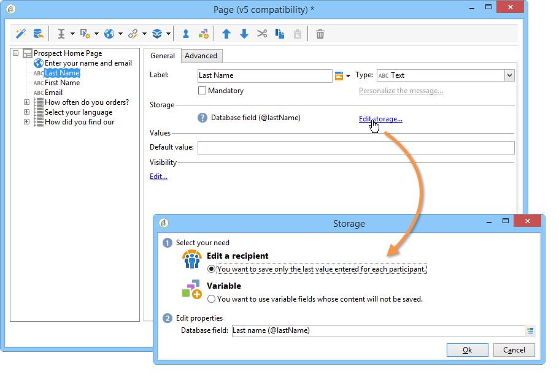

# 網路表單答案{#web-forms-answers}


## 回應儲存欄位 {#response-storage-fields}

表單的答案可儲存在資料庫的欄位中，或暫時儲存在本機變數中。 答案的儲存模式是在欄位建立期間選擇的。 可透過進行編輯 **[!UICONTROL Edit storage...]** 連結。

針對表單中的每個輸入欄位，可使用下列儲存選項：



* **[!UICONTROL Edit a recipient]**

  您可以選取資料庫的欄位：使用者的回答會儲存在此欄位中。 對於每個使用者，僅儲存最後輸入的值：它被新增到他們的設定檔：請參閱 [將資料儲存在資料庫中](#storing-data-in-the-database).

* **[!UICONTROL Variable]**

  如果您不想將資訊儲存在資料庫中，可以使用變數。 區域變數可以宣告到上游。 請參閱 [將資料儲存在區域變數中](#storing-data-in-a-local-variable).

### 將資料儲存在資料庫中 {#storing-data-in-the-database}

若要將資料儲存在資料庫的現有欄位中，請按一下 **[!UICONTROL Edit expression]** 圖示並從可用欄位清單中選取它。


>[!NOTE]
>
>預設參考檔案為 **nms：recipient** 綱要。 若要檢視表單或選擇新表單，請從清單中選取表單，然後按一下 **[!UICONTROL Properties]** 按鈕。

### 將資料儲存在區域變數中 {#storing-data-in-a-local-variable}

您可以使用區域變數，即使資料未儲存在資料庫中，也可以在頁面或其他頁面上重複使用，例如將條件放在欄位顯示上，或個人化訊息。

這表示您可以使用未儲存欄位的值來授權在頁面上顯示一組選項。 在以下頁面中，車輛型別未儲存在資料庫中：


儲存在變數中，建立下拉式方塊時或透過時必須選取該變數 **[!UICONTROL Edit storage...]** 連結。


您可以顯示現有變數，並透過以下方式建立新變數： **[!UICONTROL Edit variables...]** 連結。 按一下 **[!UICONTROL Add]** 按鈕以建立新變數。


建立頁面的輸入欄位時，新增的變數將可在本機變數清單中使用。

>[!NOTE]
>
>您可以為每個表單上游建立變數。 要執行此操作，請選取表單並按一下 **[!UICONTROL Properties]** 按鈕。 此 **[!UICONTROL Variables]** 索引標籤包含表單的本機變數。

**有條件化的本機儲存範例**

在上述範例中，包含私家車相關資料的容器僅在 **[!UICONTROL Private]** 從下拉式清單中選取選項，如可見性條件中所示：


如果使用者選擇私人車輛，網路表單會提供下列選項：


如果選取「專業」選項，則會顯示內含商業車輛相關資料的容器，如可見度條件所示：


這表示，如果使用者選取商業車輛，表單會提供下列選項：


## 使用收集的資訊 {#using-collected-information}

對於每個表單，提供的答案可以在欄位或標籤中重複使用。 必須使用下列語法：

* 對於儲存在資料庫欄位中的內容：

  ```
  <%=ctx.recipient.@field name%
  ```

* 針對儲存在區域變數中的內容：

  ```
  <%= ctx.vars.variable name %
  ```

* 對於儲存在HTML文字欄位中的內容：

  ```
  <%== HTML field name %
  ```

  >[!NOTE]
  >
  >與其他欄位不同， `<%=` 使用逸出字元取代字元，HTML內容會依原樣儲存： `<%==` 語法。

## 儲存網路表單答案 {#saving-web-forms-answers}

若要儲存表單頁面中所收集的資訊，您需要在圖表中放置儲存方塊。


使用此方塊有兩種方式：

* 如果透過電子郵件中傳送的連結存取Web表單，而且存取應用程式的使用者已經在資料庫中，您可以檢查 **[!UICONTROL Update the preloaded record]** 選項。 有關詳細資訊，請參閱 [透過電子郵件傳遞表單](publishing-a-web-form.md#delivering-a-form-via-email).

  在這種情況下，Adobe Campaign會使用使用者設定檔的加密主金鑰，即Adobe Campaign指派給每個設定檔的唯一識別碼。 您需要設定要透過預先載入方塊預先載入的資訊。 有關詳細資訊，請參閱 [預先載入表單資料](publishing-a-web-form.md#pre-loading-the-form-data).

  >[!CAUTION]
  >
  >如果有欄位可輸入，此選項會覆寫使用者資料，包括電子郵件地址。 它無法用來建立新的設定檔，而且需要在表單中使用預先載入方塊。

* 若要擴充資料庫中收件者的資料，請編輯儲存方塊並選取調解金鑰。 對於內部使用（通常是內部網路系統）或用來建立新設定檔的表單，您可以選取調解欄位。 方塊提供Web應用程式各個頁面中所使用之資料庫的所有欄位：

  

依預設，資料會由匯入資料庫的 **[!UICONTROL Update or insertion]** 作業：如果資料庫中存在元素，則會更新元素（例如，選取的newsletter或輸入的電子郵件地址）。 如果不存在，則會新增資訊。

不過，您可以變更此行為。 要執行此操作，請選取元素的根目錄，然後從下拉式清單中選取要執行的操作：


您可以選取要調解的搜尋資料夾，以及新設定檔的建立資料夾。 如果這些欄位為空，則會搜尋設定檔並在運運算元的預設資料夾中建立。

>[!NOTE]
>
>可能的操作包括： **[!UICONTROL Simple reconciliation]**， **[!UICONTROL Update or insertion]**， **[!UICONTROL Insertion]**， **[!UICONTROL Update]**， **[!UICONTROL Deletion]**.\
>操作員的預設資料夾是操作員具有寫入許可權的第一個資料夾。\
>請參閱[本節](../../platform/using/access-management.md)。
