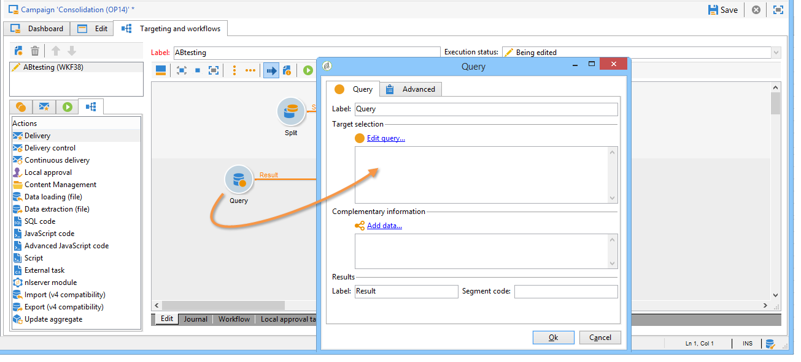
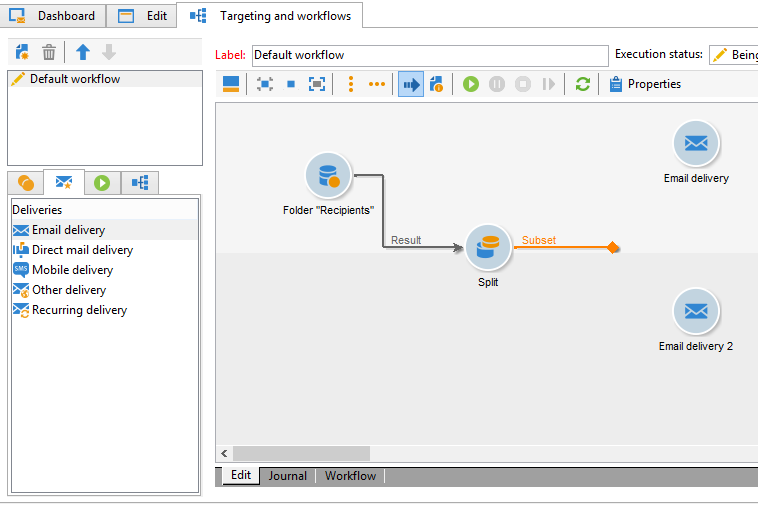
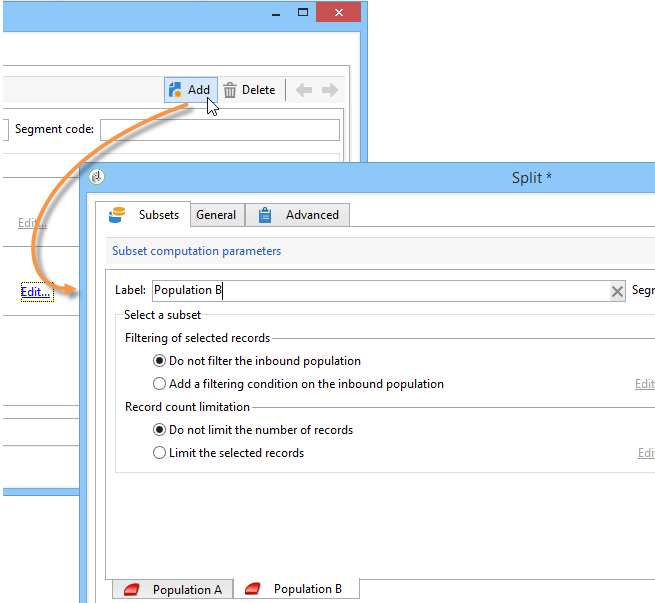
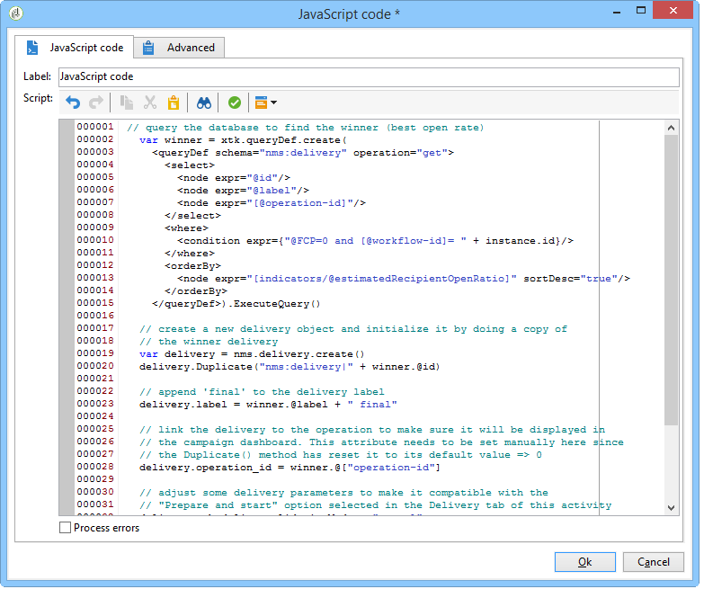

# A/B測試{#a-b-testing}

如果您有數個電子郵件傳送內容，而您想瞭解哪個版本對目標群體的影響最大，您可以將不同版本傳送給部分收件者，然後選取成功率最高的版本，並傳送給其他收件者。

在此使用案例中，我們將透過定位工作流程來比較兩個電子郵件傳送內容。 訊息和文字在兩個傳送中都相同：只會變更版面。

目標人口分為三：兩個測試群組和其餘人口。 傳送的不同版本會傳送至每個測試群組。 傳送後，會先設定5天的等待期，再收集最佳開放率的結果。 然後指令碼會復原分數最高的傳送內容，並傳送至未用作測試群組的人口族群。

請注意，將決定哪個傳送方式最佳的准則，可能會因應您的需求而改變。 可以是開放率、點進率、訂閱率、反應性等。

此外，本使用案例中詳述的測試僅涉及兩個傳送，但您可以視需要測試任意多個版本。 只需將活動新增至工作流程即可。

若要建立A/B測試，請套用下列步驟：

* [步驟1:建立定位工作流程](#step-1--creating-a-targeting-workflow)
* [步驟2:配置人口樣本](#step-2--configuring-population-samples)
* [步驟3:建立兩個傳送範本](#step-3--creating-two-delivery-templates)
* [步驟4:在工作流程中設定傳送](#step-4--configuring-the-deliveries-in-the-workflow)
* [步驟5:建立指令碼](#step-5--creating-the-script)
* [步驟7:啟動工作流](#step-7--starting-the-workflow)
* [步驟8:分析結果](#step-8--analyzing-the-result)。

## 步驟1:建立定位工作流程 {#step-1--creating-a-targeting-workflow}

您必須在促銷活動的標籤中 **[!UICONTROL Targeting and Workflows]** 建立工作流程。 它由活動、與兩個活 **[!UICONTROL Query]** 動連結的活 **[!UICONTROL Split]** 動、活動、活 **[!UICONTROL Email delivery]** 動和活 **[!UICONTROL Wait]** 動組成 **[!UICONTROL JavaScript code]****[!UICONTROL Delivery]** 。

1. 如果您尚未建立促銷活動，請建立促銷活動(如需詳細資訊，請參閱此 [節](../../campaign/using/setting-up-marketing-campaigns.md#creating-a-campaign))。

   

1. 轉至標 **[!UICONTROL Targeting and Workflows]** 簽。

   

1. 變更現有工作流程的標籤或按一 **[!UICONTROL Add]** 下以建立新工作流程(如需詳細資訊，請參閱本 [節](../../campaign/using/marketing-campaign-deliveries.md#selecting-the-target-population))。

   

1. 使用滑鼠將活動拖放到工作流中，包括 **[!UICONTROL Query]** (**[!UICONTROL Target]** )、( **[!UICONTROL Split]** tab)、兩個&#x200B;**[!UICONTROL Target]** (tab)、活動(tab)、活動(tab)、活動 **[!UICONTROL Email deliveries]****[!UICONTROL Deliveries]****[!UICONTROL Wait]****[!UICONTROL Flow Control]****[!UICONTROL JavaScript code]****[!UICONTROL Actions]****[!UICONTROL Delivery]****[!UICONTROL Actions]** (tab)、活動(tab)和活動(tab)。


## 步驟2:配置人口樣本 {#step-2--configuring-population-samples}

### 配置查詢活動 {#configuring-the-query-activity}

* 連按兩下活 **[!UICONTROL Query]** 動。

   

* 按一下 **[!UICONTROL Edit query]** 連結，然後選取您要定位的收件者。

   

* 將活動 **[!UICONTROL Query]** 連結至活 **[!UICONTROL Split]** 動。

   

### 配置拆分活動 {#configuring-the-split-activity}

此活動可讓您建立數個人口族群：接收遞送A的遞送B的遞送B的遞送B的遞送A和剩餘的人口。 使用隨機選擇可讓您只鎖定每個傳送的部分人口。

1. 建立人口A:

   * 連按兩下活 **[!UICONTROL Split]** 動。

      

   * 在現有標籤中，將標籤變更為填入A。

      

   * 選擇選 **[!UICONTROL Limit the selected records]** 項。

      

   * 按一下 **[!UICONTROL Edit]** 連結，選 **[!UICONTROL Activate random sampling]**&#x200B;取並按一下 **[!UICONTROL Next]**。

      

   * 將臨界值設為10%，然後按一下 **[!UICONTROL Finish]**。

      

1. 建立人口B:

   * 按一 **[!UICONTROL Add]** 下以建立人口B的新標籤。

      

   * 將人口限制為先前的10%。

      

1. 建立剩餘人口：

   * 轉至標 **[!UICONTROL General]** 簽。

      

   * Select **[!UICONTROL Generate complement]**.

      

   * 變更標籤以指定此人口族群既不包含A也不包含B，然後按一下 **[!UICONTROL OK]** 以關閉活動。

      

## 步驟3:建立兩個傳送範本 {#step-3--creating-two-delivery-templates}

我們現在想要建立兩個傳送範本。 每個範本都會在連結至活 **[!UICONTROL Email delivery]** 動的活動中引 **[!UICONTROL Split]** 用。 For more on this, refer to this [section](../../delivery/using/about-templates.md).

1. 前往資料 **[!UICONTROL Resources > Delivery template]** 夾。
1. 複製傳 **[!UICONTROL Email]** 送範本。

   

1. 建立要用於傳送A的內容。

   

1. 重複此程式以建立傳送B的範本。

   

## 步驟4:在工作流程中設定傳送 {#step-4--configuring-the-deliveries-in-the-workflow}

下一步是設定傳送。 它們的目的地是在前一個階段建立的三個人口：步 [驟2:配置人口樣本](#step-2--configuring-population-samples)。 前兩個傳送可讓您傳送不同的內容給人口A和B。第三批貨物的目的地是既未收到A也未收到B的人口。其內容將由指令碼計算，並會與A或B相同，視哪一個開啟率最高而定。 我們需要設定第三個交貨的等待期，以瞭解交貨A和B的結果。這就是為什麼第三個傳送包含活 **[!UICONTROL Wait]** 動。

1. 移至活動 **[!UICONTROL Split]** 並將目的地為人口A的轉場連結至工作流程中已傳送的其中一個電子郵件。

   

1. 連按兩下傳送以開啟。
1. 使用下拉式清單，選取傳送A的範本。

   

1. 按一 **[!UICONTROL Continue]** 下以檢視傳送，然後儲存。

   

1. 將目的地為人口B **[!UICONTROL Split]** 的活動轉換連結至第二封電子郵件傳送。

   

1. 開啟傳送並選取傳送B中的範本，然後儲存傳送。

   

1. 將目的地為剩餘人口的轉場連結至活 **[!UICONTROL Wait]** 動。

   

1. 開啟 **[!UICONTROL Wait]** 活動並設定5天等候期。

   

1. 將活動 **[!UICONTROL Wait]** 連結至活 **[!UICONTROL JavaScript code]** 動。

   

## 步驟5:建立指令碼 {#step-5--creating-the-script}

指令碼會計算針對剩餘人口的傳送內容選擇。 此指令碼會以最高開啟率來恢復傳送的相關資訊，並將內容複製至最終傳送。

### 指令碼範例 {#example-of-a-script}

以下指令碼可如同在定位工作流程中使用。 For more on this, refer to [Implementation](#implementation).

```
 // query the database to find the winner (best open rate)
   var winner = xtk.queryDef.create(
     <queryDef schema="nms:delivery" operation="get">
       <select>
         <node expr="@id"/>
         <node expr="@label"/>
         <node expr="[@operation-id]"/>
         <node expr="[@workflow-id]"/>
       </select>
       <where>
         <condition expr={"@FCP=0 and [@workflow-id]= " + instance.id}/>
       </where>
       <orderBy>
         <node expr="[indicators/@estimatedRecipientOpenRatio]" sortDesc="true"/>
       </orderBy>
     </queryDef>).ExecuteQuery()
   
   // create a new delivery object and initialize it by doing a copy of
   // the winner delivery
   var delivery = nms.delivery.create()
   delivery.Duplicate("nms:delivery|" + winner.@id)

   // append 'final' to the delivery label
   delivery.label = winner.@label + " final"

   // link the delivery to the operation to make sure it will be displayed in
   // the campaign dashboard. This attribute needs to be set manually here since 
   // the Duplicate() method has reset it to its default value => 0
   delivery.operation_id = winner.@["operation-id"]
   delivery.workflow_id = winner.@["workflow-id"]

   // adjust some delivery parameters to make it compatible with the 
   // "Prepare and start" option selected in the Delivery tab of this activity
   delivery.scheduling.validationMode = "manual"
   delivery.scheduling.delayed = 0
 
   // save the delivery in database
   delivery.save()
 
   // store the new delivery Id in event variables
   vars.deliveryId = delivery.id
```

有關指令碼的詳細說明，請參 [閱指令碼詳細資訊](#details-of-the-script)。

### 實作 {#implementation}

1. 開啟您的 **[!UICONTROL JavaScript code]** 活動。
1. 將「指令碼範例 [」中提供的指令碼複製](#example-of-a-script) ，到 **[!UICONTROL JavaScript code]** 視窗中。

   

1. 在字 **[!UICONTROL Label]** 段中，輸入指令碼的名稱，即

   ```
   <%= vars.deliveryId %>
   ```

   

1. 關閉活 **[!UICONTROL JavaScript code]** 動。
1. 儲存您的工作流程。

### 指令碼的詳細資訊 {#details-of-the-script}

本節詳細說明指令碼的各個部分及其操作模式。

* 指令碼的第一部分是查詢。 使 **用queryDef** 命令可以從 **NmsDelivery** 表中恢復通過執行定位工作流建立的傳送，並根據其估計的開啟率對傳送進行排序，然後恢復具有最高開啟率的傳送資訊。

   ```
   // query the database to find the winner (best open rate)
      var winner = xtk.queryDef.create(
        <queryDef schema="nms:delivery" operation="get">
          <select>
            <node expr="@id"/>
            <node expr="@label"/>
            <node expr="[@operation-id]"/>
          </select>
          <where>
            <condition expr={"@FCP=0 and [@workflow-id]= " + instance.id}/>
          </where>
          <orderBy>
            <node expr="[indicators/@estimatedRecipientOpenRatio]" sortDesc="true"/>
          </orderBy>
        </queryDef>).ExecuteQuery()
   ```

* 複製開啟率最高的傳送。

   ```
    // create a new delivery object and initialize it by doing a copy of
    // the winner delivery
   var delivery = nms.delivery.create()
   delivery.Duplicate("nms:delivery|" + winner.@id)
   ```

* 已修改複製傳送的標籤，並將詞 **詞** final新增至標籤。

   ```
   // append 'final' to the delivery label
   delivery.label = winner.@label + " final"
   ```

* 傳送會複製到促銷活動控制面板。

   ```
   // link the delivery to the operation to make sure it will be displayed in
   // the campaign dashboard. This attribute needs to be set manually here since 
   // the Duplicate() method has reset it to its default value => 0
   delivery.operation_id = winner.@["operation-id"]
   delivery.workflow_id = winner.@["workflow-id"]
   ```

   ```
   // adjust some delivery parameters to make it compatible with the 
   // "Prepare and start" option selected in the Delivery tab of this activity
   delivery.scheduling.validationMode = "manual"
   delivery.scheduling.delayed = 0
   ```

* 傳送會儲存在資料庫中。

   ```
   // save the delivery in database
   delivery.save()
   ```

* 複製傳送的唯一識別碼會儲存在工作流程變數中。

   ```
   // store the new delivery Id in event variables
   vars.deliveryId = delivery.id
   ```

### 其他選擇標準 {#other-selection-criteria}

上述範例可讓您根據電子郵件的開啟率來選取傳送的內容。 您可以根據其他特定遞送指標來調整：

* 最佳點按吞吐量： `[indicators/@recipientClickRatio]`、
* 最高反應率（開啟電子郵件並點擊訊息）: `[indicators/@reactivity]`、
* 最低投訴率： `[indicators/@refusedRatio]` （對sortDesc屬性使用false值）,
* 最高轉換率： `[indicators/@transactionRatio]`、
* 收到訊息後瀏覽的頁數： `[indicators/@totalWebPage]`、
* 最低取消訂閱率： `[indicators/@optOutRatio]`、
* 事務處理金額： `[indicators/@amount]`。

## 步驟6:定義最終交付 {#step-6--defining-the-final-delivery}

建立指令碼以選取A/B測試成功者後，您就可以定義最終傳送的參數。

1. 將活動 **[!UICONTROL JavaScript code]** 連接到其餘活 **[!UICONTROL Delivery]** 動。
1. 開啟活 **[!UICONTROL Delivery]** 動。
1. 取消選 **[!UICONTROL Generate an outbound transition]** 中此選項可完成此活動的工作流。
1. 將其他選項保留為其預設值。

   

準備在轉場中指定的傳送(透過活 **[!UICONTROL Javascript Code]** 動定義)後，您就可以核准傳送，並開始傳送，如下一步所述。

## 步驟7:啟動工作流 {#step-7--starting-the-workflow}

1. 按一下 **[!UICONTROL Start]** 工作流程。

   

1. 透過促銷活動控制面板核准傳送A和B的目標和內容。
1. 確認傳送。
1. 等到5天時段結束，以找出在傳送開始結果後計算的內容。

   

   在此情況下，選擇範本B。

1. 確定第三個傳送的內容後，請核准目標和內容。

## 步驟8:分析結果 {#step-8--analyzing-the-result}

在傳送測試傳送後，您可以檢查哪些收件者已傳送至，以及是否已開啟。

* 若要找出已定位哪些收件者，請透過促銷活動控制面板開啟傳送，然後按一下標 **[!UICONTROL Delivery]** 簽。

   

* 若要瞭解傳送是否已開啟，請前往標籤 **[!UICONTROL Tracking]** 頁。

   

* 請比較其他傳送方式。

   

在我們的例子中，傳送B的開放率最高。 這表示內容B將用於最終傳送。


