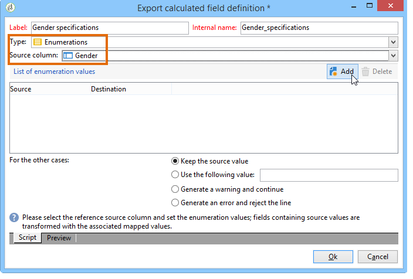

# 添加枚舉類型計算欄位 {#adding-an-enumeration-type-calculated-field}

在此處，我們要建立具有&#x200B;**[!UICONTROL Enumerations]**&#x200B;類型計算欄位的查詢。 此欄位將在資料預覽視窗中產生額外的欄。 此欄將為每個收件者（0、1和2）指定結果傳回的數值。 新欄中的每個值都會指派性別：&quot;Male&quot;代表&quot;1&quot;,&quot;Femole&quot;代表&quot;2&quot;，如果值等於&quot;0&quot;則代表&quot;Not indiced&quot;。

* 需要選取哪個表格？

   收件者表格(nms:recipient)

* 要在輸出列中選擇的欄位？

   姓氏，名字，性別

* 要根據哪個條件篩選資訊？

   收件者語言

應用以下步驟：

1. 開啟「一般查詢編輯器」並選取「收件者」表格(**[!UICONTROL nms:recipient]**)。
1. 在&#x200B;**[!UICONTROL Data to extract]**&#x200B;窗口中，選擇&#x200B;**[!UICONTROL Last name]**、**[!UICONTROL First name]**&#x200B;和&#x200B;**[!UICONTROL Gender]**。

   

1. 在&#x200B;**[!UICONTROL Sorting]**&#x200B;視窗中，按一下&#x200B;**[!UICONTROL Next]**:此範例不需要排序。
1. 在 **[!UICONTROL Data filtering]** 中選取 **[!UICONTROL Filtering conditions]**。
1. 在&#x200B;**[!UICONTROL Target element]**&#x200B;視窗中，設定篩選條件以收集說英文的收件者。

   

1. 在&#x200B;**[!UICONTROL Data formatting]**&#x200B;窗口中，按一下&#x200B;**[!UICONTROL Add a calculated field]**。

   

1. 轉至&#x200B;**[!UICONTROL Export calculated field definition]**&#x200B;窗口的&#x200B;**[!UICONTROL Type]**&#x200B;窗口，然後選擇&#x200B;**[!UICONTROL Enumerations]**。

   定義新計算欄位必須參考的欄。 要執行此操作，請在&#x200B;**[!UICONTROL Source column]**&#x200B;欄位的下拉式選單中選取&#x200B;**[!UICONTROL Gender]**&#x200B;欄：目標值將與&#x200B;**[!UICONTROL Gender]**&#x200B;欄一致。

   

   定義&#x200B;**Source**&#x200B;和&#x200B;**Destination**&#x200B;值：目標值可讓查詢結果更容易讀取。 此查詢應傳回收件者性別，結果為0、1或2。

   對於要輸入的每行「source-destination」，按一下&#x200B;**[!UICONTROL List of enumeration values]**&#x200B;中的&#x200B;**[!UICONTROL Add]**:

   * 在&#x200B;**[!UICONTROL Source]**&#x200B;欄中，在新行中輸入每個性別(0,1,2)的源值。
   * 在&#x200B;**[!UICONTROL Destination]**&#x200B;欄中，輸入值：行&quot;0&quot;的&quot;未指示&quot;、行&quot;1&quot;的&quot;Male&quot;和行&quot;2&quot;的&quot;Femole&quot;。

   選擇&#x200B;**[!UICONTROL Keep the source value]**&#x200B;函式。

   按一下&#x200B;**[!UICONTROL OK]**&#x200B;以核准計算欄位。

   

1. 在&#x200B;**[!UICONTROL Data formatting]**&#x200B;窗口中，按一下&#x200B;**[!UICONTROL Next]**。
1. 在預覽視窗中， **[!UICONTROL start the preview of the data]**。

   另一欄定義0、1和2的性別：

   * 0表示「未指明」
   * 1代表「男性」
   * 2代表&quot;女性&quot;

   

   例如，如果您未在&#x200B;**[!UICONTROL List of enumeration values]**&#x200B;中輸入性別&quot;2&quot;，且已選取&#x200B;**[!UICONTROL In other cases]**&#x200B;欄位的&#x200B;**[!UICONTROL Generate a warning and continue]**&#x200B;函式，則會收到警告記錄。 此日誌表示未輸入性別&quot;2&quot;（女性）。 它顯示在資料預覽窗口的&#x200B;**[!UICONTROL Logs generated during export]**&#x200B;欄位中。

   

   讓我們舉另一個例子，說明未輸入列舉值「2」。 選擇&#x200B;**[!UICONTROL Generate an error and reject the line]**&#x200B;函式：所有性別「2」的收件者都會引發異常，以及行中的其他資訊（名字和姓氏等） 不會匯出。 在資料預覽窗口的&#x200B;**[!UICONTROL Logs generated during export]**&#x200B;欄位中顯示錯誤日誌。 此日誌指示未輸入枚舉值「2」。

   
