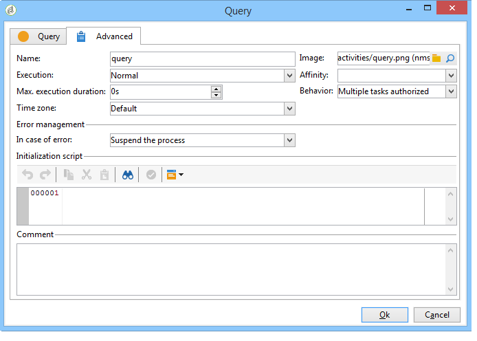

# 高級參數{#advanced-parameters}

活動的屬性畫面有一個&#x200B;**[!UICONTROL Advanced]**&#x200B;索引標籤，可讓您定義發生錯誤時的行為，即活動的執行期間；和可讓您輸入初始化指令碼。 此標籤有兩個版本：

* 簡化版本（例如&#x200B;**[!UICONTROL Start]**&#x200B;和&#x200B;**[!UICONTROL End]**&#x200B;活動）

   

* 更詳細的版本（例如&#x200B;**[!UICONTROL Query]**&#x200B;活動）

   

在&#x200B;**[!UICONTROL Advanced]**&#x200B;頁簽中要輸入的欄位將在以下各節中詳細說明。

## 名稱 {#name}

此欄位包含活動的內部名稱。

## 影像 {#image}

此欄位可讓您變更連結至活動的影像。 有關詳細資訊，請參閱：[管理活動影像](managing-activity-images.md)。

## 執行 {#execution}

此欄位可讓您定義觸發任務時要執行的動作。 有三種可能的選項：

通常以滑鼠右鍵按一下活動，即可在購物車中選取這些選項。

* **[!UICONTROL Normal]**:活動會照常執行。
* **[!UICONTROL Do not activate]**:不會執行此任務和以下所有任務（在同一分支中）。
* **[!UICONTROL Activate but do not execute]**:此任務和以下所有任務（在同一分支中）將自動停止。如果您想在任務啟動時在場，則此功能會很實用。 要手動執行任務，請按一下右鍵該活動並選擇&#x200B;**[!UICONTROL Normal execution]**。

## 相關性 {#affinity}

您可以選擇在特定電腦上強制執行工作流程或工作流程活動。 要執行此操作，您必須在工作流或相關活動的級別定義一個或多個傾向。

在此[節](../../installation/using/configuring-campaign-server.md#high-availability-workflows-and-affinities)中詳細說明了高可用性工作流配置。

## Max。 執行期間 {#max--execution-period}

此欄位可讓您在任務過長時設定警告。 它不會影響工作流程操作。 如果&#x200B;**[!UICONTROL Max. execution period]**&#x200B;結束前未完成該任務，則&#x200B;**[!UICONTROL Instance monitoring]**&#x200B;頁面將顯示此工作流的警告。 此頁面可透過首頁的&#x200B;**[!UICONTROL Monitoring]**&#x200B;標籤存取。

## 行為 {#behavior}

此欄位可讓您定義要使用非同步任務套用的行為。 有兩種可能的選項：

* **[!UICONTROL Several tasks authorized]**:即使第一個任務尚未完成，也可以同時執行多個任務。
* **[!UICONTROL The current task has priority]**:正在執行的任務優先。只要正在執行任務，就不會執行其他任務。

## 時區 {#time-zone}

此欄位可讓您選取活動的時區。 如需詳細資訊：[管理時區](managing-time-zones.md)。

## 發生錯誤時 {#in-case-of-errors}

此欄位可讓您定義當活動發生錯誤時要執行的動作。 有兩種可能的選項：

* **[!UICONTROL Stop the process]**:工作流程會自動停止。其狀態變更為&#x200B;**[!UICONTROL Failed]**。 問題解決後，重新啟動工作流。
* **[!UICONTROL Ignore]**:不會執行此任務和以下所有任務（在同一分支中）。這對循環任務非常有用。 如果分支有上游的排程器，則會照常在下一個執行日期開始。

## 初始化指令碼 {#initialization-script}

此欄位可讓您初始化變數或修改活動屬性。 有關詳細資訊，請參閱：[JavaScript指令碼和模板](javascript-scripts-and-templates.md)。

## 註解 {#comment}

**[!UICONTROL Comment]**&#x200B;欄位是可讓您新增說明的自由欄位。
