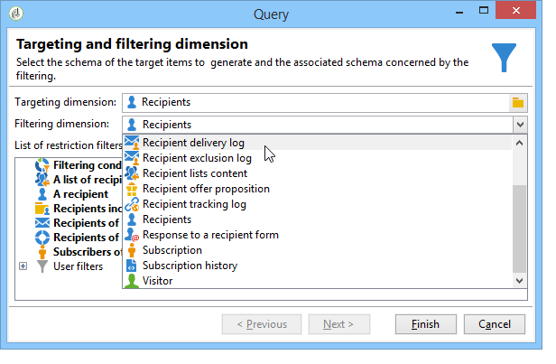

# 建立工作流程 {#building-a-workflow}

本節詳細說明在Campaign中建立工作流程的主要原則和最佳實務。

* 建立工作流程，請參閱 [建立新工作流程](#creating-a-new-workflow)
* 設計工作流程圖，請參閱 [新增和連結活動](#adding-and-linking-activities)
* 存取活動的參數和屬性，請參閱 [設定活動](#configuring-activities)
* 設計目標工作流程，請參閱 [目標工作流程](#targeting-workflows)
* 使用工作流程執行促銷活動，請參閱 [行銷活動工作流程](#campaign-workflows)
* 存取及建立技術工作流程，請參閱 [技術工作流程](#technical-workflows)
* 使用範本建立工作流程，請參閱 [工作流程範本](#workflow-templates)

## 建立新工作流程 {#creating-a-new-workflow}

從 **[!UICONTROL Explorer]**，存取工作流程資料夾。 依預設，您可以使用 **[!UICONTROL Profiles and Targets]** > **[!UICONTROL Jobs]** > **[!UICONTROL Targeting workflows]**.

按一下 **[!UICONTROL New]** 按鈕。

或者，您也可以使用 **[!UICONTROL Create]** 按鈕(**[!UICONTROL Monitoring]** > **[!UICONTROL Workflow]** 連結)。

輸入標籤，然後按一下 **[!UICONTROL Save]**.

>[!NOTE]
>
>修改工作流活動或工作流本身的內部名稱時，請確保在關閉工作流之前保存該工作流，以便正確考慮新的內部名稱。

## 新增和連結活動 {#adding-and-linking-activities}

您現在必須定義各種活動，並將它們在圖表中連結在一起。在設定的這個階段，我們會看到圖表標籤和工作流程狀態（正在編輯）。 窗口的下部僅用於編輯圖。 它包含工具列、活動浮動視窗（位於左側），以及圖表本身（位於右側）。

>[!NOTE]
>
>如果浮動視窗未顯示，請按一下工具列上的第一個按鈕以顯示它。

活動會依浮動視窗不同標籤內的類別分組。 可用的標籤和活動可能會依工作流程類型（技術、鎖定目標或行銷活動工作流程）而有所不同。

* 第一個標籤包含定位和資料操控活動。 這些活動在 [目標定位活動](about-targeting-activities.md).
* 第二個索引標籤包含排程活動，主要用於協調其他活動。 這些活動在 [流量控制活動](about-flow-control-activities.md).
* 第三個索引標籤包含可在工作流程中使用的工具和動作。 這些活動在 [動作活動](about-action-activities.md).
* 第四個索引標籤包含依賴指定事件的活動，例如收到電子郵件或檔案到達伺服器。 這些活動在 [事件活動](about-event-activities.md).

建立圖表的方式

1. 在浮動視窗中選取活動，並使用拖放操作將其移至圖表，以新增活動。

   新增 **開始** 活動，然後 **傳送** 圖表上的活動。

   

1. 拖曳 **開始** 活動轉變並將其拖放到 **傳送** 活動。

   

   您可以將新活動放置在轉變結束時，自動將活動連結至上一個活動。

1. 新增您需要的活動，並將它們連結在一起，如下圖所示。

   

>[!CAUTION]
>
>您可以在相同的工作流程中複製和貼上活動。 不過，我們不建議跨不同的工作流程複製貼上活動。 某些附加至活動（例如傳送和排程器）的設定在執行目標工作流程時可能會導致衝突和錯誤。 反之，我們建議您  **複製** 工作流程。 如需詳細資訊，請參閱 [複製工作流程](#duplicating-workflows).

您可以使用下列元素來變更圖表的顯示和配置：

* **使用工具列**

   圖表編輯工具列可讓您存取工作流程的版面和執行功能。

   

   這可讓您調整編輯工具的版面：顯示浮動視窗，以及圖形對象的概述、大小和對齊方式。

   

   有關追蹤和啟動進階鎖定工作流程的圖示，請參閱 [節](../../campaign/using/marketing-campaign-deliveries.md#creating-a-targeting-workflow).

* **對象對齊**

   若要對齊圖示，請選取圖示並按一下 **[!UICONTROL Align vertically]** 或 **[!UICONTROL Align horizontally]** 表徵圖。

   使用 **CTRL** 鍵，以選取數個分散的活動或取消選取一或多個活動。 按一下圖表背景，取消選取所有項目。

* **影像管理**

   您可以自訂圖表的背景影像，以及與各種活動相關的背景影像。 請參閱 [管理活動影像](managing-activity-images.md).

## 設定活動 {#configuring-activities}

連按兩下要設定的活動，或以滑鼠右鍵按一下並選取 **[!UICONTROL Open...]**.

>[!NOTE]
>
>行銷活動工作流程活動在 [本節](about-activities.md).

第一個索引標籤包含基本設定。 此 **[!UICONTROL Advanced]** 索引標籤包含其他參數，這些參數尤其用於在遇到錯誤時定義行為、指定活動的執行持續時間以及輸入初始化指令碼。

為了更好地了解活動，並提高工作流的可讀性，您可以在活動中輸入注釋：當運算子捲動到活動上時，這些會自動顯示。

## 目標工作流程 {#targeting-workflows}

目標工作流程可讓您建立數個傳送目標。 由於工作流活動，您可以建立查詢、根據特定條件定義聯合或排除、新增排程。 此定位的結果可自動轉移至清單，作為傳送動作的目標

除了這些活動，資料管理選項還可讓您控制資料並存取進階功能，以滿足複雜的鎖定目標問題。 有關詳細資訊，請參閱 [資料管理](targeting-data.md#data-management).

您可以在第一個工作流程索引標籤中找到所有這些活動。

>[!NOTE]
>
>定位活動在 [本節](about-activities.md).

您可以透過 **[!UICONTROL Profiles and Targets > Jobs > Targeting workflows]** Adobe Campaign樹的節點，或透過 **[!UICONTROL Profiles and Targets > Targeting workflows]** 首頁的菜單。

所有行銷活動工作流程都會儲存行銷活動架構內的目標工作流程。

### 建立目標工作流程的關鍵步驟 {#implementation-steps-}

建立目標工作流程的步驟在以下章節中詳細說明：

1. **識別** 資料庫中的資料 — 請參閱 [建立查詢](targeting-data.md#creating-queries)
1. **準備** 滿足傳遞需求的資料 — 請參閱 [擴充和修改資料](targeting-data.md#enriching-and-modifying-data)
1. **使用** 執行更新或傳送內的資料 — 請參閱 [更新資料庫](how-to-use-workflow-data.md#updating-the-database)

鎖定目標期間執行的所有擴充和所有處理結果都會儲存在個人化欄位中，且可供存取，尤其是用於建立個人化訊息時。 有關詳細資訊，請參閱 [目標資料](data-life-cycle.md#target-data)

### 定位和篩選維度 {#targeting-and-filtering-dimensions}

在資料分段作業期間，目標索引鍵會對應至篩選維度。 目標維度可讓您定義作業鎖定的母體：收件者、合約受益人、營運商、訂閱者等。 篩選維度可讓您根據特定條件選取母體：合約持有者、電子報訂閱者等

例如，要選擇已擁有壽險保單超過5年的客戶，請選擇以下目標維度： **用戶端** 和下列篩選維度： **合同持有人**. 然後，您可以在查詢活動中定義篩選條件

在目標維度選取階段期間，介面中僅提供相容的篩選維度。

這兩個維度必須相關。 因此， **[!UICONTROL Filtering dimension]** 清單取決於第一個欄位中指定的目標維度。

例如，對於收件者(**收件者**)，將可使用下列篩選維度：

為 **Web應用程式**，清單將包含下列篩選維度：

## 行銷活動工作流程 {#campaign-workflows}

對於每個促銷活動，您可以建立要從 **[!UICONTROL Targeting and workflows]** 標籤。 這些工作流程是行銷活動專屬的。

此索引標籤包含與所有工作流程相同的活動。 [了解更多](#implementation-steps-)

除了鎖定目標促銷活動，促銷活動工作流程還可讓您建立和設定所有可用管道的傳送。 在工作流程中建立後，這些傳送即可從促銷活動的控制面板中使用。 [了解更多](../../campaign/using/marketing-campaign-deliveries.md)

所有行銷活動工作流程都集中在 **[!UICONTROL Administration > Production > Objects created automatically > Campaign workflows]** 節點。

行銷活動工作流程和實作範例在 [本頁](../../campaign/using/marketing-campaign-deliveries.md#building-the-main-target-in-a-workflow).

## 技術工作流程 {#technical-workflows}

Adobe Campaign提供立即可用的技術工作流程。 這些操作或作業計畫在伺服器上定期執行。 它們可讓您對資料庫進行維護、轉送傳送的追蹤資訊，以及設定傳送的臨時程式。 技術工作流程可透過 **[!UICONTROL Administration > Production > Technical workflows]** 節點。

原生範本可用於建立技術工作流程。 可依您的需求加以設定。

此 **[!UICONTROL Campaign process]** 子資料夾會集中執行行銷活動中的程式所需的工作流程：任務通知、庫存管理、成本計算等

>[!NOTE]
>
>隨每個模組安裝的技術工作流程清單可在 [專屬區段](about-technical-workflows.md).

您可以在 **[!UICONTROL Administration > Production > Technical workflows]** 樹結構的節點。 不過，此程式會保留給專家使用者。

提供的活動與目標工作流程的相同。 [了解更多](#implementation-steps-)

## 工作流程範本 {#workflow-templates}

工作流程範本包含屬性的整體設定，以及圖表中串連的可能範圍活動。 此設定可重複用於建立包含特定數量之預先設定元素的新工作流程

您可以根據現有範本建立新的工作流程範本，或直接將工作流程變更為範本。

工作流程範本會儲存在 **[!UICONTROL Resources > Templates > Workflow templates]** Adobe Campaign樹的節點。

除了通常的工作流屬性外，模板屬性還允許您為基於此模板建立的工作流指定執行檔案。

## 複製工作流程 {#duplicating-workflows}

您可以複製不同類型的工作流程。 複製之後，不會將工作流程的修改轉存到工作流程的副本中。

>[!CAUTION]
>
>複製貼上功能可在工作流程中使用，但建議您使用 **複製**. 複製活動後，會保留其整個設定。 對於傳送活動（電子郵件、簡訊、推播通知……），附加至活動的傳送物件也會複製，而這可能導致當機。

1. 以滑鼠右鍵按一下工作流程。
1. 按一下 **複製**.

   

1. 在工作流程視窗中，變更工作流程標籤。
1. 按一下 **儲存**.

促銷活動檢視不直接提供重複功能。

不過，您可以建立檢視來顯示執行個體上的所有工作流程。 在此檢視中，您可以使用 **複製到**.

**首先，建立檢視：**

1. 在 **瀏覽器**，移至在中建立檢視所需的資料夾。
1. 按一下滑鼠右鍵，然後前往 **新增資料夾** > **程式**，選取 **工作流程**.

   

新資料夾 **工作流程** 中所有規則的URL區段。

1. 按一下滑鼠右鍵並選取 **屬性**.
1. 在 **限制**，檢查 **資料夾是檢視** 按一下 **儲存**.

   

資料夾現在會填入您執行個體的所有工作流程。

**複製行銷活動工作流程**

1. 在工作流程檢視中選取促銷活動工作流程。
1. 按一下右鍵 **複製到**.
   
1. 更改其標籤。
1. 按一下 **儲存**.

您可以在工作流程檢視中查看重複的工作流程。
