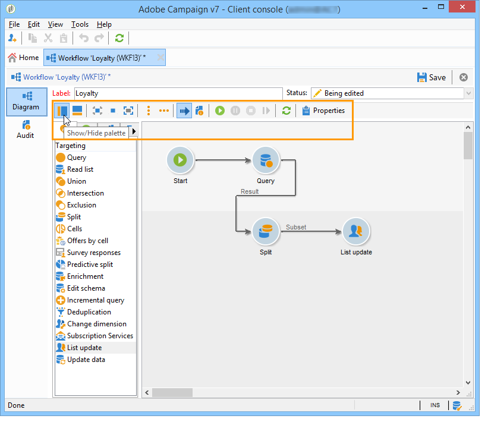

# 建置工作流程 {#building-a-workflow}

本節詳細說明在Campaign中建立工作流程的主要原則和最佳實務。

* 建立工作流程，請參閱 [建立新工作流程](#creating-a-new-workflow)
* 設計工作流程圖表，請參閱 [新增和連結活動](#adding-and-linking-activities)
* 存取活動的引數和屬性，請參閱 [設定活動](#configuring-activities)
* 設計目標工作流程，請參閱 [目標工作流程](#targeting-workflows)
* 使用工作流程執行行銷活動，請參閱 [行銷活動工作流程](#campaign-workflows)
* 存取及建立技術工作流程，請參閱 [技術工作流程](#technical-workflows)
* 使用範本建立工作流程，請參閱 [工作流程範本](#workflow-templates)

## 建立新的工作流程 {#creating-a-new-workflow}

從 **[!UICONTROL Explorer]**，存取工作流程資料夾。 依預設，您可以使用 **[!UICONTROL Profiles and Targets]** > **[!UICONTROL Jobs]** > **[!UICONTROL Targeting workflows]**.

按一下 **[!UICONTROL New]** 按鈕的工作流程清單上方。

或者，您也可以使用 **[!UICONTROL Create]** 工作流程概覽中的按鈕(**[!UICONTROL Monitoring]** > **[!UICONTROL Workflow]** 連結)。

輸入標籤並按一下 **[!UICONTROL Save]**.

>[!NOTE]
>
>修改工作流程活動的內部名稱或工作流程本身時，請務必在關閉工作流程之前先儲存工作流程，以便正確考慮新的內部名稱。

## 新增和連結活動 {#adding-and-linking-activities}

您現在必須定義各種活動，並將它們在圖表中連結在一起。 在設定的這個階段，我們可以看到圖表標籤和工作流程狀態（正在編輯）。 視窗的下半部僅用於編輯圖表。 它包含工具列、活動浮動面板（位於左側）和圖表本身（位於右側）。

>[!NOTE]
>
>如果浮動視窗未顯示，請按一下工具列上的第一個按鈕以顯示它。

活動會依浮動視窗不同標籤中的類別分組。 可用的標籤和活動會依工作流程型別（技術、目標定位或行銷活動工作流程）而有所不同。

* 第一個標籤包含定位和資料操作活動。 這些活動的詳細資訊，請參見 [目標定位活動](about-targeting-activities.md).
* 第二個索引標籤包含排程活動，主要用於協調其他活動。 這些活動的詳細資訊，請參見 [流量控制活動](about-flow-control-activities.md).
* 第三個標籤包含可用於工作流程的工具和動作。 這些活動的詳細資訊，請參見 [動作活動](about-action-activities.md).
* 第四個索引標籤包含取決於指定事件的活動，例如收到電子郵件或檔案抵達伺服器。 這些活動的詳細資訊，請參見 [事件活動](about-event-activities.md).

建立圖表

1. 在浮動視窗中選取活動，並使用拖放操作將其移至圖表，以新增活動。

   新增 **開始** 活動，然後是 **傳遞** 活動在圖表上。

   

1. 拖曳「 」，將活動連結在一起 **開始** 活動轉換並將其放置到 **傳遞** 活動。

   

   您可以將新活動放在轉變的結尾處，自動將活動連結至上一個活動。

1. 新增您需要的活動，並將它們連結在一起，如下圖所示。

   

>[!CAUTION]
>
>您可以在相同的工作流程中複製和貼上活動。 不過，我們不建議跨不同的工作流程複製貼上活動。 某些附加至傳送和排程器等活動的設定，在執行目標工作流程時可能會導致衝突和錯誤。 我們建議您  **複製** 工作流程。 如需詳細資訊，請參閱 [複製工作流程](#duplicating-workflows).

您可以使用下列元素來變更圖表的顯示和版面配置：

* **使用工具列**

  圖表編輯工具列可讓您存取工作流程的佈局和執行功能。

  

  這可讓您調整編輯工具的版面：顯示浮動視窗以及圖形物件的概觀、大小和對齊。

  

  以下各節詳細介紹了與進度和日誌顯示相關的圖示：

   * [顯示進度](../../workflow/using/monitoring-workflow-execution.md#displaying-progress)
   * [顯示記錄](../../workflow/using/monitoring-workflow-execution.md#displaying-logs)

* **物件對齊方式**

  若要對齊圖示，請選取圖示並按一下 **[!UICONTROL Align vertically]** 或 **[!UICONTROL Align horizontally]** 圖示。

  使用 **CTRL** 鍵可選取數個分散的活動，或取消選取一或多個活動。 按一下圖表背景以取消選取所有專案。

* **影像管理**

  您可以自訂圖表的背景影像以及與各種活動相關的影像。 請參閱 [變更活動影像](managing-activity-images.md).

## 設定活動 {#configuring-activities}

連按兩下活動以進行設定，或按一下右鍵並選取 **[!UICONTROL Open...]**.

>[!NOTE]
>
>行銷活動工作流程活動的詳情，請參閱 [本節](about-activities.md).

第一個索引標籤包含基本設定。 此 **[!UICONTROL Advanced]** tab包含其他引數，這些引數專用於定義發生錯誤時的行為、指定活動的執行持續時間以及輸入初始化指令碼。

為了更瞭解活動並改善工作流程易讀性，您可以在活動中輸入註解：當操作員捲動活動時，會自動顯示註解。

## 目標工作流程 {#targeting-workflows}

目標工作流程可讓您建立數個傳遞目標。 由於工作流程活動，您可以根據特定條件建立查詢、定義聯合或排除、新增排程。 此目標定位的結果可自動傳輸至可作為傳遞動作目標的清單

除了這些活動以外，資料管理選項可讓您操控資料並存取進階函式，以滿足複雜的鎖定目標問題。 有關詳細資訊，請參閱 [資料管理](targeting-data.md#data-management).

所有這些活動都可在第一個工作流程標籤中找到。

>[!NOTE]
>
>目標定位活動的詳情，請參閱 [本節](about-activities.md).

目標工作流程可透過以下方式建立及編輯： **[!UICONTROL Profiles and Targets > Jobs > Targeting workflows]** Adobe Campaign節點，或透過 **[!UICONTROL Profiles and Targets > Targeting workflows]** 首頁的功能表。

行銷活動框架內的目標工作流程會與所有行銷活動工作流程一起儲存。

### 建立目標定位工作流程的關鍵步驟 {#implementation-steps-}

建立目標定位工作流程的步驟在以下章節中詳細說明：

1. **識別** 資料庫中的資料 — 請參閱 [建立查詢](targeting-data.md#creating-queries)
1. **準備** 資料以滿足傳送需求 — 請參閱 [豐富及修改資料](targeting-data.md#enriching-and-modifying-data)
1. **使用** 資料以執行更新或傳遞內 — 請參閱 [更新資料庫](how-to-use-workflow-data.md#updating-the-database)

鎖定目標期間執行的所有增強功能和所有處理的結果都會儲存在個人化欄位中以供存取，尤其是在建立個人化訊息時使用。 有關詳細資訊，請參閱 [目標資料](data-life-cycle.md#target-data)

### 目標定位和篩選維度 {#targeting-and-filtering-dimensions}

在資料細分作業期間，目標定位鍵對應到篩選維度。目標定位維度可讓您定義作業的目標母體：收件者、合約受益人、操作者、訂閱者等。篩選維度可讓您可以根據特定標準選取母體：合約持有人、電子報訂閱者等。

例如，若要選取投保人壽保險單已超過5年的客戶，請選取下列目標維度： **使用者端** 以及下列篩選維度： **合約持有人**. 然後，您可以在查詢活動中定義篩選條件

在目標維度選擇階段中，介面中只會提供相容的篩選維度。

這兩個維度必須相關。 因此， **[!UICONTROL Filtering dimension]** 清單取決於第一個欄位中指定的目標維度。

例如，對於收件者(**收件者**)，則可使用下列篩選維度：

當用於 **網頁應用程式**，清單將包含下列篩選維度：

## 行銷活動工作流程 {#campaign-workflows}

對於每個行銷活動，您可從以下專案建立要執行的工作流程： **[!UICONTROL Targeting and workflows]** 標籤。 這些工作流程是行銷活動專屬的。

此索引標籤包含與所有工作流程相同的活動。 [了解更多](#implementation-steps-)

除了目標定位行銷活動之外，行銷活動工作流程可讓您完全針對所有可用頻道建立和設定傳送。 在工作流程中建立之後，就可從行銷活動的控制面板使用這些傳送。 [了解更多](../../campaign/using/marketing-campaign-deliveries.md)

所有行銷活動工作流程都會集中在 **[!UICONTROL Administration > Production > Objects created automatically > Campaign workflows]** 節點。

行銷活動工作流程和實作範例的詳細資訊，請參閱 [此頁面](../../campaign/using/marketing-campaign-deliveries.md#building-the-main-target-in-a-workflow).

## 技術工作流程 {#technical-workflows}

Adobe Campaign提供現成可用的技術工作流程。 它們是排定在伺服器上定期執行的作業或工作。 它們可讓您對資料庫進行維護、轉送傳遞的相關追蹤資訊，以及設定傳遞的臨時流程。 技術工作流程可透過 **[!UICONTROL Administration > Production > Technical workflows]** 節點。

原生範本可用於建立技術工作流程。 可依您的需求加以設定。

此 **[!UICONTROL Campaign process]** 子檔案夾會集中處理在行銷活動中執行流程所需的工作流程：任務通知、庫存管理、成本計算等。

>[!NOTE]
>
>隨每個模組一起安裝的技術工作流程清單可在 [專用區段](about-technical-workflows.md).

您可以在中建立其他技術工作流程 **[!UICONTROL Administration > Production > Technical workflows]** 樹狀結構的節點。 不過，此程式僅供專家使用者使用。

提供的活動與定位工作流程相同。 [了解更多](#implementation-steps-)

## 工作流程範本 {#workflow-templates}

工作流程範本包含屬性的整體設定，且可能包含串連在圖表中的一系列活動。 此設定可重複用於建立包含特定數量之預先設定元素的新工作流程

您可以根據現有範本建立新的工作流程範本，或直接將工作流程變更為範本。

工作流程範本儲存在 **[!UICONTROL Resources > Templates > Workflow templates]** Adobe Campaign樹的節點。

除了一般的工作流程屬性外，範本屬性可讓您為根據此範本建立的工作流程指定執行檔案。

## 複製工作流程 {#duplicating-workflows}

您可以複製不同型別的工作流程。 複製之後，不會將工作流程的修改轉存到工作流程的副本中。

>[!CAUTION]
>
>工作流程中提供複製貼上功能，但建議您使用 **複製**. 活動複製後，會保留其整個設定。 對於傳送活動（電子郵件、簡訊、推播通知……），也會複製附加至活動的傳送物件，這可能會造成當機。

1. 在工作流程上按一下右鍵。
1. 按一下 **複製**.

   

1. 在工作流程視窗中，變更工作流程標籤。
1. 按一下「**儲存**」。

行銷活動的檢視中不直接提供重複功能。

不過，您可以建立檢視，以顯示執行個體上的所有工作流程。 在此檢視中，您可以使用以下專案重複工作流程： **複製到**.

**建立檢視**

1. 在 **瀏覽器**，前往您在中建立檢視所需的資料夾。
1. 按一下滑鼠右鍵並前往 **新增資料夾** > **程式**，選取 **工作流程**.

   

新資料夾 **工作流程** 「 」已建立。

1. 按一下右鍵並選取 **屬性**.
1. 在 **限制**，檢查 **資料夾是一個檢視** 並按一下 **儲存**.

   

資料夾現在已填入執行個體的所有工作流程。

**複製行銷活動工作流程**

1. 在工作流程檢視中選取行銷活動工作流程。
1. 按一下右鍵 **複製到**.
   
1. 變更其標籤。
1. 按一下「**儲存**」。

您可以在工作流程檢視中看到重複的工作流程。
