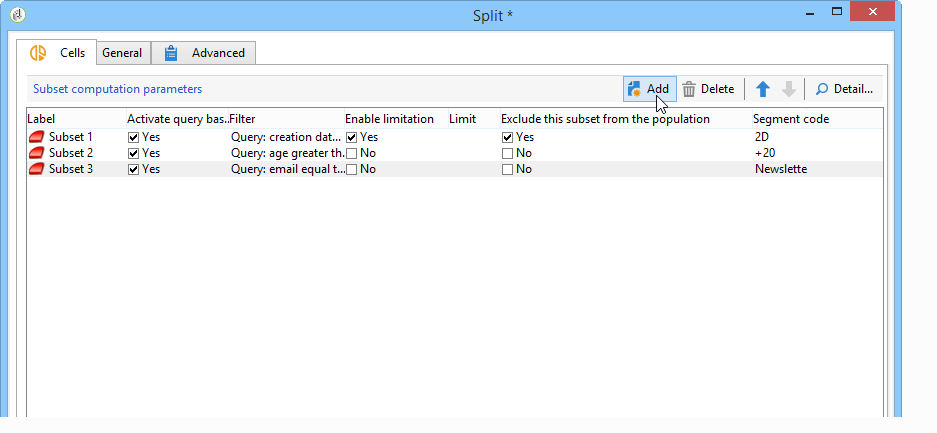

# 儲存格{#cells}


的 **[!UICONTROL Cells]** activity以資料列的形式提供了各種子集的視圖。 它便於子集操作，並且還設計為鼓勵個性化可能性。



可以根據用戶需要配置此活動以輸入特定參數。 預設情況下，每個子集的詳細資訊將通過 **[!UICONTROL Selection]** 和 **[!UICONTROL Advanced]** 頁籤。 在下面的示例中，表單已修改：a **[!UICONTROL Data]** 已添加頁籤，以啟用提供和每個子集的優先順序的關聯。


對於此配置，以下資訊已添加到工作流表單(在 **[!UICONTROL Administration > Configurations > Input forms]** 節點):

```
<container img="nms:miniatures/mini-enrich.png" label="Data">
                <input xpath="@code"/>
                <container xpath="select/node[@alias='@numTest']">
                  <input alwaysActive="true" expr="'long'" type="expr" xpath="@type"/>
                  <input alwaysActive="true" expr="'Priority'" type="expr" xpath="@label"/>
                  <input label="Priority" maxValue="12" minValue="0" type="number"
                         xpath="@value" xpathEditFromType="@type"/>
                </container>
                <container xpath="select/node[@alias='@test']">
                  <input alwaysActive="true" expr="'string'" type="expr" xpath="@type"/>
                  <input alwaysActive="true" expr="'Identifier'" type="expr" xpath="@label"/>
                  <input label="Cell identifier" xpath="@value"/>
                </container>
                <container xpath="select/node[@alias='linkTest']">
                  <input alwaysActive="true" expr="'link'" type="expr" xpath="@type"/>
                  <input alwaysActive="true" expr="'nms:offer'" type="expr" xpath="@dataType"/>
                  <input alwaysActive="true" expr="'Offre'" type="expr" xpath="@label"/>
                  <input computeStringAlias="@valueLabel" label="Offers" notifyPathList="@_cs|@valueLabel"
                         schema="nms:offer" type="linkEdit" xpath="@value"/>
                </container>
```

Adobe Campaign的入口表單個性化為專家用戶保留。 如需詳細資訊，請參閱本[區段](../../configuration/using/identifying-a-form.md)。
