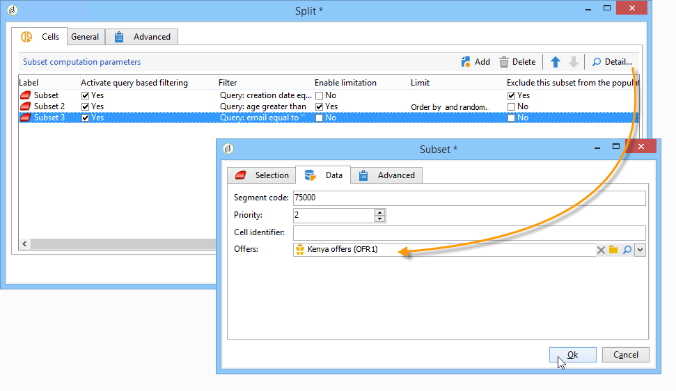

# 儲存格{#cells}

**[!UICONTROL Cells]**&#x200B;活動以資料列的形式提供了各種子集的視圖。 它有助於子集操作，也旨在鼓勵個人化的可能性。


您可以設定此活動，以根據使用者需求輸入特定參數。 依預設，每個子集的詳細資料會透過&#x200B;**[!UICONTROL Selection]**&#x200B;和&#x200B;**[!UICONTROL Advanced]**&#x200B;標籤在專用視窗中詳細列出。 在下列範例中，表單已修改：已新增&#x200B;**[!UICONTROL Data]**&#x200B;標籤，以啟用選件與每個子集之優先順序層級的關聯。



對於此配置，工作流表單（在Adobe Campaign樹的&#x200B;**[!UICONTROL Administration > Configurations > Input forms]**&#x200B;節點中）中添加了以下資訊：

```
<container img="nms:miniatures/mini-enrich.png" label="Data">
                <input xpath="@code"/>
                <container xpath="select/node[@alias='@numTest']">
                  <input alwaysActive="true" expr="'long'" type="expr" xpath="@type"/>
                  <input alwaysActive="true" expr="'Priority'" type="expr" xpath="@label"/>
                  <input label="Priority" maxValue="12" minValue="0" type="number"
                         xpath="@value" xpathEditFromType="@type"/>
                </container>
                <container xpath="select/node[@alias='@test']">
                  <input alwaysActive="true" expr="'string'" type="expr" xpath="@type"/>
                  <input alwaysActive="true" expr="'Identifier'" type="expr" xpath="@label"/>
                  <input label="Cell identifier" xpath="@value"/>
                </container>
                <container xpath="select/node[@alias='linkTest']">
                  <input alwaysActive="true" expr="'link'" type="expr" xpath="@type"/>
                  <input alwaysActive="true" expr="'nms:offer'" type="expr" xpath="@dataType"/>
                  <input alwaysActive="true" expr="'Offre'" type="expr" xpath="@label"/>
                  <input computeStringAlias="@valueLabel" label="Offers" notifyPathList="@_cs|@valueLabel"
                         schema="nms:offer" type="linkEdit" xpath="@value"/>
                </container>
```

Adobe Campaign中的登入表單個人化保留給專家使用者。 如需詳細資訊，請參閱本[區段](../../configuration/using/identifying-a-form.md)。
