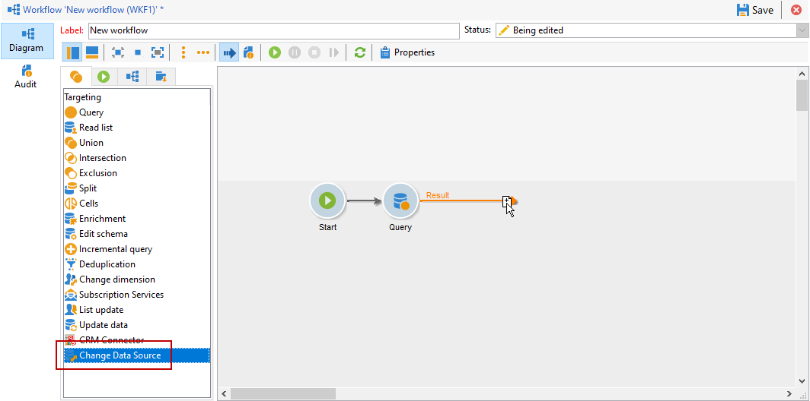

# 更改資料源 {#change-data-source}

>[!NOTE]
>
> **[!UICONTROL Change data source]**&#x200B;活動僅可與&#x200B;**[!UICONTROL Access to external data (Federated Data Access)]**&#x200B;套件一起使用。 如需Adobe Campaign Classic內建套件的詳細資訊，請參閱此[page](../../installation/using/installing-campaign-standard-packages.md)。

**[!UICONTROL Change data source]**&#x200B;活動可讓您變更工作流程&#x200B;**[!UICONTROL Working table]**&#x200B;的資料來源。 這可提供更大的彈性，可管理不同資料來源的資料，例如FDA、FFDA和本機資料庫。

**[!UICONTROL Working table]**可讓Adobe Campaign Classic工作流程處理資料，並與工作流程活動共用資料。
預設情況下， **[!UICONTROL Working table]**&#x200B;建立在與我們查詢的資料源相同的資料庫中。

例如，查詢儲存在雲資料庫上的&#x200B;**[!UICONTROL Profiles]**&#x200B;表時，您將在相同雲資料庫上建立&#x200B;**[!UICONTROL Working table]**。
若要變更此項，您可以新增**[!UICONTROL Change Data Source]**&#x200B;活動，以為&#x200B;**[!UICONTROL Working table]**&#x200B;選擇不同的資料來源。

請注意，使用&#x200B;**[!UICONTROL Change Data Source]**&#x200B;活動時，您需要切換回雲端資料庫，以繼續執行工作流程。

若要使用&#x200B;**[!UICONTROL Change Data Source]**&#x200B;活動：

1. 建立工作流程.

1. 使用&#x200B;**[!UICONTROL Query]**&#x200B;活動查詢目標收件者。

   有關&#x200B;**[!UICONTROL Query]**&#x200B;活動的詳細資訊，請參閱此[page](../../workflow/using/query.md#creating-a-query)。

1. 從&#x200B;**[!UICONTROL Targeting]**&#x200B;索引標籤，新增&#x200B;**[!UICONTROL Change data source]**&#x200B;活動。

   

1. 連按兩下您的&#x200B;**[!UICONTROL Change data source]**&#x200B;活動以選取&#x200B;**[!UICONTROL Default data source]**。

   然後，將包含查詢結果的工作表移至預設的PostgreSQL資料庫。

   

1. 從&#x200B;**[!UICONTROL Actions]**&#x200B;索引標籤，拖放&#x200B;**[!UICONTROL JavaScript code]**&#x200B;活動，以對工作表執行統一操作。

   有關&#x200B;**[!UICONTROL JavaScript code]**&#x200B;活動的詳細資訊，請參閱[ JavaScript程式碼和進階JavaScript程式碼](../../workflow/using/sql-code-and-javascript-code.md#javascript-code)頁面。

1. 新增其他&#x200B;**[!UICONTROL Change data source]**&#x200B;活動，以切換回雲端資料庫。

1. 連按兩下您的活動，然後選取&#x200B;**[!UICONTROL Active FDA external account]**，然後選取對應的&#x200B;**[!UICONTROL External database]**&#x200B;外部帳戶。

   

1. 您現在可以開始工作流程。
