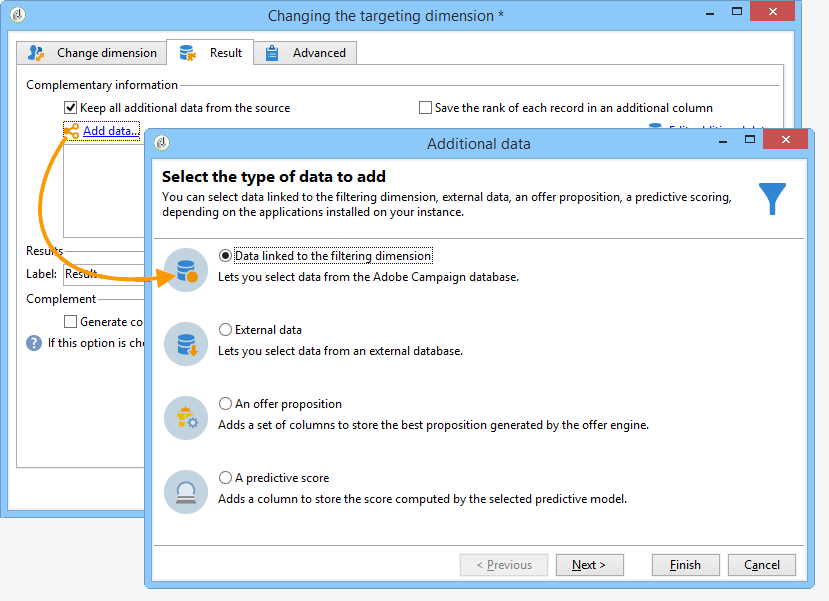

# 變更維度{#change-dimension}

更改維活動允許您在目標構建週期中更改目標維。 軸偏移取決於資料模板和輸入維。 這允許您從「contracts」維切換到「clients」維。

您還可以使用此活動定義新目標的附加列。

可以定義重複資料消除標準。

## 配置模式 {#configuration-mode}

要配置更改維活動，請應用以下步驟：

1. 通過 **[!UICONTROL Change dimension]** 的子菜單。

   

1. 在維更改期間，可保留所有元素或選擇要保留在輸出中的元素。 在以下示例中，最大值。 重複項數設定為2。

   

   選擇只保留一條記錄時，工作架構中將顯示一個集合：此集合表示在最終結果中不會針對的所有記錄（因為只保留一個記錄）。 與所有其他集合一樣，此集合允許您計算列中的聚合或恢復資訊。

   例如，如果您更改 **[!UICONTROL Customers]** 維到 **[!UICONTROL Recipients]** 維，可以針對特定商店的客戶，同時增加購買數量。

1. 如果選擇不保留所有這些資訊，則可以配置重複管理模式。

   

   使用藍色箭頭可以定義重複處理優先順序。

   在上例中，收件人將首先在其電子郵件地址上進行重複資料消除，然後根據需要在其帳號上進行重複資料消除。

1. 的 **[!UICONTROL Result]** 頁籤。

   例如，您可以使用 **子字串** 的子菜單。 操作步驟：

   * 按一下 **[!UICONTROL Add data...]** 連結和選擇 **[!UICONTROL Data linked to the filtering dimension]**。

      

      >[!NOTE]
      >
      >有關建立和管理附加列的資訊，請參閱 [添加資料](query.md#adding-data)。

   * 選取上一個目標尺寸（軸切換前），然後選取 **[!UICONTROL Zip Code]** 的 **[!UICONTROL Location]** 子樹，然後按一下 **[!UICONTROL Edit expression]**。

      

   * 按一下 **[!UICONTROL Advanced selection]** 選擇 **[!UICONTROL Edit the formula using an expression]**。

      

   * 使用清單中提供的函式並指定要執行的計算。

      

   * 最後，輸入剛建立的列的標籤。

      

1. 執行工作流以查看此配置的結果。 比較更改維活動前後表中的資料，並比較工作流表的結構，如下例所示：

   

   
