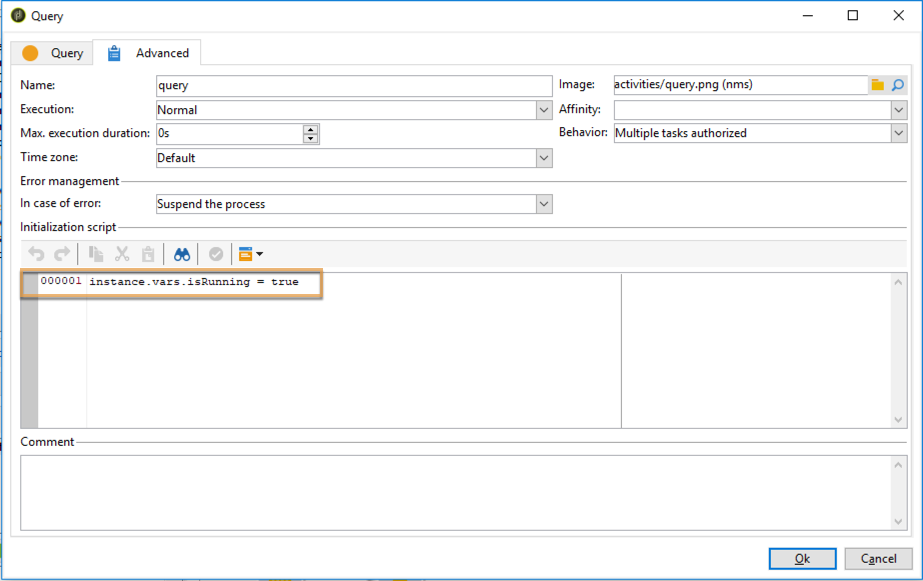

# 協調資料更新{#coordinating-data-updates}

此使用案例詳細說明了如何建立工作流程，當您使用工作流程的數個執行時，該工作流程可讓您管理伴隨更新。

目的是在執行另一更新操作之前檢查更新過程是否已結束。 為此，我們將設定一個實例變數，並讓工作流測試是否正在運行實例以決定是否繼續執行工作流並執行更新。

此工作流程由下列部分組成：

* **排程器**&#x200B;活動，在特定頻率上執行工作流。
* **測試**&#x200B;活動，檢查工作流是否已執行。
* **** 查詢 **並更** 新資料活動，以備工作流程尚未執行時使用，接著執行將工作流程例 **** 項變數重新初始化為false的結束活動。
* 如果工作流已執行，則&#x200B;**結束**&#x200B;活動。

若要建立工作流程，請遵循下列步驟：

1. 新增&#x200B;**排程器**&#x200B;活動，然後根據您的需求設定其頻率。
1. 新增&#x200B;**Test**&#x200B;活動以檢查工作流程是否已執行，然後依照下列方式進行設定。

   >[!NOTE]
   >
   >「isRunning」是我們為此範例選擇的執行個體變數名稱。 這不是內建變數。

   

1. 將&#x200B;**End**&#x200B;活動新增至&#x200B;**No**&#x200B;復本。 如此一來，如果工作流程已執行，則不會執行任何動作。
1. 將所需的活動新增至&#x200B;**Yes**&#x200B;復本。 在本例中，**Query**&#x200B;和&#x200B;**更新資料**&#x200B;活動。
1. 開啟第一個活動，然後在&#x200B;**[!UICONTROL Advanced]**&#x200B;標籤中新增&#x200B;**instance.vars.isRunning = true**&#x200B;命令。 如此一來，執行個體變數就會設為執行中。

   

1. 在&#x200B;**[!UICONTROL Yes]**&#x200B;復本的結尾新增&#x200B;**End**&#x200B;活動，然後在&#x200B;**[!UICONTROL Advanced]**&#x200B;索引標籤中新增&#x200B;**instance.vars.isRunning = false**&#x200B;命令。

   如此一來，只要工作流程執行中，就不會執行任何動作。

   

**相關主題：**

* [防止同時執行多個執行](monitoring-workflow-execution.md#preventing-simultaneous-multiple-executions)
* [更新資料活動](update-data.md)
