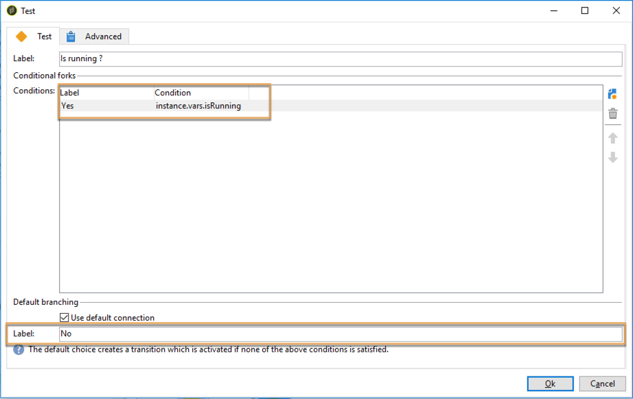

# 協調資料更新{#coordinating-data-updates}

此使用案例詳細說明了工作流程的建立，可讓您在使用工作流程的數個執行時管理伴隨更新。

目的是在執行另一個更新操作之前檢查更新進程是否已結束。 為此，我們將設定一個實例變數，並讓工作流測試是否正在運行該實例以決定是否繼續執行工作流並執行更新。

此工作流由以下幾部分組成：

* a **調度器**&#x200B;活動，該活動在特定頻率上執行工作流。
* a **Test**&#x200B;活動，會檢查工作流是否已執行。
* **查詢和** 更 **新資料活動，以備工作流尚未執行時使用，接著執行**  **** Endactivity，將工作流實例變數重新初始化為false。
* 如果工作流已在執行，則&#x200B;**結束**&#x200B;活動。

若要建立工作流程，請遵循下列步驟：

1. 新增&#x200B;**排程器**&#x200B;活動，然後根據您的需求設定其頻率。
1. 新增&#x200B;**Test**&#x200B;活動以檢查工作流程是否已執行，然後設定如下。

   >[!NOTE]
   >
   >&quot;isRunning&quot;是我們為此範例選擇的例項變數名稱。 這不是內建變數。

   

1. 將&#x200B;**End**&#x200B;活動添加到&#x200B;**No**&#x200B;分叉。 這樣，如果工作流已執行，則不執行任何操作。
1. 將所需活動添加到&#x200B;**Yes**&#x200B;分叉。 在本例中，**Query**&#x200B;和&#x200B;**更新資料**&#x200B;活動。
1. 開啟第一個活動，然後在&#x200B;**[!UICONTROL Advanced]**&#x200B;標籤中新增&#x200B;**instance.vars.isRunning = true**&#x200B;命令。 如此，例項變數就會設為執行中。

   

1. 在&#x200B;**[!UICONTROL Yes]**&#x200B;分叉的末尾添加&#x200B;**End**&#x200B;活動，然後在&#x200B;**[!UICONTROL Advanced]**&#x200B;頁籤中添加&#x200B;**instance.vars.isRunning = false**&#x200B;命令。

   這樣，只要工作流正在執行，就不會執行任何操作。

   

**相關主題：**

* [防止同時執行多個執行](../../workflow/using/monitoring-workflow-execution.md#preventing-simultaneous-multiple-executions)
* [更新資料活動](../../workflow/using/update-data.md)

