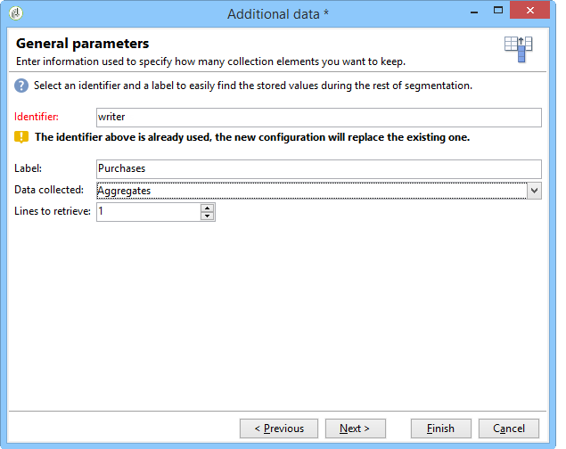

# 建立摘要清單{#creating-a-summary-list}

此使用案例詳細說明了如何建立工作流程，此工作流程在收集檔案並進行數項擴充後，可讓您建立摘要清單。 此範例以在商店中購買產品的聯絡人清單為基礎。


使用下列資料結構：


其目的是：

* 要使用富集活動的各種選項
* 要在協調後更新資料庫中的資料
* 建立豐富資料的全域「檢視」

要建立摘要清單，您需要遵循以下步驟：

1. 在工作流程的工作表中收集和載入「購買」檔案
1. 建立參考表的連結，豐富匯入的資料
1. 使用豐富的資料更新「購買」表格
1. 從「購買」表中以匯總計算豐富「聯繫人」資料
1. 建立摘要清單

## 步驟1:載入檔案並協調導入的資料 {#step-1--loading-the-file-and-reconciling-the-imported-data}

要載入的資料是「購買」相關資料，其格式如下：

```
Product Name;Product price;Store
Computer;2000;London 3
Tablet;600;Cambridge
Computer;2000;London 5
Comptuer;2000;London 8
Tablet;600;Cambridge
Phone;500;London 5
```

此資料包含在「Purchases.txt」文字檔案中。

1. 將「檔 **案」收集器****和「資料載入（檔案）** 」活動新增至工作流程。

   「檔 **案收集器** 」活動可讓您從Adobe Campaign伺服器收集和傳送檔案。

   「資 **料載入（檔案）** 」活動可讓您以收集的資料豐富工作流程的工作表。

   有關此活動的詳細資訊，請參 [閱從檔案載入資料](../../workflow/using/importing-data.md#loading-data-from-a-file)。

1. 配置「 **檔案」(File)收集器** (Collector)活動，以從所選目錄收集文本(*.txt)類型檔案。

   

   「文 **件」收集器** (File collector)活動可讓您管理源目錄中缺少檔案。 若要這麼做，請勾選 **[!UICONTROL Process file nonexistence]** 選項。 在此工作流程中，已新 **增「等待** 」活動，以嘗試在收集時從目錄中遺失的其他檔案集合。

1. 使用與 **要導入的資料格式相同的示例檔案配置資料載入（檔案）** 。

   

   按一下 **[!UICONTROL Click here to change the file format...]** 連結，使用「購買」表格的內部名稱和標籤來重新命名欄。

   

在匯入資料後，可建立與「商店」架構相符之參考表的連結，以進行擴充。

新增「擴充」活動，並依下列方式設定：

1. 從「資料載入（檔案）」活動中選取由 **資料組成的主集** 。

   

1. 按一 **[!UICONTROL Add data]**&#x200B;下，然後選取 **[!UICONTROL A link]** 選項。

   

1. 選擇選 **[!UICONTROL Define a collection]** 項。
1. 選擇「儲存」結構作為目標。

   

有關各種連結的詳細資訊，請參 [閱豐富和修改資料](../../workflow/using/targeting-data.md#enriching-and-modifying-data)。

在以下窗口中，您需要通過選擇源欄位（在主集中）和目標欄位（屬於「儲存」方案）來建立連接條件來配置資料協調。


現在建立連結，我們將從「商店」架構新增欄至工作流程的工作表：「郵遞區號參考」欄位。

1. 開啟濃縮活動。
1. 按一下 **[!UICONTROL Edit additional data]**.
1. 將「郵遞區號參考」欄位新增至 **[!UICONTROL Output columns]**。


此擴充後，工作流程工作表中的資料如下：


## 步驟2:將豐富的資料寫入「購買」表格 {#step-2--writing-enriched-data-to-the--purchases--table}

此步驟詳細說明如何將匯入和豐富的資料寫入「購買」表格。 為此，我們需要使用「更新 **資料** 」活動。

必須在更新「購買」表格中的資料之前，先執行工作流程工作表中的資料與 **Purchases** 定位維度 **** 的協調。

1. 按一下 **[!UICONTROL Reconciliation]** 擴充活動的標籤。
1. 選取定位維度，在此例中為「購買」結構。
1. 為工作流表中的資料選擇一個「源表達式」（本例中為「storeName」欄位）。
1. 在「購買」表格中為資料選取「目標運算式」（此例中為「儲存重新命名」欄位）。
1. 勾選 **[!UICONTROL Keep unreconciled data coming from the work table]** 選項。


在「更 **新資料** 」活動中，需要下列設定：

1. 在欄位中 **[!UICONTROL Insert or update]** 選取選項， **[!UICONTROL Operation type]** 以避免在每次收集檔案時建立新記錄。
1. 選取 **[!UICONTROL By directly using the targeting dimension]** 選項的 **[!UICONTROL Record identification]** 值。
1. 選擇「購買」結構 **[!UICONTROL Document type]**。
1. 指定要更新的欄位清單。 此 **[!UICONTROL Destination]** 欄可讓您定義「購買」結構的欄位。 該 **[!UICONTROL Expression]** 列允許您選擇工作表中的欄位以執行映射。
1. 按一下選 **[!UICONTROL Generate an outbound transition]** 項。


## 步驟3:豐富「聯絡」資料 {#step-3--enriching--contact--data-}

「連絡人」結構實際上連結至「購買」結構。 這表示您可以使用「Enrichment」（擴充）選項的另一個選項：新增連結至篩選維度的資料。

第二次擴充的目的是在購買架構上建立匯總，以計算每個已識別連絡人的購買總額。

1. 新增查 **詢類型** 活動，可讓您復原所有儲 **存的Contact** 。
1. 新增「 **Enrichment** 」活動，然後選取由上一個查詢產生的主集。
1. 按一下「新增 **[!UICONTROL Data]**」。
1. 按一下選 **[!UICONTROL Data linked to the targeting dimension]** 項。
1. 按一下窗 **[!UICONTROL Data linked to the filtering dimension]** 口中的選 **[!UICONTROL Select fields to add]** 項。
1. 選擇節 **[!UICONTROL Purchases]** 點，然後按一下 **[!UICONTROL Next]**。

   

1. 選擇選 **[!UICONTROL Collected data]** 項以變更欄 **[!UICONTROL Aggregates]** 位。

   

1. 按一下 **[!UICONTROL Next]**.
1. 新增下列運算式，以計算每個連絡人的購買總計：&quot;Sum(@prodprice)&quot;。

   

若要準備摘要清單，您必須從「購買」欄位和第一個擴充功能新增欄位：「郵遞區號參考」欄位。

1. 按一下 **[!UICONTROL Edit additional data...]** 擴充活動中的連結。
1. 新增「商店名稱」和「購買／郵遞區號參考」欄位。

   

1. 按一下標 **[!UICONTROL Properties]** 簽。
1. 變更第二個連結，只建立一行。

   

## 步驟4:建立和添加到摘要清單 {#step-4--creating-and-adding-to-a-summary-list}

最後一個步驟是將所有豐富的資料寫入清單。

1. 將「清 **單更新** 」活動新增至工作流程。 此活動必須連結到第二個濃縮活動的出站轉換。
1. 選擇選 **[!UICONTROL Create the list if necessary (Calculated name)]** 項。
1. 選擇計算名稱的值。 為清單選擇的標籤是當前日期：&lt;%= formatDate(new Date(), &quot;%2D/%2M/%2Y&quot;)%>。

執行工作流程後，清單將包含：

* 聯繫人名單，
* 「購買總數」欄，
* 「商店名稱」欄，
* 輸入「郵遞區號參考」欄，以供存放區參考結構中包含的所有存放區使用。


