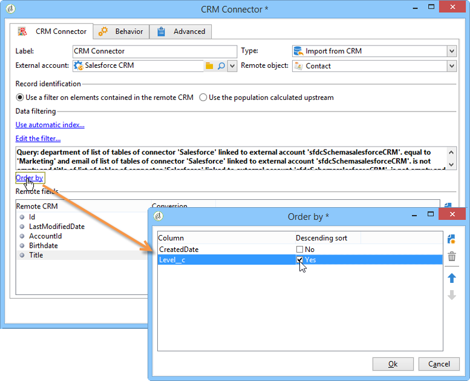
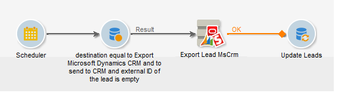
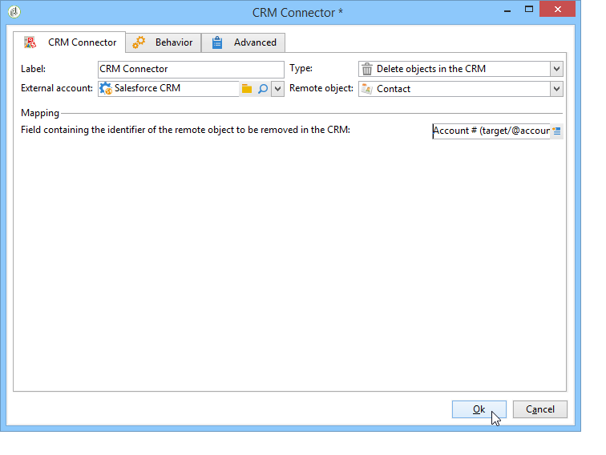

# CRM Connector{#crm-connector}

CRM連 **接器** ，可讓您設定Adobe Campaign和CRM之間的資料同步。

如需Adobe Campaign中CRM連接器的詳細資訊，請參閱本 [節](../../platform/using/crm-connectors.md)。

這表示您可以：

* 從CRM匯入(請參閱從 [CRM匯入](#importing-from-the-crm)),
* 匯出至CRM(請參 [閱匯出至CRM](#exporting-to-the-crm)),
* 匯入在CRM中刪除的物件(請參 [閱匯入在CRM中刪除的物件](#importing-objects-deleted-in-the-crm)),
* 刪除CRM中的物件(請參 [閱刪除CRM中的物件](#deleting-objects-in-the-crm))。


選擇與要配置同步的CRM匹配的外部帳戶，然後選擇要同步的對象（帳戶、業務機會、聯繫人等）。


此活動的配置取決於要執行的進程。 以下詳細說明了各種配置。

## 從CRM匯入 {#importing-from-the-crm}

若要在Adobe Campaign中透過CRM匯入資料，您必須建立下列類型的工作流程：


對於匯入活動， **CRM Connector** 活動設定步驟為：

1. 選擇操 **[!UICONTROL Import from the CRM]** 作。
1. 轉至下拉 **[!UICONTROL Remote object]** 式清單，並選取程式所關注的物件。 此物件與連接器設定期間在Adobe Campaign中建立的其中一個表格一致。
1. 轉到該 **[!UICONTROL Remote fields]** 部分並輸入要導入的欄位。

   若要新增欄位，請按一下工 **[!UICONTROL Add]** 具列中的按鈕，然後按一下圖 **[!UICONTROL Edit expression]** 示。

   

   如有必要，請透過欄的下拉式清單變更資料格 **[!UICONTROL Conversion]** 式。 本頁將詳述可能的轉換 [類型](../../platform/using/crm-connectors.md#data-format)。

   >[!CAUTION]
   >
   >CRM中記錄的識別碼是CRM和Adobe Campaign中連結物件的必備項。 當活動被核準時，就會自動新增它。
   > 
   >對於增量資料匯入，CRM端的最後修改日期也是強制性的。

1. 您也可以根據需求篩選要匯入的資料。 若要這麼做，請按一下 **[!UICONTROL Edit the filter...]** 連結。

   在下列範例中，Adobe Campaign將只匯入自2012年7月31日起已記錄某些活動的連絡人。

   

   連結至資料篩選模式的限制在資料篩選區 [段中有詳細說明](#filter-on-data) 。

1. 選 **[!UICONTROL Use automatic index]** 項可讓您根據日期及其上次修改，自動管理CRM和Adobe Campaign之間的增量物件同步。

   For more on this, refer to [Variable management](#variable-management).

## 變數管理 {#variable-management}

啟用選 **[!UICONTROL Automatic index]** 項可讓您僅收集自上次匯入後修改的物件。


預設情況下，上次同步的日期儲存在配置窗口中指定的選項中：

```
LASTIMPORT_<%=instance.internalName%>_<%=activityName%>
```

您可以指定要納入的遠端CRM欄位，以識別最近的變更。

依預設，會使用下列欄位（依指定順序）:

* 針對Microsoft Dynamics:已 **修改**,
* 對於Oracle On Demand:上次 **更新**、 **修改日期**、 **上次登入**、
* 若是Salesforce.com:LastModifiedDate **、** SystemModstamp ****。

啟用選 **[!UICONTROL Automatic index]** 項會產生三個變數，這些變數可透過類型活動用於同步 **[!UICONTROL JavaScript code]** 工作流程。 這些活動包括：

* **varscrmOptionName**:代表包含上次匯入日期的選項名稱。
* **vars.crmStartImport**:表示上次資料恢復的開始日期（包括）。
* **vars.crmEndDate**:代表上次資料復原的結束日期（已排除）。

   這些日期以下列格式顯示：yyyy/ **MM/dd hh:mm:ss**。

## 篩選資料 {#filter-on-data}

為了確保使用各種CRM進行高效操作，需要使用以下規則建立篩選器：

* 每個篩選級別只能使用一種邏輯運算子。
* 不支援EXCEPT(AND NOT)運算子。
* 比較可能只涉及空值(&#39;is empty&#39;/&#39;is not empty&#39; type)或數字。 這表示一旦評 **[!UICONTROL Value]** 估了列（右欄），此評估的結果必須是數字。
* 欄中的資料 **[!UICONTROL Value]** 會以JavaScript進行評估。
* 不支援JOIN比較。
* 左欄中的運算式必須是欄位。 它不能是多個表達式、數字等的組合。

例如，下列說明的篩選條件對CRM匯入無效，因為：

* OR運算子與AND運算子位於相同的層級。
* 對文本字串進行比較。


## 訂購依據 {#order-by}

在Microsoft Dynamics和Salesforce.com中，您可以依遞增或遞減順序對要匯入的遠端欄位排序。

若要這麼做，請按一 **[!UICONTROL Order by]** 下連結並新增欄至清單。

清單中欄的順序是排序順序：



## 記錄識別 {#record-identification}

您不需匯入CRM中包含（可能篩選）的元素，而是可以使用工作流程中預先計算的人口族群。

若要這麼做，請選取選 **[!UICONTROL Use the population calculated upstream]** 項並指定包含遠端識別碼的欄位。

然後選擇要導入的入站人口的欄位，如下所示：


## 匯出至CRM {#exporting-to-the-crm}

將Adobe Campaign資料匯出至CRM可讓您將整個內容複製到CRM資料庫。

若要將資料匯出至CRM，您需要建立下列類型的工作流程：



若是匯出，請套用下列設定至 **CRM Connector活動** :

1. 選擇操 **[!UICONTROL Export to CRM]** 作。
1. 轉至下拉 **[!UICONTROL Remote object]** 式清單，並選取程式所關注的物件。 此物件與連接器設定期間在Adobe Campaign中建立的其中一個表格一致。

   >[!CAUTION]
   >
   >「 **CRM連接器」活動的匯出功能** ，可插入或更新CRM端的欄位。 若要啟用CRM中的欄位更新，您必須指定遠端表格的主要索引鍵。 如果索引鍵遺失，則會插入資料（而非更新）。

1. 在該 **[!UICONTROL Mapping]** 節中，指定要導出的欄位及其在CRM中的映射。

   

   若要新增欄位，請按一下工 **[!UICONTROL Add]** 具列中的按鈕，然後按一下圖 **[!UICONTROL Edit expression]** 示。

   對於指定欄位，如果CRM端未定義相符項目，則無法更新值：會直接插入CRM。

   如有必要，請透過欄的下拉式清單變更資料格 **[!UICONTROL Conversion]** 式。 本節將詳述可能的轉換 [類型](../../platform/using/crm-connectors.md#data-format)。

   要導出的記錄清單和導出結果將保存在臨時檔案中，該臨時檔案在工作流完成或重新啟動之前仍可訪問。 這可讓您在發生錯誤時重新啟動程式，而不會執行多次匯出相同記錄或遺失資料的風險。

## 資料格式與錯誤處理 {#data-format-and-error-processing}

將資料格式匯入CRM或從CRM匯入時，您可以即時轉換資料格式。

若要這麼做，請選取要套用至相符欄的轉換。


此模 **[!UICONTROL Default]** 式會套用自動資料轉換，在大多數情況下會等於資料的複製／貼上。 不過，會套用時區管理。

其他可能的轉換包括：

* **[!UICONTROL Date only]**:此模式會刪除「日期+時間」類型欄位。
* **[!UICONTROL Without time offset]**:此模式取消在預設模式下應用的時區管理。
* **[!UICONTROL Copy/Paste]**:此模式使用原始資料，例如字串（無轉換）。


在資料匯入或匯出的架構中，您可以套用特定程式至錯誤和拒絕。 若要這麼做，請選取標 **[!UICONTROL Process rejects]** 簽中 **[!UICONTROL Process errors]** 的和 **[!UICONTROL Behavior]** 選項。

這些選項會放置相符的對外轉場。


然後，放置與您要套用的程式相關的活動。

要處理例項的錯誤，您可以添加等待活動並計畫工作流重試。

拒絕會收集到其錯誤代碼和相關消息，這表示您可以設定拒絕跟蹤以優化同步過程。

即使未啟 **[!UICONTROL Process rejects]** 用此選項，也會針對每個已拒絕的欄產生警告，並顯示錯誤碼和訊息。

出站 **[!UICONTROL Reject]** 轉換允許您訪問輸出方案，該輸出方案包含與錯誤消息和代碼相關的特定列。 這些欄包括：

* 對於Oracle On Demand: **errorLogFilename** （Oracle端的日誌檔案名）、 **errorCode** （錯誤代碼）、 **errorSymbol** （錯誤符號，與錯誤代碼不同）、 **** errorMessageDescription（錯誤上下文的說明）。
* 若是Salesforce.com: **errorSymbol** (error symbol **，不同於錯誤代碼),** errorMessage（錯誤上下文的說明）。

## 導入在CRM中刪除的對象 {#importing-objects-deleted-in-the-crm}

若要啟用廣泛的資料同步程式設定，您可以將CRM中刪除的物件匯入Adobe Campaign。

若要這麼做，請套用下列步驟：

1. 選擇操 **[!UICONTROL Import objects deleted in the CRM]** 作。
1. 轉至下拉 **[!UICONTROL Remote object]** 式清單，並選取程式所關注的物件。 此物件與連接器設定期間在Adobe Campaign中建立的其中一個表格一致。
1. 在和欄位中指定要考量的刪 **[!UICONTROL Start date]** 除期 **[!UICONTROL End date]** 間。 這些日期將包含在期間內。

   

   >[!CAUTION]
   >
   >元素刪除期間必須與CRM的特定限制相符。 例如，對於Salesforce.com,30天前刪除的元素無法復原。

## 刪除CRM中的對象 {#deleting-objects-in-the-crm}

若要刪除CRM端的物件，您必須指定要刪除之遠端元素的主要索引鍵。



此標 **[!UICONTROL Behavior]** 簽可讓您啟用拒絕的處理。 此選項會為活動產生第二個輸出轉 **[!UICONTROL CRM connector]** 換。 For more on this, refer to this [section](../../platform/using/crm-connectors.md#error-processing).

即使停用選 **[!UICONTROL Process rejects]** 項，也會針對每個拒絕的欄產生警告。

## 如何設定連絡人匯入的範例 {#example-of-how-to-configure-a-contact-import}

在以下示例中，活動配置為從Oracle On Demand CRM導入聯繫人。 在匯入之前，CRM欄位的選取方式會與Adobe Campaign資料庫中已存在的欄位一致。


