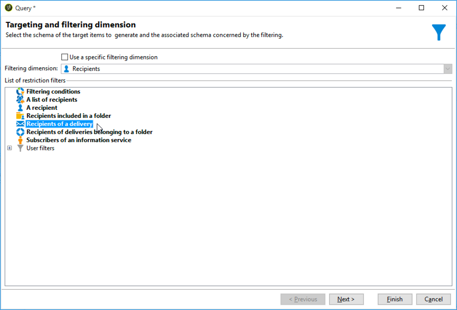

# 跨頻道傳遞工作流程{#cross-channel-delivery-workflow}

此使用案例提供跨通道傳送工作流程的範例。 在[本節](cross-channel-deliveries.md)中介紹跨通道傳送的一般概念。

目標是將受眾從資料庫的收件者細分為不同的群組，以便傳送電子郵件至群組，並傳送簡訊至其他群組。

此使用案例的主要實施步驟如下：

1. 建立&#x200B;**[!UICONTROL Query]**&#x200B;活動以鎖定您的對象。
1. 建立包含選件連結的&#x200B;**[!UICONTROL Email delivery]**&#x200B;活動。
1. 將&#x200B;**[!UICONTROL Split]**&#x200B;活動用於：

   * 傳送另一封電子郵件給未開啟第一封電子郵件的收件者。
   * 傳送簡訊給開啟電子郵件但未點按優惠方案連結的收件者。
   * 將開啟電子郵件並按一下連結的收件者新增至資料庫。

## 步驟1:鎖定對象 {#step-1--targeting-the-audience}

若要定義目標，請建立查詢以識別收件者。

1. 建立促銷活動. 如需詳細資訊，請參閱[本章節](../../campaign/using/setting-up-marketing-campaigns.md#creating-a-campaign)。
1. 在促銷活動的&#x200B;**[!UICONTROL Targeting and workflows]**&#x200B;標籤中，將&#x200B;**Query**&#x200B;活動新增至工作流程。 有關使用此活動的詳細資訊，請參閱[此部分](query.md)。
1. 定義將接收您傳遞內容的收件者。 例如，選擇「金」成員作為目標維。
1. 新增篩選條件至查詢。 在此範例中，選取具有電子郵件地址和行動電話號碼的收件者。

   

1. 儲存您的變更。

## 步驟2:建立包含優惠方案的電子郵件 {#step-2--creating-an-email-including-an-offer}

1. 建立&#x200B;**[!UICONTROL Email delivery]**&#x200B;活動，並在工作流程中連按兩下該活動以進行編輯。 如需建立電子郵件的詳細資訊，請參閱[此區段](../../delivery/using/about-email-channel.md)。
1. 設計訊息並將包含選件的連結插入內容中。

   

   如需將優惠方案整合至訊息內文的詳細資訊，請參閱[此區段](../../interaction/using/integrating-an-offer-via-the-wizard.md#delivering-with-a-call-to-the-offer-engine)。

1. 儲存您的變更。
1. 以滑鼠右鍵按一下&#x200B;**[!UICONTROL Email delivery]**&#x200B;活動以開啟它。
1. 選取&#x200B;**[!UICONTROL Generate an outbound transition]**&#x200B;選項以復原母體和追蹤記錄。

   

   這可讓您根據收件者在收到第一封電子郵件時的行為，使用此資訊來傳送另一封傳送。

1. 新增&#x200B;**[!UICONTROL Wait]**&#x200B;活動，讓收件者在數天內開啟電子郵件。

   

## 步驟3:將產生的對象分段 {#step-3--segmenting-the-resulting-audience}

識別目標並建立第一次傳遞後，您需要使用篩選條件將目標細分為不同的母體。

1. 將&#x200B;**Split**&#x200B;活動新增至工作流程並開啟它。 有關使用此活動的詳細資訊，請參閱[此部分](split.md)。
1. 從查詢上游的母體計算中建立三個區段。

   

1. 對於第一個子集，選擇&#x200B;**[!UICONTROL Add a filtering condition on the inbound population]**&#x200B;選項，然後按一下&#x200B;**[!UICONTROL Edit]**。

   

1. 選擇&#x200B;**[!UICONTROL Recipients of a delivery]**&#x200B;作為限制篩選器，然後按一下&#x200B;**[!UICONTROL Next]**。

   

1. 在篩選設定中，從&#x200B;**[!UICONTROL Behavior]**&#x200B;下拉式清單中選取&#x200B;**[!UICONTROL Recipients who have not opened or clicked (email)]**，然後從傳送清單中選取包含您要傳送之優惠方案的電子郵件。 按一下&#x200B;**[!UICONTROL Finish]**。

   

1. 對第二個子集執行類似操作，然後從&#x200B;**[!UICONTROL Behavior]**&#x200B;下拉清單中選擇&#x200B;**[!UICONTROL Recipients who have not clicked (email)]**。

   

1. 對於第三個子集，在選擇&#x200B;**[!UICONTROL Add a filtering condition on the inbound population]**&#x200B;並按一下&#x200B;**[!UICONTROL Edit]**&#x200B;後，選擇&#x200B;**[!UICONTROL Use a specific filtering dimension]**&#x200B;選項。
1. 從&#x200B;**[!UICONTROL Filtering dimension]**&#x200B;下拉清單中選擇&#x200B;**[!UICONTROL Recipient tracking log]**，從&#x200B;**[!UICONTROL List of restriction filters]**&#x200B;中突出顯示&#x200B;**[!UICONTROL Filtering conditions]**，然後按一下&#x200B;**[!UICONTROL Next]**。

   

1. 選取篩選條件，如下所示：

   

1. 按一下&#x200B;**[!UICONTROL Finish]**&#x200B;以儲存變更。

## 步驟4:完成工作流程 {#step-4--finalizing-the-workflow}

1. 在&#x200B;**[!UICONTROL Split]**&#x200B;活動產生的三個子集之後，將相關活動新增至您的工作流程：

   * 新增&#x200B;**[!UICONTROL Email delivery]**&#x200B;活動，以傳送提醒電子郵件至第一個子集。
   * 新增&#x200B;**[!UICONTROL Mobile delivery]**&#x200B;活動以傳送SMS訊息至第二個子集。
   * 新增&#x200B;**[!UICONTROL List update]**&#x200B;活動，將對應的收件者新增至資料庫。

1. 連按兩下工作流程中的傳送活動以進行編輯。 如需建立電子郵件和簡訊的詳細資訊，請參閱[電子郵件通道](../../delivery/using/about-email-channel.md)和[SMS通道](../../delivery/using/sms-channel.md)。
1. 連按兩下&#x200B;**[!UICONTROL List update]**&#x200B;活動並選取&#x200B;**[!UICONTROL Generate an outbound transition]**&#x200B;選項。

   然後，您可以將產生的收件者從Adobe Campaign匯出至Adobe Experience Cloud。 例如，您可以將&#x200B;**[!UICONTROL Update shared audience]**&#x200B;活動新增至工作流程，以在Adobe Target中使用對象。 如需詳細資訊，請參閱[匯出對象](../../integrations/using/importing-and-exporting-audiences.md#exporting-an-audience)。

1. 按一下動作列中的&#x200B;**開始**&#x200B;按鈕以執行工作流程。

將分段&#x200B;**Query**&#x200B;活動所定位的母體，以根據收件者的行為接收電子郵件或簡訊傳送。 剩餘母體將使用&#x200B;**[!UICONTROL List update]**&#x200B;活動新增至資料庫。
