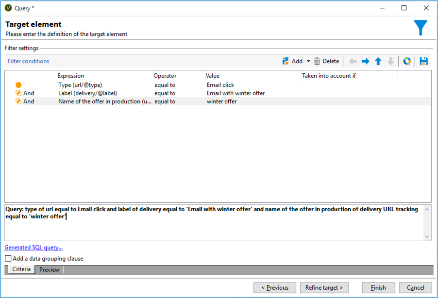

# 跨通道傳送工作流程{#cross-channel-delivery-workflow}

此使用案例提供跨通道傳送工作流程的範例。 本節將介紹跨通道傳送的一 [般概念](../../workflow/using/cross-channel-deliveries.md)。

目標是將資料庫收件者的讀者細分為不同群組，以便傳送電子郵件至群組，並傳送SMS訊息至其他群組。

此使用案例的主要實施步驟如下：

1. 建立活動 **[!UICONTROL Query]** 以鎖定您的觀眾。
1. 建立包 **[!UICONTROL Email delivery]** 含選件連結的活動。
1. 使用活 **[!UICONTROL Split]** 動可：

   * 傳送另一封電子郵件給未開啟第一封電子郵件的收件者。
   * 傳送簡訊給開啟電子郵件但未按一下選件連結的收件者。
   * 將開啟電子郵件並按一下連結的收件者新增至資料庫。

## 步驟1:鎖定受眾 {#step-1--targeting-the-audience}

若要定義目標，請建立查詢以識別收件者。

1. 建立促銷活動。 如需詳細資訊，請參閱[本小節](../../campaign/using/setting-up-marketing-campaigns.md#creating-a-campaign)。
1. 在促銷 **[!UICONTROL Targeting and workflows]** 活動的標籤中，新增「查 **詢** 」活動至工作流程。 For more on using this activity, refer to [this section](../../workflow/using/query.md).
1. 定義將接收您遞送的收件者。 例如，選擇「Gold」成員作為目標維。
1. 新增篩選條件至查詢。 在此範例中，選取具有電子郵件地址和行動號碼的收件者。

   

1. 儲存您的變更。

## 步驟2:建立包含選件的電子郵件 {#step-2--creating-an-email-including-an-offer}

1. 建立活 **[!UICONTROL Email delivery]** 動，並在工作流程中按兩下該活動以進行編輯。 如需建立電子郵件的詳細資訊，請參 [閱本節](../../delivery/using/about-email-channel.md)。
1. 設計訊息並將包含選件的連結插入內容。

   

   如需將選件整合至訊息內文的詳細資訊，請參閱 [本節](../../interaction/using/integrating-an-offer-via-the-wizard.md#delivering-with-a-call-to-the-offer-engine)。

1. 儲存您的變更。
1. 以滑鼠右鍵按一 **[!UICONTROL Email delivery]** 下活動以開啟它。
1. 選取 **[!UICONTROL Generate an outbound transition]** 可復原人口與追蹤記錄檔的選項。

   

   這可讓您使用這項資訊，根據收件者在收到第一封電子郵件時的行為，傳送其他傳送內容。

1. 新增活 **[!UICONTROL Wait]** 動，讓收件者在幾天內開啟電子郵件。

   

## 步驟3:將產生的觀眾區隔 {#step-3--segmenting-the-resulting-audience}

在識別目標並建立第一次傳送後，您必須使用篩選條件將目標細分為不同的人口族群。

1. 將「分 **割** 」活動新增至工作流程並開啟。 For more on using this activity, refer to [this section](../../workflow/using/split.md).
1. 從查詢上游計算的人口族群建立三個區段。

   

1. 對於第一個子集，選擇選 **[!UICONTROL Add a filtering condition on the inbound population]** 項並按一下 **[!UICONTROL Edit]**。

   

1. 選擇 **[!UICONTROL Recipients of a delivery]** 作為限制篩選器並按一下 **[!UICONTROL Next]**。

   

1. 在篩選設定中，從下 **[!UICONTROL Recipients who have not opened or clicked (email)]** 拉式清 **[!UICONTROL Behavior]** 單中選擇，然後選取電子郵件，包括您要從傳送清單傳送的選件。 按一下 **[!UICONTROL Finish]**.

   

1. 對第二個子集進行類似操作， **[!UICONTROL Recipients who have not clicked (email)]** 然後從下 **[!UICONTROL Behavior]** 拉式清單中選擇。

   

1. 對於第三個子集，在選擇並單 **[!UICONTROL Add a filtering condition on the inbound population]** 擊後 **[!UICONTROL Edit]**，選擇 **[!UICONTROL Use a specific filtering dimension]** 選項。
1. 從下 **[!UICONTROL Recipient tracking log]** 拉式清 **[!UICONTROL Filtering dimension]** 單中選取，從中反 **[!UICONTROL Filtering conditions]** 白標示，然 **[!UICONTROL List of restriction filters]** 後按一下 **[!UICONTROL Next]**。

   

1. 選擇篩選條件，如下所示：

   

1. 按一 **[!UICONTROL Finish]** 下以儲存變更。

## 步驟4:最終確定工作流 {#step-4--finalizing-the-workflow}

1. 將相關活動新增至工作流程中，並依活動產生的三個子集而 **[!UICONTROL Split]** 新增：

   * 新增活 **[!UICONTROL Email delivery]** 動以傳送提醒電子郵件至第一個子集。
   * 新增活 **[!UICONTROL Mobile delivery]** 動以傳送SMS訊息至第二個子集。
   * 新增活 **[!UICONTROL List update]** 動，將對應的收件者新增至資料庫。

1. 連按兩下工作流程中的傳送活動以進行編輯。 如需建立電子郵件和簡訊的詳細資訊，請參 [閱電子郵件](../../delivery/using/about-email-channel.md)[頻道和簡訊頻道](../../delivery/using/sms-channel.md)。
1. 連按兩下活 **[!UICONTROL List update]** 動並選取選 **[!UICONTROL Generate an outbound transition]** 項。

   然後，您可以將產生的收件者從Adobe Campaign匯出至Adobe Experience Cloud。 例如，您可以在Adobe Target中新增活動至工作流程，以 **[!UICONTROL Update shared audience]** 使用對象。 如需詳細資訊，請參閱匯 [出觀眾](../../integrations/using/importing-and-exporting-audiences.md#exporting-an-audience)。

1. 按一下操 **作欄** 中的「開始」按鈕以執行工作流。

查詢活動所定位的 **人口族群** ，將會依收件者的行為加以區隔，以接收電子郵件或簡訊傳送。 剩餘人口將使用活動添加到數 **[!UICONTROL List update]** 據庫。
