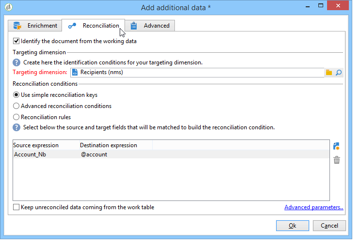

# 資料生命週期 {#data-life-cycle}


## 工作表 {#work-table}

在工作流程中，從一個活動傳輸到另一個活動的資料會儲存在臨時工作表中。

在適當的轉變上按一下滑鼠右鍵，即可顯示和分析此資料。


要執行此操作，請選取相關功能表：

* 顯示目標

   此功能表會顯示目標母體上的可用資料以及工作表結構(**[!UICONTROL Schema]** 標籤)。

   

   有關詳細資訊，請參閱 [工作表和工作流程結構描述](monitoring-workflow-execution.md#worktables-and-workflow-schema).

* 分析目標

   此功能表可讓您存取描述性分析精靈，該精靈可讓您產生轉變資料的統計資料和報告。

   如需詳細資訊，請參閱本[區段](../../reporting/using/using-the-descriptive-analysis-wizard.md)。

在執行工作流程時清除目標資料。 只能存取最後一個工作表。 您可以設定工作流程，讓所有工作表都保持可存取狀態：檢查 **[!UICONTROL Keep the result of interim populations between two executions]** 工作流程屬性中的選項。

不過，我們建議您避免在出現大量資料時啟用此選項。


## 目標資料 {#target-data}

儲存在工作流程工作表中的資料可在個人化欄位中存取。

這可讓您使用透過清單收集的資料，或是根據傳送中調查的回答收集的資料。 要執行此操作，請使用下列語法：

```
%= targetData.FIELD %
```

**[!UICONTROL Target extension]** (targetData)型別個人化元素不適用於目標工作流程。 必須在工作流程中建立傳遞目標，並在傳遞的入站轉變中指定。

如果您想要建立傳遞校樣，校樣目標需要根據 **[!UICONTROL Address substitution]** 模式，以便輸入個人化資料。 如需詳細資訊，請參閱本[區段](../../delivery/using/steps-defining-the-target-population.md#using-address-substitution-in-proof)。

在以下範例中，我們將收集客戶資訊清單，以用於個人化電子郵件中。

應用以下步驟：

1. 建立工作流程以收集資訊，將其與資料庫中已存在的資料進行調解，然後開始傳送。

   

   在我們的範例中，檔案內容如下：

   ```
   Music,First name,Last name,Account,CD/DVD,Card
   Pop,David,BLAIR,4323,CD,0
   Rock,Daniel,ARCARI,3222,DVD,1
   Disco,Uma,ALTON,0488,DVD,0
   Jazz,Paul,BOLES,6475,CD,1
   Jazz,David,BOUKHARI,0841,DVD,1
   [...]
   ```

   若要載入檔案，請套用下列步驟：

   

1. 設定 **[!UICONTROL Enrichment]** 輸入activity ，將收集的資料與Adobe Campaign資料庫中已存在的資料進行調解。

   在此，調解金鑰是帳號：

   

1. 然後設定 **[!UICONTROL Delivery]**：此變數根據範本建立，收件者則由入站轉變指定。

   

   >[!CAUTION]
   >
   >只能使用轉變中包含的資料來個人化傳遞。 **targetdata** 型別個人化欄位僅適用於 **[!UICONTROL Delivery]** 活動。

1. 在傳遞範本中，使用在工作流程中收集的欄位。

   要執行此操作，請插入 **[!UICONTROL Target extension]** 輸入個人化欄位。

   

   在此，我們要插入客戶最愛的音樂流派和媒體型別（CD或DVD），如工作流程收集的檔案中所述。

   此外，我們將為熟客卡持有者（即「卡片」值等於1的收件者）新增優惠券。

   

   **[!UICONTROL Target extension]** (targetData)型別資料會使用與所有個人化欄位相同的特性，插入傳遞中。 它們也可用於主旨、連結標籤或連結本身。

   寄給所收集收件者的郵件將包含下列資料：

   
