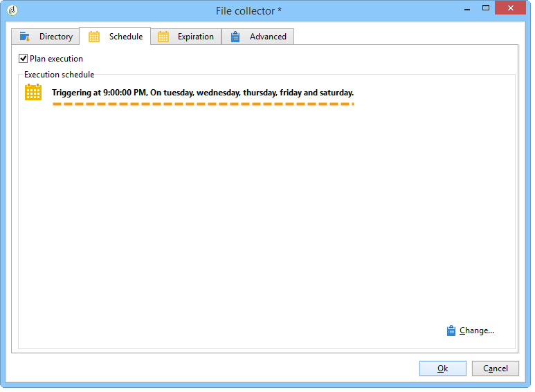
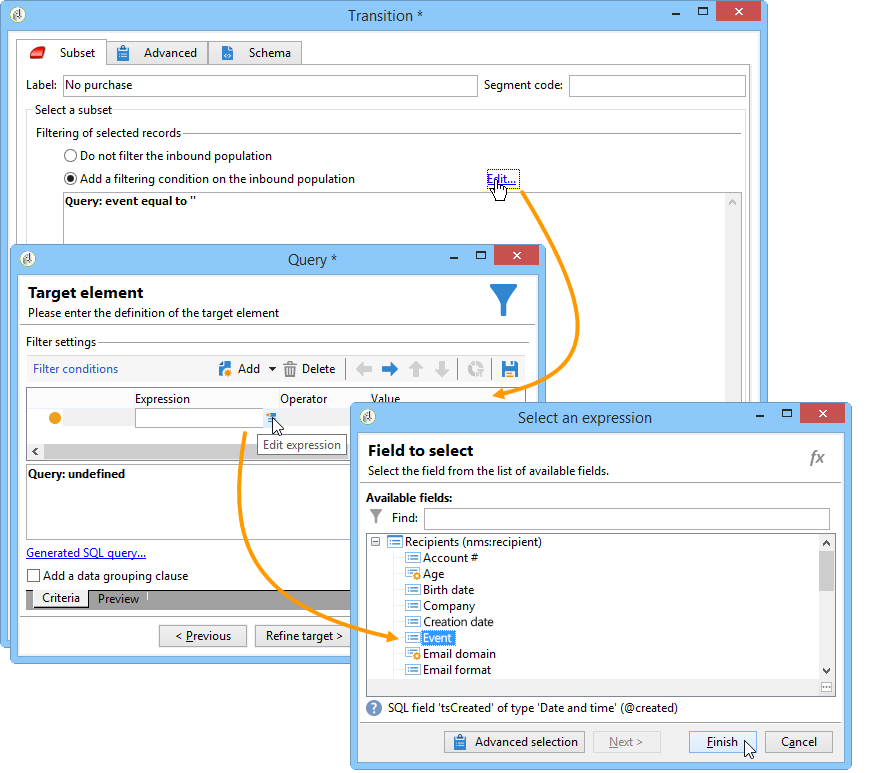

# 資料載入 (檔案){#data-loading-file}

## 使用{#use}

**[!UICONTROL Data loading (File)]**&#x200B;活動可讓您直接存取外部資料來源，並在Adobe Campaign中使用。 事實上，定位作業所需的所有資料並不總是出現在Adobe Campaign資料庫中：可在外部檔案中使用。

要載入的檔案可通過轉換指定，或在執行此活動期間計算。 例如，它可以是客戶機的10種最愛產品的清單，這些產品的採購在外部資料庫中進行管理。

此活動的配置窗口的上半部分可讓您定義檔案格式。 若要這麼做，請使用與要匯入的檔案格式相同的範例檔案。 此檔案可儲存在本機或伺服器上。

>[!CAUTION]
>
>僅支援「平面」結構檔案（例如CSV、TXT等）。 不建議使用XML格式。

例如，您可以定義在檔案匯入期間要執行的預先處理，以免在伺服器上解壓縮檔案（並因此儲存解壓縮檔案的空間），但在檔案處理中加入解壓縮。 選擇&#x200B;**[!UICONTROL Pre-process the file]**&#x200B;選項，並從3個選項中選擇：**[!UICONTROL None]**、**[!UICONTROL Decompression]**(zcat)或&#x200B;**[!UICONTROL Decrypt]**(gpg)。

如需更多相關資訊，請參閱本節：[在處理](../../workflow/using/importing-data.md#unzipping-or-decrypting-a-file-before-processing)之前解壓縮或解密檔案。

## 定義檔案格式{#defining-the-file-format}

載入檔案時，會自動偵測欄格式及每種資料類型的預設參數。 您可以修改這些預設參數，以指定要套用至資料的特定程式，尤其是當有錯誤或空值時。

要執行此操作，請在&#x200B;**[!UICONTROL Data loading (file)]**&#x200B;活動的主窗口中選擇&#x200B;**[!UICONTROL Click here to change the file format...]**。 隨後將開啟格式詳細資訊窗口。

然後，您可以修改檔案的常規格式以及每列的格式。

一般的檔案格式可讓您定義欄的識別方式（檔案編碼、使用分隔符等）。

欄格式化可讓您定義每列的值處理：

* **[!UICONTROL Ignore column]**：不會在資料載入期間處理此欄。
* **[!UICONTROL Data type]**：指定每欄所需的資料類型。
* **[!UICONTROL Allow NULLs]**:指定如何管理空值。

   * **[!UICONTROL Adobe Campaign default]**：僅為數字欄位產生錯誤，否則插入 NULL 值。
   * **[!UICONTROL Empty value allowed]**：授權空值。因此插入值 NULL。
   * **[!UICONTROL Always populated]**：如果值為空，則產生錯誤。

* **[!UICONTROL Length]**:指定字串資料類型的字 **** 符數上限。
* **[!UICONTROL Format]**:定義時間和日期格式。
* **[!UICONTROL Data transformation]**:定義字元大小寫程式是否需要套用至字 **串**。

   * **[!UICONTROL None]**:匯入的字串不會修改。
   * **[!UICONTROL First letter in upper case]**:字串每個字詞的第一個字母以大寫開頭。
   * **[!UICONTROL Upper case]**:字串中的所有字元都以大寫顯示。
   * **[!UICONTROL Lower case]**:字串中的所有字元都以小寫顯示。

* **[!UICONTROL White space management]**:指定字串中是否需要忽略某些空格。**[!UICONTROL Ignore spaces]**&#x200B;值只允許忽略字串開頭和結尾的空格。
* **[!UICONTROL Error processings]**：會定義發生錯誤時的行為。

   * **[!UICONTROL Ignore the value]**：會忽略值。會在工作流程執行記錄檔中產生警告。
   * **[!UICONTROL Reject line]**：不會處理整行。
   * **[!UICONTROL Use a default value in case of error]**：以在　**[!UICONTROL Default value]**　欄位中定義的預設值取代造成錯誤的值。
   * **[!UICONTROL Reject the line when there is no remapping value]**:除非為錯誤值定義了映射(請參閱下面的選 **[!UICONTROL Mapping]** 項)，否則不處理整行。
   * **[!UICONTROL Use a default value in case the value is not remapped]**:以在欄位中定義的預設值取代導致錯誤的值， **[!UICONTROL Default value]** 除非已為錯誤值定義對應(請參閱 **[!UICONTROL Mapping]** 下列選項)。

* **[!UICONTROL Default value]**：根據選取的錯誤處理指定預設值。
* **[!UICONTROL Mapping]**:此欄位僅在列詳細配置中可用（通過按兩下或通過列清單右側的選項訪問）。這會在匯入某些值時轉換這些值。 例如，您可將　&quot;three&quot;　轉換為　&quot;3&quot;。

## 範例：收集資料並將其載入到資料庫{#example--collecting-data-and-loading-it-in-the-database}中

以下範例可讓您每天在伺服器上收集檔案、載入其內容，並根據檔案包含的資訊更新資料庫中的資料。 要收集的檔案包含客戶可能已購買（價格在3000歐元以上）、要求購買時退款或未購買任何商品就去商店購物的資訊。 根據此資訊，各種進程將應用於資料庫中的其配置檔案。

1. 檔案收集器允許您恢復儲存在目錄中的檔案，具體取決於給定的頻率。

   **[!UICONTROL Directory]**&#x200B;頁籤包含有關要恢復的檔案的資訊。 在我們的示例中，將恢復所有文本格式的檔案，其名稱中包含單字&#39;customers&#39;，並儲存在伺服器的tmp/Adobe/Data/files目錄中。

   使用&#x200B;**[!UICONTROL File collector]**&#x200B;在[檔案收集器](../../workflow/using/file-collector.md)部分中有詳細說明。

   

   使用&#x200B;**[!UICONTROL Schedule]**&#x200B;頁籤可以調度收集器的執行，即指定檢查這些檔案存在的頻率。

   在這裡，我們想在每個工作日的晚上9點觸發收集器。

   

   若要這麼做，請按一下編輯工具右下方區段中的&#x200B;**[!UICONTROL Change...]**&#x200B;按鈕，並設定排程。

   有關詳細資訊，請參閱[調度程式](../../workflow/using/scheduler.md)。

1. 然後設定資料載入（檔案）活動，以指出應如何讀取收集的檔案。 若要這麼做，請選取與要載入的檔案結構相同的範例檔案。

   

   在此，檔案包含五欄：

   * 第一欄包含與事件相符的程式碼：購買（大於或少於3,000歐元），一次或多次購買時不會購買或退款。
   * 以下四欄包含客戶的名字、姓氏、電子郵件和帳號。

   要載入的檔案格式設定與在Adobe Campaign中匯入資料時所定義的格式設定一致。 如需詳細資訊，請參閱本[區段](../../platform/using/importing-data.md#step-2---source-file-selection)。

1. 在拆分活動中，根據&#x200B;**Event**&#x200B;列值指定要建立的子集。

   「拆分」活動在該節中有詳細說明。

   

   對於每個子集，請在&#x200B;**Event**&#x200B;列中指定其中一個值。

   

   因此，**[!UICONTROL Split]**&#x200B;活動將包含以下資訊：

   

1. 然後，指定要針對每種類型的人口群實施的流程。 在我們的示例中，我們將在資料庫中訪問&#x200B;**[!UICONTROL Update the data]**。 若要這麼做，請在分割活動的每個傳出轉場結束時放置&#x200B;**[!UICONTROL Update data]**&#x200B;活動。

   **[!UICONTROL Update data]**&#x200B;活動在[更新資料](../../workflow/using/update-data.md)部分中詳細說明。

