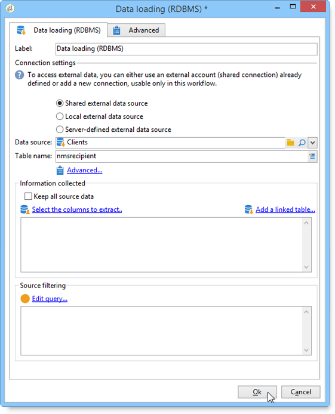

# 資料載入 (RDBMS){#data-loading-rdbms}

**[!UICONTROL Data loading (RDBMS)]**&#x200B;活動可讓您直接存取此外部資料庫，並僅收集定位所需的資料。

若要改善效能，我們建議使用查詢活動（可在其中使用外部資料庫的資料）。 如需詳細資訊，請參閱[存取外部資料庫(FDA)](accessing-an-external-database-fda.md)。

操作如下：

1. 從清單中選取資料來源，然後輸入包含要擷取之資料的表格名稱。

   

   在對應欄位中輸入的表格名稱會作為範本使用，以便在外部資料庫中收集資料。 工作流程處理的表格名稱，可由資料載入活動的入站轉變計算或傳送。 若要選取要使用的資料表，請按一下&#x200B;**[!UICONTROL Advanced..]**。 連結並選取&#x200B;**[!UICONTROL Specified in the transition]**&#x200B;或&#x200B;**[!UICONTROL Explicit]**&#x200B;選項。

   

1. 按一下&#x200B;**[!UICONTROL Select the columns to extract...]**&#x200B;連結以選擇要收集到資料庫中的資料。

   

1. 您可以在此資料上定義篩選器。 若要這麼做，請按一下&#x200B;**[!UICONTROL Edit query....]**&#x200B;連結。

   如此收集的資料可在整個工作流程生命週期中使用。
