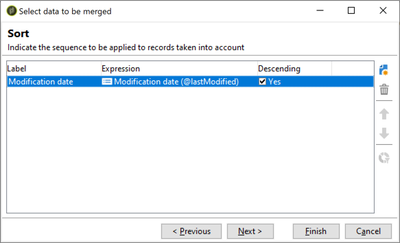

# 使用重複資料消除活動的合併功能{#deduplication-merge}

## 關於此使用案例{#about-this-use-case}

此使用案例說明如何使用&#x200B;**[!UICONTROL Deduplication]**&#x200B;活動中的&#x200B;**[!UICONTROL Merge]**&#x200B;功能。

有關此字型的詳細資訊，請參閱[本節](../../workflow/using/deduplication.md#merging-fields-into-single-record)。

**[!UICONTROL Deduplication]**&#x200B;活動用於從資料集中刪除重複行。 在此使用案例中，以下顯示的資料會根據「電子郵件」欄位進行複製。

| 上次修改日期 | 名字 | 姓氏 | 電子郵件 | 行動電話 | 電話 |
|-----|------------|-----------|-------|--------------|------|
| 2020年5月19日 | 羅伯特 | 蒂斯納 | bob@mycompany.com | 444-444-444 | 777-777-7777 |
| 2020年7月22日 | 鮑比 | 蒂斯納 | bob@mycompany.com |  | 777-777-7777 |
| 10/03/2020 | 鮑勃 |  | bob@mycompany.com |  | 888-888-8888 |

使用重複資料消除活動的&#x200B;**[!UICONTROL Merge]**&#x200B;字元，您可以為重複資料消除配置一組規則，以定義一組欄位，以便合併到單個生成的資料記錄中。 例如，您可以使用一組重複的記錄，選擇保留最舊的電話號碼或最新名稱。

## 激活合併功能{#activating-merge}

若要啟用合併功能，您必須先設定&#x200B;**[!UICONTROL Deduplication]**&#x200B;活動。 要執行此操作，請依照下列步驟執行：

1. 開啟活動，然後按一下「編輯設定&#x200B;]**」連結。**[

1. 選擇要用於重複資料消除的協調欄位，然後按一下&#x200B;**[!UICONTROL Next]**。 在此範例中，我們想根據電子郵件欄位進行去重複化。

   

1. 按一下&#x200B;**[!UICONTROL Advanced parameters]**&#x200B;連結，然後啟動&#x200B;**[!UICONTROL Merge records]**&#x200B;和&#x200B;**[!UICONTROL Use several record merging criteria]**&#x200B;選項。

   

1. **[!UICONTROL Merge]**&#x200B;標籤會新增至&#x200B;**[!UICONTROL Deduplication]**&#x200B;設定畫面。 在執行重複資料消除時，我們將使用此頁籤指定要合併的資料。

## 配置要合併{#configuring-rules}的欄位

以下是我們要用來將資料合併為單一記錄的規則：

* 保留最新名稱（名字和姓氏欄位）,
* 保留最新的行動電話，
* 保留最舊的電話號碼，
* 群組中的所有欄位都必須非空值，才能符合最終記錄的資格。

若要設定這些規則，請遵循下列步驟：

1. 開啟&#x200B;**[!UICONTROL Merge]**&#x200B;標籤，然後按一下&#x200B;**[!UICONTROL Add]**&#x200B;按鈕。

   

1. 指定要合併的欄位群組的識別碼和標籤。

   

1. 指明選擇要考慮的記錄的條件。

   

1. 在上次修改日期排序，以選擇最新名稱。

   

1. 選擇要合併的欄位。 在此範例中，我們要保留名字和姓氏欄位。

   

1. 欄位會新增至要合併的資料集，而新元素則會新增至工作流程架構。

   重複這些步驟以設定行動電話和電話欄位。

   

   

## 結果{#results}

在設定這些規則後，會在&#x200B;**[!UICONTROL Deduplication]**&#x200B;活動結束時收到下列資料。

| 修改日期 | 名字 | 姓氏 | 電子郵件 | 行動電話 | 電話 |
-----|------------|-----------|-------|--------------|------|
| 2020年5月19日 | 羅伯特 | 蒂斯納 | bob@mycompany.com | 444-444-444 | 777-777-7777 |
| 2020年7月22日 | 鮑比 | 蒂斯納 | bob@mycompany.com |  | 777-777-7777 |
| 10/03/2020 | 鮑勃 |  | bob@mycompany.com |  | 888-888-8888 |

根據先前配置的規則，將結果從三個記錄中合併。 通過比較，得出使用最新名稱和手機以及原電話號碼的結論。

| 名字 | 姓氏 | 電子郵件 | 行動電話 | 電話 |
|------------|-----------|-------|--------------|------|
| 鮑比 | 蒂斯納 | bob@mycompany.com | 444-444-4444 | 888-888-8888 |

>[!NOTE]
>
> 請注意，已合併的名字是&quot;Bobby&quot;，因為我們設定了由名字和姓氏欄位組成的&quot;Name&quot;規則。
>
>因此，「Bob」（最近的名字）無法納入考量，因為其關聯的姓氏欄位是空的。 最近的名字和姓氏組合被合併到了最終記錄中。
