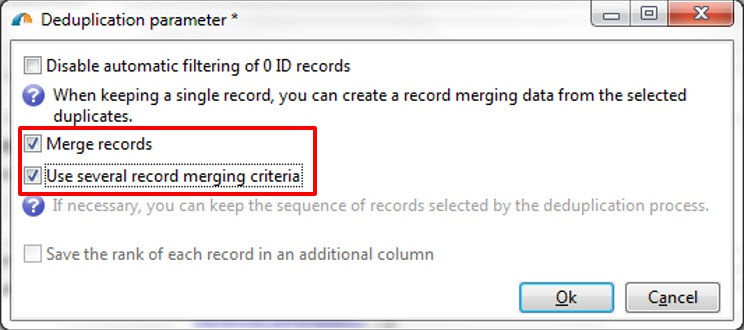

# 重複資料刪除{#deduplication}

重複資料消除從入站活動的結果中刪除重複項。 可在電子郵件地址、電話號碼或其他欄位上執行重複資料刪除。

**[!UICONTROL Deduplication]**&#x200B;活動用於從資料集中刪除重複行。 例如，以下記錄可能會被視為重複，因為它們有相同的電子郵件地址和相同的行動及／或家用電話。

| 上次修改日期 | 名字 | 姓氏 | 電子郵件 | 行動電話 | 電話 |
-----|------------|-----------|-------|--------------|------
| 02/03/2020 | 鮑勃 | 蒂斯納 | bob@mycompany.com | 444-444-4444 | 888-888-8888 |
| 05/19/2020 | 羅伯特 | 蒂斯納 | bob@mycompany.com | 444-444-4444 | 777-777-7777 |
| 07/22/2020 | 鮑比 | 蒂斯納 | bob@mycompany.com | 444-444-4444 | 777-777-7777 |

**[!UICONTROL Deduplication]**&#x200B;活動可在識別重複項後將整行保留為唯一記錄。 例如，在上述使用案例中，如果活動設定為僅保留最舊&#x200B;**[!UICONTROL Date]**&#x200B;的記錄，則結果為：

| 日期 | 名字 | 姓氏 | 電子郵件 | 行動電話 | 電話 |
-----|----------|------------|-------|--------------|------
| 02/03/2020 | 鮑勃 | 蒂斯納 | bob@mycompany.com | 444-444-4444 | 888-888-8888 |

所選主記錄將繼承資料，而不將欄位資料與重複行中其它相關資料合併。

補充：

| 日期 | 名字 | 姓氏 | 電子郵件 | 行動電話 | 電話 |
-----|------------|-----------|-------|--------------|------
| 05/19/2020 | 羅伯特 | 蒂斯納 | bob@mycompany.com | 444-444-4444 | 777-777-7777 |
| 07/22/2020 | 鮑比 | 蒂斯納 | bob@mycompany.com | 444-444-4444 | 777-777-7777 |

## 最佳實務{#best-practices}

在重複資料消除期間，入站流將單獨處理。 例如，如果在查詢1的結果和查詢2的結果中都找到收件者A，則不會對它們進行重複資料消除。

此問題需解決如下：

* 建立&#x200B;**Union**&#x200B;活動以統一每個入站流。
* 在&#x200B;**Union**&#x200B;活動後建立&#x200B;**重複資料消除**&#x200B;活動。

## 設定 {#configuration}

要配置重複資料消除，請輸入其標籤、方法和重複資料消除標準，以及與結果相關的選項。

1. 按一下&#x200B;**[!UICONTROL Edit configuration...]**&#x200B;連結以定義重複資料消除模式。

   

1. 選擇此活動的目標類型（預設情況下，重複資料消除連結到收件人）和要使用的標準，即相同值允許您標識重複項的欄位。

   >[!NOTE]
   >
   >如果您使用外部資料作為輸入，例如從外部檔案輸入，請務必選取&#x200B;**[!UICONTROL Temporary schema]**&#x200B;選項。
   >
   >在下一步中，**[!UICONTROL Other]**&#x200B;選項可讓您選取要使用的准則或准則：

   

1. 在下一步中，**[!UICONTROL Other]**&#x200B;選項可讓您選擇在相同值情況下要使用的准則或准則。

   

1. 從下拉清單中，選擇要使用的重複資料消除方法，並輸入要保留的重複數。

   

   可使用下列方法：

   * **[!UICONTROL Choose for me]**：隨機選取要保留在重複項目外的記錄。
   * **[!UICONTROL Following a list of values]**：可讓您定義一或多個欄位的值優先順序。若要定義值，請選取欄位或建立運算式，然後將值新增至適當的資料表中。若要定義新欄位，請按一下值清單上方的 **[!UICONTROL Add]** 按鈕。

      

   * **[!UICONTROL Non-empty value]**：您可以保留所選運算式的值不為空白的記錄作為優先順序。

      

   * **[!UICONTROL Using an expression]**:可讓您使用指定運算式的最低（或最高）值來保存記錄。

      
   >[!NOTE]
   >
   >**[!UICONTROL Merge]**&#x200B;功能可透過&#x200B;**[!UICONTROL Advanced parameters]**&#x200B;連結存取，可讓您設定一組規則，以便將欄位或欄位群組合併為單一產生的資料記錄。 有關詳細資訊，請參閱[將欄位合併到單個記錄](#merging-fields-into-single-record)。

1. 按一下&#x200B;**[!UICONTROL Finish]**&#x200B;批准所選的重複資料消除方法。

   窗口的中部區域將匯總定義的配置。

   在活動編輯器窗口的下部，您可以修改圖形對象的出站轉換標籤，並輸入與活動結果關聯的段代碼。 此程式碼稍後可用作定位標準。

   

1. 如果希望利用剩餘人口，請選中&#x200B;**[!UICONTROL Generate complement]**&#x200B;選項。 補碼由所有復本組成。 然後，活動中會新增額外的轉場，如下所示：

   

## 範例：在傳送之前識別重複項目{#example--identify-the-duplicates-before-a-delivery}

在以下示例中，重複資料消除涉及三個查詢的聯合。

工作流程的目的是透過排除重複項目來定義傳送的目標，以避免多次傳送給相同的收件者。

標識的重複項還將整合到專用的重複項清單中，如有必要，可以重複使用。

1. 新增並連結工作流程運作所需的各種活動，如上所示。

   此處使用union活動將三個查詢「統一」為單一轉換。 因此，重複資料刪除不能單獨用於每個查詢，而是用於整個查詢。 有關此主題的詳細資訊，請參閱[最佳實踐](#best-practices)。

1. 開啟重複資料消除活動，然後按一下&#x200B;**[!UICONTROL Edit configuration...]**&#x200B;連結以定義重複資料消除模式。
1. 在新窗口中，選擇&#x200B;**[!UICONTROL Database schema]**。
1. 選擇「**收件者**」作為定位和篩選維度。
1. 選擇&#x200B;**[!UICONTROL Email]**&#x200B;復本的ID欄位，只傳送一次至每個電子郵件地址，然後按一下&#x200B;**[!UICONTROL Next]**。

   如果希望將重複的ID基於特定欄位，請選擇&#x200B;**[!UICONTROL Other]**&#x200B;以訪問可用欄位清單。

1. 選擇只保留一個項目，當為多個收件者識別相同的電子郵件地址時。
1. 選擇&#x200B;**[!UICONTROL Choose for me]**&#x200B;重複資料消除模式，以便隨機選擇在發現重複項時保存的記錄，然後按一下&#x200B;**[!UICONTROL Finish]**。

執行工作流程時，所有識別為重複項目的收件者都會從結果中排除（因此也會排除傳送），並新增至重複項清單。 此清單可能會再次使用，而不需要重新識別重複項目。

## 將欄位合併到單個資料記錄{#merging-fields-into-single-record}

**[!UICONTROL Merge]**&#x200B;功能允許您為重複資料消除配置一組規則，以定義要合併到單個結果資料記錄中的欄位或欄位組。

例如，您可以使用一組重複的記錄，選擇保留最舊的電話號碼或最新名稱。

[本節](../../workflow/using/deduplication-merge.md)中提供了利用此功能的使用案例。

要執行此操作，請依照下列步驟執行：

1. 在&#x200B;**[!UICONTROL Deduplication method]**&#x200B;選擇步驟中，按一下&#x200B;**[!UICONTROL Advanced Parameters]**&#x200B;連結。

   

1. 選擇&#x200B;**[!UICONTROL Merge records]**&#x200B;選項以激活該功能。

   如果您想在每個合併條件中對多個資料欄位進行分組，請激活&#x200B;**[!UICONTROL Use several record merging criteria]**&#x200B;選項。

   

1. 啟動功能後，**[!UICONTROL Merge]**&#x200B;標籤會新增至&#x200B;**[!UICONTROL Deduplication]**&#x200B;活動。 它可讓您定義要合併的欄位群組及其相關規則。

   有關詳細資訊，請參閱[本節](../../workflow/using/deduplication-merge.md)中的專用使用案例。

   

## 輸入參數{#input-parameters}

* tableName
* 架構

每個傳入事件都必須指定由這些參數定義的目標。

## 輸出參數{#output-parameters}

* tableName
* 架構
* recCount

這組三個值標識了重複資料消除產生的目標。 **[!UICONTROL tableName]** 是保存目標標識符的表的名稱， **[!UICONTROL schema]** 是人口的模式（通常是nms:recipient）, **[!UICONTROL recCount]** 是表中的元素數。

與補體相關的過渡具有相同的參數。
