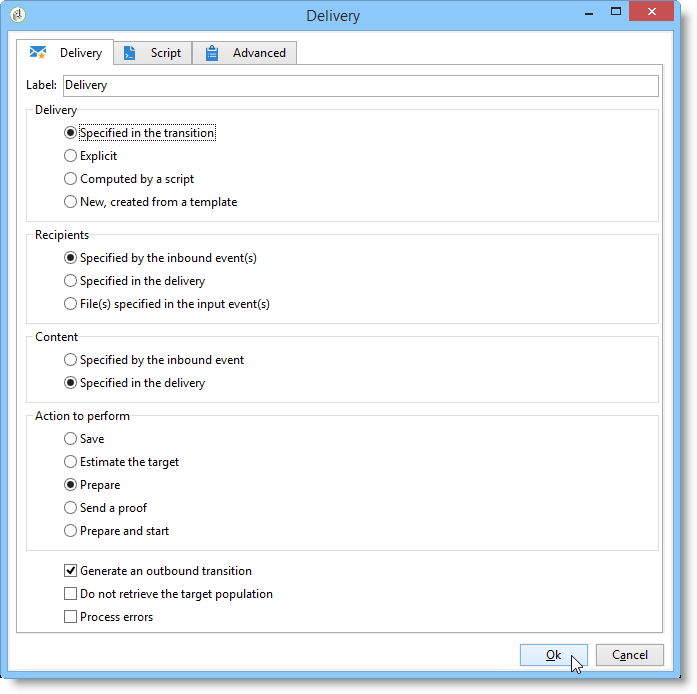
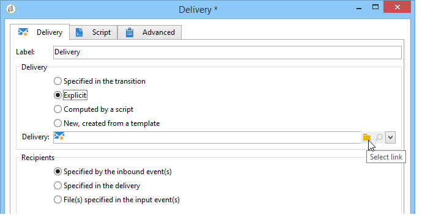

# 傳遞{#delivery}

**傳送**-type活動可讓您建立傳送動作。 可使用輸入元素來建構。

若要設定，請編輯活動並輸入傳送選項。



1. **傳送**

   您可以：

   * 對入站轉變中指定的傳送採取行動。 要執行此操作，請選取視窗&#x200B;**[!UICONTROL Delivery]**&#x200B;區段的第一個選項。

      當先前的工作流程活動已建立或指定傳送時，可使用此選項。 如下列範例所示，同一類型的活動可能已產生出站轉變，因此可以執行此操作。

      在下列範例中，會首次建立傳送。 母體和內容稍後會定義。 接下來，會使用入站轉變，將這三個元素的資訊重新輸入到新的傳送活動中，以便傳送。

      

   * 直接選取相關的傳送。 要執行此操作，請選取&#x200B;**[!UICONTROL Explicit]**&#x200B;選項，然後從&#x200B;**[!UICONTROL Delivery]**&#x200B;欄位的下拉式清單中選取傳送。

      清單預設會顯示&#x200B;**Deliveries**&#x200B;資料夾中包含的未完成傳送。 若要存取其他促銷活動，請按一下&#x200B;**[!UICONTROL Select link]**&#x200B;圖示。

      

      從&#x200B;**[!UICONTROL Folder]**&#x200B;欄位的下拉式清單中選取促銷活動，或按一下&#x200B;**[!UICONTROL Display sub-levels]**&#x200B;以顯示子資料夾中包含的所有傳送：

      

      選取傳送動作後，按一下&#x200B;**[!UICONTROL Edit link]**&#x200B;圖示即可顯示內容。

   * 建立指令碼以計算傳送。 要執行此操作，請選取&#x200B;**[!UICONTROL Computed by a script]**&#x200B;選項並輸入指令碼。 您可以按一下&#x200B;**[!UICONTROL Edit...]**&#x200B;選項以開啟輸入視窗。 下列範例會復原傳送的識別碼：

      

   * 建立新傳送。 若要這麼做，請選取&#x200B;**[!UICONTROL New, created from a template]**&#x200B;選項，並選取傳送將依據的傳送範本。

      

      按一下&#x200B;**[!UICONTROL Select link]**&#x200B;圖示以瀏覽資料夾，如果要檢視所選範本的內容，請按一下&#x200B;**[!UICONTROL Edit link]**&#x200B;圖示。

1. **收件者**

   收件者可由傳入事件指定，例如在檔案匯入後指定，或在傳送動作中指定。 它們也可以儲存在一或多個檔案中。

   

1. **內容**

   您可以在傳送或入站事件中定義訊息的內容。

   

1. **要執行的動作**

   您可以建立傳遞、準備傳遞、啟動傳遞、預估目標或傳送校樣。

   

   選取要執行的動作類型：

   * **[!UICONTROL Save]**:此選項可讓您建立傳送並儲存。它不會分析或傳送。
   * **[!UICONTROL Estimate the target]**:此選項可讓您計算傳送目標以評估其潛在（第一個分析階段）。此動作等同於透過&#x200B;**傳送**&#x200B;傳送至主要目標時，選取&#x200B;**[!UICONTROL Estimate the population to be targeted]**&#x200B;選項並按一下&#x200B;**[!UICONTROL Analyze]**。
   * **[!UICONTROL Prepare]**:此選項可讓您執行完整的分析程式（目標計算和內容準備）。未傳送傳遞。 此動作等同於使用&#x200B;**傳送**&#x200B;傳送至主要目標時，選取&#x200B;**[!UICONTROL Deliver as soon as possible]**&#x200B;選項並按一下&#x200B;**[!UICONTROL Analyze]**。
   * **[!UICONTROL Send a proof]**:此選項可讓您傳送傳遞的校樣。此動作等同於使用&#x200B;**Delivery**&#x200B;按一下傳送工具列中的&#x200B;**[!UICONTROL Send a proof]**&#x200B;按鈕
   * **[!UICONTROL Prepare and start]**:此選項會啟動完整分析程式（目標計算和內容準備）並傳送傳遞。此動作等同於使用&#x200B;**傳送**&#x200B;傳送傳送至主要目標時，按一下&#x200B;**[!UICONTROL Deliver as soon as possible]**、**[!UICONTROL Analyze]**&#x200B;和&#x200B;**[!UICONTROL Confirm delivery]**&#x200B;選項。

   工作流程中進一步使用的&#x200B;**[!UICONTROL Act on a delivery]**&#x200B;活動可讓您啟動開始傳送所需的所有剩餘步驟（目標計算、內容準備、傳送）。 有關詳細資訊，請參閱[傳送控制項](../../workflow/using/delivery-control.md)。

   也提供下列選項：

   * **[!UICONTROL Generate an outbound transition]**

      建立將在執行結束時啟動的出站轉變。 您可以選擇是否擷取出站傳送的目標。

   * **[!UICONTROL Do not recover target]**

      無法恢復傳出傳送動作的目標。

   * **[!UICONTROL Processing errors]**

      請參閱[傳送控制項](../../workflow/using/delivery-control.md)。
   **Script**&#x200B;標籤可讓您修改傳送參數。

   

## 範例：傳遞工作流程{#example--delivery-workflow}

建立新工作流程並新增活動，如下圖所示：


開啟&#x200B;**Delivery**&#x200B;活動，並定義如下屬性：

* 在&#x200B;**[!UICONTROL Delivery]**&#x200B;區段中，選取&#x200B;**[!UICONTROL New, created from a template]**&#x200B;並選取傳送範本。
* 在&#x200B;**[!UICONTROL Recipients]**&#x200B;部分，選擇&#x200B;**[!UICONTROL Specified in the delivery]**。
* 在&#x200B;**[!UICONTROL Action to execute]**&#x200B;區段中，保留&#x200B;**[!UICONTROL Prepare]**&#x200B;選項。


按一下&#x200B;**[!UICONTROL OK]**&#x200B;以關閉屬性窗口。 您剛剛設定了活動，包括根據要在其中指定目標的傳送範本建立和準備新傳送。

開啟&#x200B;**Approval**&#x200B;活動，並定義如下屬性：

1. 在&#x200B;**[!UICONTROL Assignment type]**&#x200B;欄位中，選擇要註冊的組。 如果您是使用「管理員」帳戶連線，請選取「管理」群組。
1. 接下來，輸入標題，並在訊息內文中插入下列文字：

   ```
   Do you wish to approve delivery (<%= vars.recCount %> recipient(s))?
   ```

   此訊息包含以JavaScript撰寫的運算式：**[!UICONTROL vars.recCount]**&#x200B;表示上一任務的傳送所定位的收件者人數。 有關JavaScript運算式的詳細資訊，請參閱[JavaScript指令碼和範本](../../workflow/using/javascript-scripts-and-templates.md)。

   

   在[Approval](../../workflow/using/approval.md)中詳細說明了「批准」任務。

## 輸入參數{#input-parameters}

傳送識別碼，如果在&#x200B;**[!UICONTROL Delivery]**&#x200B;區段中選取了&#x200B;**[!UICONTROL Specified in the transition]**&#x200B;選項。

* deliveryId
* tableName
* 綱要

每個入站事件都必須指定由這些參數定義的目標。

>[!NOTE]
>
>只有在&#x200B;**[!UICONTROL Recipients]**&#x200B;區段中選取了&#x200B;**[!UICONTROL Specified by inbound event(s)]**&#x200B;選項時，才會顯示此參數。

* 檔案名

   在&#x200B;**[!UICONTROL Recipients]**&#x200B;區段中選取&#x200B;**[!UICONTROL File(s) specified by inbound event(s)]**&#x200B;選項時，產生的檔案完整名稱。

* contentId

   如果在&#x200B;**[!UICONTROL Content]**&#x200B;區段中選取了&#x200B;**[!UICONTROL Specified by inbound events]**&#x200B;選項，則內容識別碼。

## 輸出參數{#output-parameters}

* tableName
* 綱要
* recCount

這組三個值可識別傳送產生的目標。 **[!UICONTROL tableName]** 是儲存目標標識符的表的名稱，是 **[!UICONTROL schema]** 母體的模式（通常是nms:recipient）, **[!UICONTROL recCount]** 是表中的元素數。

與補體相關聯的轉變具有相同的參數。

>[!NOTE]
>
>選擇&#x200B;**[!UICONTROL Do not recover target]**&#x200B;選項時沒有輸出參數。
