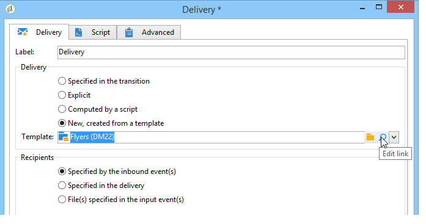
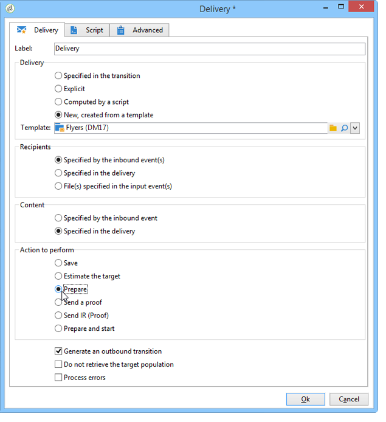

# 傳送{#delivery}

**傳送**&#x200B;類型活動可讓您建立傳送動作。 它可以使用輸入元件來構造。

若要設定，請編輯活動並輸入傳送選項。


1. **傳送**

   您可以：

   * 對傳入轉換中指定的傳送採取動作。 若要這麼做，請選取視窗的&#x200B;**[!UICONTROL Delivery]**&#x200B;區段的第一個選項。

      當先前的工作流程活動已建立或指定傳送時，可使用此選項。 這可以像下面的示例一樣，由生成出站轉換的相同類型的活動來完成。

      在下列範例中，會首次建立傳送。 稍後會定義人口與內容。 接著，使用傳入轉場功能，將這三個元素的資訊重新輸入到新的傳送活動中，以便傳送。

      

   * 直接選擇相關的交貨。 若要這麼做，請選取&#x200B;**[!UICONTROL Explicit]**&#x200B;選項，然後從&#x200B;**[!UICONTROL Delivery]**&#x200B;欄位的下拉式清單中選取傳送。

      此清單預設顯示&#x200B;**Deliveries**&#x200B;資料夾中包含的未完成交貨。 若要存取其他促銷活動，請按一下&#x200B;**[!UICONTROL Select link]**&#x200B;圖示。

      

      從&#x200B;**[!UICONTROL Folder]**&#x200B;欄位的下拉式清單中選取促銷活動，或按一下&#x200B;**[!UICONTROL Display sub-levels]**&#x200B;以顯示子資料夾中包含的所有傳送：

      

      選取傳送動作後，您可以按一下&#x200B;**[!UICONTROL Edit link]**&#x200B;圖示來顯示內容。

   * 建立指令碼以計算傳送。 要執行此操作，請選擇&#x200B;**[!UICONTROL Computed by a script]**&#x200B;選項並輸入指令碼。 按一下&#x200B;**[!UICONTROL Edit...]**&#x200B;選項可開啟輸入窗口。 下列範例會恢復傳送的識別碼：

      

   * 建立新的傳送。 若要這麼做，請選取&#x200B;**[!UICONTROL New, created from a template]**&#x200B;選項，並選取傳送所依據的傳送範本。

      

      按一下&#x200B;**[!UICONTROL Select link]**&#x200B;表徵圖瀏覽資料夾，如果要查看所選模板的內容，請按一下&#x200B;**[!UICONTROL Edit link]**&#x200B;表徵圖。

1. **收件者**

   收件者可由傳入事件指定，例如在檔案匯入後，或在傳送動作中指定。 這些檔案也可以儲存在一或多個檔案中。

   

1. **內容**

   可在傳送或傳入事件中定義訊息的內容。

   

1. **執行動作**

   您可以建立傳送、準備、開始、估計目標或傳送證明。

   

   選擇要執行的操作類型：

   * **[!UICONTROL Save]**:此選項可讓您建立傳送並儲存。它不會分析或提供。
   * **[!UICONTROL Estimate the target]**:此選項可讓您計算傳送目標，以評估其潛力（第一個分析階段）。此動作等同於在透過&#x200B;**Delivery**&#x200B;傳送傳送至主要目標時，選取&#x200B;**[!UICONTROL Estimate the population to be targeted]**&#x200B;選項並按一下&#x200B;**[!UICONTROL Analyze]**。
   * **[!UICONTROL Prepare]**:此選項可讓您執行完整的分析程式（目標計算和內容準備）。交貨不寄。 此動作等效於在傳送傳送至主目標時，選擇&#x200B;**[!UICONTROL Deliver as soon as possible]**&#x200B;選項，然後按一下&#x200B;**[!UICONTROL Analyze]**，傳送至&#x200B;**Delivery**。
   * **[!UICONTROL Send a proof]**:此選項可讓您傳送傳送的證明。此動作等同於按一下傳送工具列中的&#x200B;**[!UICONTROL Send a proof]**&#x200B;按鈕，並附上&#x200B;**傳送**
   * **[!UICONTROL Prepare and start]**:此選項會啟動完整分析程式（目標計算和內容準備）並傳送傳送。此動作等同於在以&#x200B;**傳送**&#x200B;傳送傳送至主要目標時按一下&#x200B;**[!UICONTROL Deliver as soon as possible]**、**[!UICONTROL Analyze]**&#x200B;和&#x200B;**[!UICONTROL Confirm delivery]**&#x200B;選項。

   工作流中進一步使用的&#x200B;**[!UICONTROL Act on a delivery]**&#x200B;活動可讓您啟動開始傳送（目標計算、內容準備、傳送）所需的所有剩餘步驟。 有關詳細資訊，請參閱[Delivery control](../../workflow/using/delivery-control.md)。

   也提供下列選項：

   * **[!UICONTROL Generate an outbound transition]**

      建立將在執行結束時激活的出站轉移。 您可以選擇是否檢索出站傳送的目標。

   * **[!UICONTROL Do not recover target]**

      不恢復傳出傳送操作的目標。

   * **[!UICONTROL Processing errors]**

      請參閱[傳送控制](../../workflow/using/delivery-control.md)。
   **Script**&#x200B;標籤可讓您修改傳送參數。

   

## 範例：傳送工作流程{#example--delivery-workflow}

建立新的工作流程並新增活動，如下圖所示：


開啟&#x200B;**Delivery**&#x200B;活動，並定義下列屬性：

* 在&#x200B;**[!UICONTROL Delivery]**&#x200B;節中，選擇&#x200B;**[!UICONTROL New, created from a template]**&#x200B;並選擇傳送模板。
* 在&#x200B;**[!UICONTROL Recipients]**&#x200B;部分中，選擇&#x200B;**[!UICONTROL Specified in the delivery]**。
* 在&#x200B;**[!UICONTROL Action to execute]**&#x200B;區段中，保留&#x200B;**[!UICONTROL Prepare]**&#x200B;選項。



按一下&#x200B;**[!UICONTROL OK]**&#x200B;關閉屬性窗口。 您剛剛設定了活動，其中包括根據傳送範本建立和準備新傳送，而傳送範本中將指定其目標。

開啟&#x200B;**Approval**&#x200B;活動，並定義下列屬性：

1. 在&#x200B;**[!UICONTROL Assignment type]**&#x200B;欄位中，選取您已註冊的群組。 如果您使用「管理員」帳戶連線，請選取「管理」群組。
1. 接著，輸入標題並在訊息內文中插入下列文字：

   ```
   Do you wish to approve delivery (<%= vars.recCount %> recipient(s))?
   ```

   這是一條消息，其中包含以JavaScript編寫的表達式：**[!UICONTROL vars.recCount]**&#x200B;代表遞送前述工作所定位的收件者人數。 有關JavaScript運算式的詳細資訊，請參閱[JavaScript指令碼和範本](../../workflow/using/javascript-scripts-and-templates.md)。

   

   「批准」任務在[Approval](../../workflow/using/approval.md)中詳細說明。

## 輸入參數{#input-parameters}

傳送識別碼，如果在&#x200B;**[!UICONTROL Delivery]**&#x200B;區段中選取了&#x200B;**[!UICONTROL Specified in the transition]**&#x200B;選項。

* deliveryId
* tableName
* 架構

每個傳入事件都必須指定由這些參數定義的目標。

>[!NOTE]
>
>僅當在&#x200B;**[!UICONTROL Recipients]**&#x200B;節中選擇了&#x200B;**[!UICONTROL Specified by inbound event(s)]**&#x200B;選項時，才會顯示此參數。

* 檔案名

   如果在&#x200B;**[!UICONTROL Recipients]**&#x200B;節中選擇了&#x200B;**[!UICONTROL File(s) specified by inbound event(s)]**&#x200B;選項，則生成的檔案的完整名稱。

* contentId

   如果在&#x200B;**[!UICONTROL Content]**&#x200B;區段中選取了&#x200B;**[!UICONTROL Specified by inbound events]**&#x200B;選項，則內容識別碼。

## 輸出參數{#output-parameters}

* tableName
* 架構
* recCount

這組三個值可識別由傳送產生的目標。 **[!UICONTROL tableName]** 是儲存目標標識符的表的名稱，是 **[!UICONTROL schema]** 人口的模式（通常是nms:recipient）, **[!UICONTROL recCount]** 是表中的元素數。

與補體相關的過渡具有相同的參數。

>[!NOTE]
>
>選擇&#x200B;**[!UICONTROL Do not recover target]**&#x200B;選項時，沒有輸出參數。

