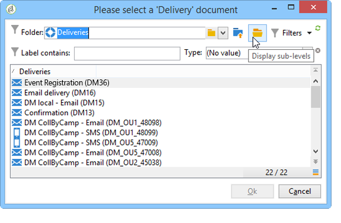

# 傳送{#delivery}

「 **傳送**」類型活動可讓您建立傳送動作。 它可以使用輸入元件來構造。

若要設定，請編輯活動並輸入傳送選項。


1. **傳送**

   您可以：

   * 對傳入轉換中指定的傳送採取動作。 要執行此操作，請選擇窗口部分 **[!UICONTROL Delivery]** 的第一個選項。

      當先前的工作流程活動已建立或指定傳送時，可使用此選項。 這可以像下面的示例一樣，由生成出站轉換的相同類型的活動來完成。

      在下列範例中，會首次建立傳送。 稍後會定義人口與內容。 接著，使用傳入轉場功能，將這三個元素的資訊重新輸入到新的傳送活動中，以便傳送。

      

   * 直接選擇相關的交貨。 若要這麼做，請選 **[!UICONTROL Explicit]** 取選項，然後從欄位的下拉式清單中選取傳送 **[!UICONTROL Delivery]** 內容。

      此清單預設會顯示「傳送」檔案夾中 **包含的未完成** 傳送。 若要存取其他促銷活動，請按一下 **[!UICONTROL Select link]** 圖示。

      

      從欄位的下拉式清單中選取促銷活 **[!UICONTROL Folder]** 動，或按一 **[!UICONTROL Display sub-levels]** 下以顯示子資料夾中包含的所有傳送：

      

      在選取傳送動作後，您可以按一下圖示來顯示 **[!UICONTROL Edit link]** 內容。

   * 建立指令碼以計算傳送。 要執行此操作，請選擇 **[!UICONTROL Computed by a script]** 選項並輸入指令碼。 您可以按一下選項以開啟輸入 **[!UICONTROL Edit...]** 視窗。 下列範例會恢復傳送的識別碼：

      

   * 建立新的傳送。 若要這麼做，請選取 **[!UICONTROL New, created from a template]** 選項並選取傳送所依據的傳送範本。

      

      按一下 **[!UICONTROL Select link]** 圖示以瀏覽資料夾，如果您想 **[!UICONTROL Edit link]** 要檢視所選範本的內容，請按一下圖示。

1. **收件者**

   收件者可由傳入事件指定，例如在檔案匯入後，或在傳送動作中指定。 這些檔案也可以儲存在一或多個檔案中。

   

1. **內容**

   可在傳送或傳入事件中定義訊息的內容。

   

1. **執行動作**

   您可以建立傳送、準備、開始、估計目標或傳送證明。

   

   選擇要執行的操作類型：

   * **[!UICONTROL Save]**:此選項可讓您建立傳送並儲存。 它不會分析或提供。
   * **[!UICONTROL Estimate the target]**:此選項可讓您計算傳送目標，以評估其潛力（第一個分析階段）。 此動作等同於選取選項， **[!UICONTROL Estimate the population to be targeted]** 並在透過「傳送 **[!UICONTROL Analyze]** 」傳送傳送至主要目標時按 **一下**。
   * **[!UICONTROL Prepare]**:此選項可讓您執行完整的分析程式（目標計算和內容準備）。 交貨不寄。 此動作相當於在傳送傳送至 **[!UICONTROL Deliver as soon as possible]** 具有「傳送 **[!UICONTROL Analyze]** 」的主目標時，選取選項並按 **一下**。
   * **[!UICONTROL Send a proof]**:此選項可讓您傳送傳送的證明。 此動作等同於按一下具 **[!UICONTROL Send a proof]** 有傳送的傳送工具列中的按 **鈕**
   * **[!UICONTROL Prepare and start]**:此選項會啟動完整分析程式（目標計算和內容準備）並傳送傳送。 此動作等同於在傳送傳送 **[!UICONTROL Deliver as soon as possible]**&#x200B;至主 **[!UICONTROL Analyze]**&#x200B;要目標時， **[!UICONTROL Confirm delivery]** 按一下、和 **選項**。
   工作流 **[!UICONTROL Act on a delivery]** 程中進一步使用的活動可讓您啟動開始傳送（目標計算、內容準備、傳送）所需的所有剩餘步驟。 For more on this, refer to [Delivery control](../../workflow/using/delivery-control.md).

   也提供下列選項：

   * **[!UICONTROL Generate an outbound transition]**

      建立將在執行結束時激活的出站轉移。 您可以選擇是否檢索出站傳送的目標。

   * **[!UICONTROL Do not recover target]**

      不恢復傳出傳送操作的目標。

   * **[!UICONTROL Processing errors]**

      請參閱 [傳送控制](../../workflow/using/delivery-control.md)。
   「指 **令碼** 」標籤可讓您修改傳送參數。

   

## 範例：傳送工作流程 {#example--delivery-workflow}

建立新的工作流程並新增活動，如下圖所示：


開啟「 **傳送** 」活動，並定義下列屬性：

* 在區段 **[!UICONTROL Delivery]** 中，選 **[!UICONTROL New, created from a template]** 取並選取傳送範本。
* 在節 **[!UICONTROL Recipients]** 中，選擇 **[!UICONTROL Specified in the delivery]**。
* 在區段 **[!UICONTROL Action to execute]** 中，保留選 **[!UICONTROL Prepare]** 項。


按一下 **[!UICONTROL OK]** 關閉屬性窗口。 您剛剛設定了活動，其中包括根據傳送範本建立和準備新傳送，而傳送範本中將指定其目標。

開啟「 **核准** 」活動，並定義下列屬性：

1. 在欄位 **[!UICONTROL Assignment type]** 中，選取您已註冊的群組。 如果您使用「管理員」帳戶連線，請選取「管理」群組。
1. 接著，輸入標題並在訊息內文中插入下列文字：

   ```
   Do you wish to approve delivery (<%= vars.recCount %> recipient(s))?
   ```

   這是一條消息，其中包含以JavaScript編寫的表達式：表 **[!UICONTROL vars.recCount]** 示由前一任務的傳送定位的接收者數。 有關JavaScript運算式的詳細資訊，請參閱 [JavaScript指令碼和範本](../../workflow/using/javascript-scripts-and-templates.md)。

   

   「批准」任務在「批准」中 [詳細說明](../../workflow/using/approval.md)。

## 輸入參數 {#input-parameters}

傳送識別碼(如果在 **[!UICONTROL Specified in the transition]** 區段中選取了選 **[!UICONTROL Delivery]** 項)。

* deliveryId
* tableName
* 架構

每個傳入事件都必須指定由這些參數定義的目標。

>[!NOTE]
>
>只有在節中選取了該 **[!UICONTROL Specified by inbound event(s)]** 選項時，才會顯示此 **[!UICONTROL Recipients]** 參數。

* 檔案名

   如果在部分中選取了選項，則 **[!UICONTROL File(s) specified by inbound event(s)]** 生成的檔案的完整 **[!UICONTROL Recipients]** 名稱。

* contentId

   內容識別碼(如果在 **[!UICONTROL Specified by inbound events]** 區段中選取了選項 **[!UICONTROL Content]** )。

## 輸出參數 {#output-parameters}

* tableName
* 架構
* recCount

這組三個值可識別由傳送產生的目標。 **[!UICONTROL tableName]** 是儲存目標標識符的表的名稱， **[!UICONTROL schema]** 是人口的模式（通常是nms:recipient）, **[!UICONTROL recCount]** 是表中的元素數。

與補體相關的過渡具有相同的參數。

>[!NOTE]
>
>選取該選項時，沒有 **[!UICONTROL Do not recover target]** 輸出參數。

