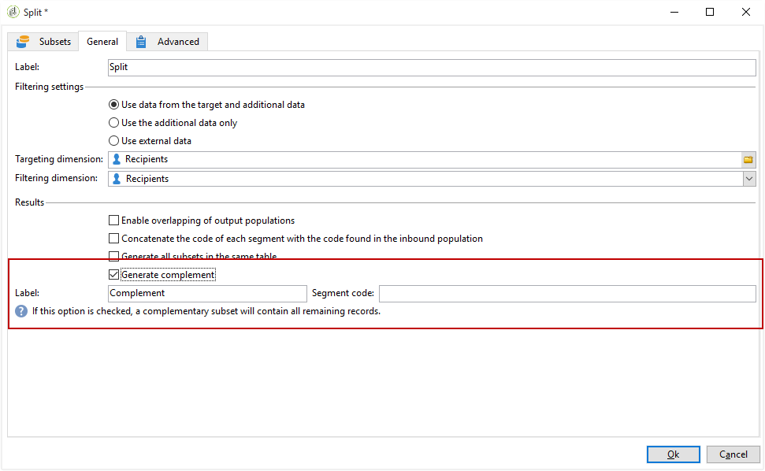
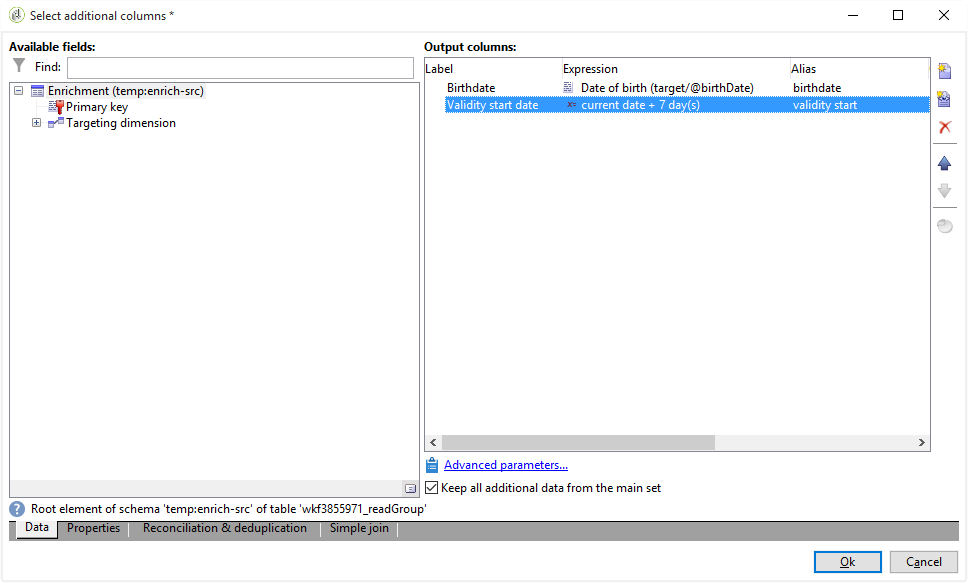

# 使用自訂日期欄位擴充電子郵件{#email-enrichment-with-custom-date-fields}

在此範例中，我們想傳送包含自訂資料欄位的電子郵件給將於本月慶祝生日的收件者。 電子郵件將包含優惠券，其有效期限為生日前後一週。

我們需要透過&#x200B;**[!UICONTROL Split]**&#x200B;活動，將本月慶祝生日的收件者鎖定在清單中。 然後，使用&#x200B;**[!UICONTROL Enrichment]**&#x200B;活動，自訂資料欄位將作為客戶特殊優惠方案電子郵件中的有效日期。


若要建立此範例，請套用下列步驟：

1. 在促銷活動的&#x200B;**[!UICONTROL Targeting and workflows]**&#x200B;標籤中，拖放&#x200B;**[!UICONTROL Read list]**&#x200B;活動以定位收件者清單。
1. 可根據此處定義的選項和參數，顯式指定要處理的清單，由指令碼計算或動態地本地化。

   

1. 新增&#x200B;**[!UICONTROL Split]**&#x200B;活動，以區分本月將慶祝生日的收件者與其他收件者。
1. 要拆分清單，請在&#x200B;**[!UICONTROL Filtering of selected records]**&#x200B;類別中，選擇&#x200B;**[!UICONTROL Add a filtering condition on the inbound population]**。 然後，按一下&#x200B;**[!UICONTROL Edit]**。

   

1. 選擇&#x200B;**[!UICONTROL Filtering conditions]** ，然後按一下&#x200B;**[!UICONTROL Edit expression]**&#x200B;按鈕以篩選收件者的生日月份。

   

1. 按一下&#x200B;**[!UICONTROL Advanced Selection]**，然後按一下&#x200B;**[!UICONTROL Edit the formula using an expression]**&#x200B;並新增下列運算式：月(@birthDate)。
1. 在&#x200B;**[!UICONTROL Operator]**&#x200B;欄中，選取&#x200B;**[!UICONTROL equal to]**。
1. 新增目前日期的&#x200B;**[!UICONTROL Value]**&#x200B;月份，進一步篩選條件：Month(GetDate())。

   這將查詢生日月份與當月相對應的收件者。

   

1. 按一下 **[!UICONTROL Finish]**。然後，在&#x200B;**[!UICONTROL Split]**&#x200B;活動的&#x200B;**[!UICONTROL General]**&#x200B;標籤中，按一下&#x200B;**[!UICONTROL Results]**&#x200B;類別中的&#x200B;**[!UICONTROL Generate complement]**。

   使用&#x200B;**[!UICONTROL Complement]**&#x200B;結果，您可以新增傳送活動或更新清單。 我們剛新增&#x200B;**[!UICONTROL End]**&#x200B;活動。

   

您現在需要設定&#x200B;**[!UICONTROL Enrichment]**&#x200B;活動：

1. 在您的子集後新增&#x200B;**[!UICONTROL Enrichment]**&#x200B;活動，以新增自訂日期欄位。

   

1. 開啟您的&#x200B;**[!UICONTROL Enrichment]**&#x200B;活動。 在&#x200B;**[!UICONTROL Complementary information]**&#x200B;類別中，按一下&#x200B;**[!UICONTROL Add data]**。

   

1. 依次選擇&#x200B;**[!UICONTROL Data linked to the filtering dimension]**&#x200B;和&#x200B;**[!UICONTROL Data of the filtering dimension]**。
1. 按一下 **[!UICONTROL Add]** 按鈕。

   

1. 新增&#x200B;**[!UICONTROL Label]**。 然後，在&#x200B;**[!UICONTROL Expression]**&#x200B;欄中，按一下&#x200B;**[!UICONTROL Edit expression]**。

   

1. 首先，我們需要將出生日期前一週的目標定位為&#x200B;**有效開始日期**，並包含下列&#x200B;**[!UICONTROL Expression]**:`SubDays([target/@birthDate], 7)`。

   

1. 然後，要建立定制日期欄位&#x200B;**有效結束日期**，以定位出生日期之後的一週為目標，您需要添加&#x200B;**[!UICONTROL Expression]**:`AddDays([target/@birthDate], 7)`。

   您可以將標籤新增至運算式。

   

1. 按一下 **[!UICONTROL Ok]**。您的擴充功能現已準備就緒。

在&#x200B;**[!UICONTROL Enrichment]**&#x200B;活動之後，您可以新增傳送。 在此情況下，我們新增了電子郵件傳送，以傳送特殊優惠方案給收件者，其有效日期可讓客戶在本月慶祝他們的生日。

1. 在&#x200B;**[!UICONTROL Enrichment]**&#x200B;活動之後拖放&#x200B;**[!UICONTROL Email delivery]**&#x200B;活動。

   

1. 連按兩下您的&#x200B;**[!UICONTROL Email delivery]**&#x200B;活動，開始個人化傳送。
1. 新增&#x200B;**[!UICONTROL Label]**&#x200B;至您的傳送，然後按一下&#x200B;**[!UICONTROL Continue]**。
1. 按一下&#x200B;**[!UICONTROL Save]**&#x200B;以建立電子郵件傳遞。
1. 在電子郵件傳送&#x200B;**[!UICONTROL Properties]**&#x200B;的&#x200B;**[!UICONTROL Approval]**&#x200B;標籤中檢查&#x200B;**[!UICONTROL Confirm delivery before sending option]**。

   然後，啟動您的工作流程，以使用目標資訊豐富您的出站轉變。

   

您現在可以使用在&#x200B;**[!UICONTROL Enrichment]**&#x200B;活動中建立的自訂日期欄位，開始設計電子郵件傳送。

1. 連按兩下您的&#x200B;**[!UICONTROL Email delivery]**&#x200B;活動。
1. 將您的目標擴充功能新增至電子郵件。 它應位於下列運算式內，以設定有效日期的格式：

   ```
   <%=
           formatDate(targetData.alias of your expression,"%2D.%2M")  %>
   ```

1. 按一下 。選取&#x200B;**[!UICONTROL Target extension]** ，然後選取先前建立的具有&#x200B;**[!UICONTROL Enrichment]**&#x200B;活動的自訂有效日期，將您的擴充功能新增至formatDate運算式。

   

1. 視需要設定您的電子郵件內容。

   

1. 預覽您的電子郵件，以檢查自訂日期欄位是否已正確設定

   

您的電子郵件現已準備就緒。 您可以開始傳送校樣並確認傳送內容，以傳送生日電子郵件。
