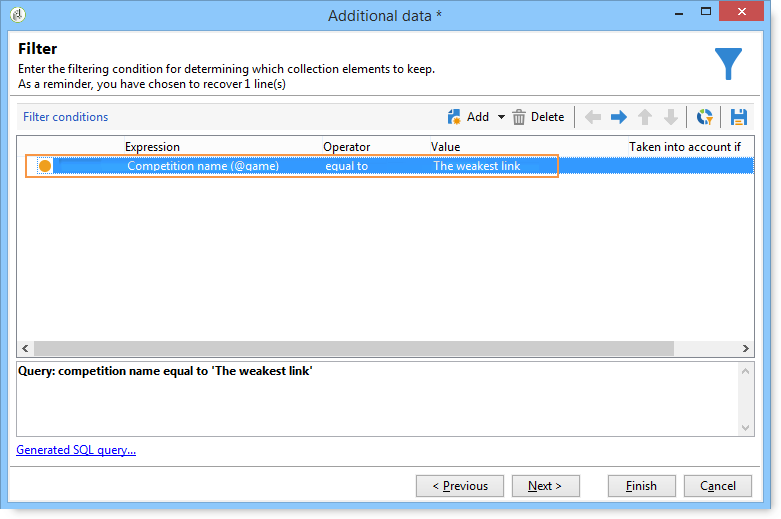

# 豐富資料{#enriching-data}

## 關於擴充資料 {#about-enriching-data}

此使用案例詳細資訊可能在目標工作流程中使用&#x200B;**[!UICONTROL Enrichment]**&#x200B;活動。 有關使用&#x200B;**[!UICONTROL Enrichment]**&#x200B;活動的詳細資訊，請參閱：[擴充](enrichment.md)。

[此區段](email-enrichment-with-custom-date-fields.md)也提供如何以自訂日期豐富電子郵件傳送的使用案例。

通過Web應用程式向行銷資料庫中的聯繫人發送參加競爭的邀請。 在&#x200B;**[!UICONTROL Competition results]**&#x200B;表中恢復競爭結果。 此表連結到聯繫表(**[!UICONTROL Recipients]**)。 **[!UICONTROL Competition results]**&#x200B;表包含下列欄位：

* 競爭名稱(@game)
* 試用號(@trial)
* 分數(@score)

**[!UICONTROL Recipients]**&#x200B;表中找到的聯繫人可以連結到&#x200B;**[!UICONTROL Competition results]**&#x200B;表中的幾行。 這兩個表之間的關係為1-n類型。 以下是收件者的結果記錄範例：

此使用案例的用途是根據參與最新競爭的人員的最高分數，將個人化傳遞傳送給他們。 得分最高的受獎者得第一名，得分第二名的受獎者得到安慰獎，其他所有人都會收到一條資訊，希望他們下次能更好運。

為了設定此使用案例，我們建立了下列目標工作流程：

要建立工作流，請應用以下步驟：

1. 會新增兩個&#x200B;**[!UICONTROL Query]**&#x200B;活動和一個&#x200B;**[!UICONTROL Intersection]**&#x200B;活動，以定位上次參加比賽的新訂閱者。
1. **[!UICONTROL Enrichment]**&#x200B;活動使我們能夠添加儲存在&#x200B;**[!UICONTROL Competition results]**&#x200B;表中的資料。 我們的傳送個人化將進行的&#x200B;**[!UICONTROL Score]**&#x200B;欄位會新增至工作流程的工作表中。
1. **[!UICONTROL Split]**&#x200B;類型活動使我們能夠根據分數建立收件人子集。
1. 對於每個子集，將添加&#x200B;**[!UICONTROL Delivery]**&#x200B;類型活動。

## 步驟1:定位 {#step-1--targeting}

第一個查詢可讓我們鎖定過去6個月內新增至資料庫的收件者。

第二個查詢可讓我們鎖定參加上次競爭的收件者。

接著會新增&#x200B;**[!UICONTROL Intersection]**&#x200B;類型活動，以定位在過去6個月內新增至資料庫的收件者，以及加入上次競爭的收件者。

## 步驟2:擴充 {#step-2--enrichment}

在此範例中，我們想根據&#x200B;**[!UICONTROL Competition results]**&#x200B;表格中儲存的&#x200B;**[!UICONTROL Score]**&#x200B;欄位來個人化傳送。 此表與收件者表具有1-n類型關係。 **[!UICONTROL Enrichment]**&#x200B;活動使我們能夠將資料從連結到篩選維的表中添加到工作流的工作表中。

1. 在擴充活動的編輯畫面中，選取&#x200B;**[!UICONTROL Add data]**，然後選取&#x200B;**[!UICONTROL Data linked to the filtering dimension]**，然後按一下&#x200B;**[!UICONTROL Next]**。

   

1. 然後選擇&#x200B;**[!UICONTROL Data linked to the filtering dimension]**&#x200B;選項，選擇&#x200B;**[!UICONTROL Competition results]**&#x200B;表，然後按一下&#x200B;**[!UICONTROL Next]**。

   

1. 輸入ID和標籤，並在&#x200B;**[!UICONTROL Data collected]**&#x200B;欄位中選擇&#x200B;**[!UICONTROL Limit the line count]**&#x200B;選項。 在&#x200B;**[!UICONTROL Lines to retrieve]**&#x200B;欄位中，選擇「1」作為值。 對於每個收件者，擴充活動會將單行從&#x200B;**[!UICONTROL Competition results]**&#x200B;表格新增至工作流程的工作表。 按一下&#x200B;**[!UICONTROL Next]**。

   

1. 在此範例中，我們想要復原收件者的最高分數，但僅針對上次競爭。 要執行此操作，請在&#x200B;**[!UICONTROL Competition name]**&#x200B;欄位中新增篩選器，以排除與先前競爭相關的所有行。 按一下&#x200B;**[!UICONTROL Next]**。

   

1. 前往&#x200B;**[!UICONTROL Sort]**&#x200B;畫面，按一下&#x200B;**[!UICONTROL Add]**&#x200B;按鈕，選取&#x200B;**[!UICONTROL Score]**&#x200B;欄位並核取&#x200B;**[!UICONTROL descending]**&#x200B;欄中的方塊，以降序排序&#x200B;**[!UICONTROL Score]**&#x200B;欄位的項目。 對於每個收件者，擴充活動會新增一行，以符合上次遊戲的最高分數。 按一下&#x200B;**[!UICONTROL Next]**。

   

1. 在&#x200B;**[!UICONTROL Data to add]**&#x200B;視窗中，按兩下&#x200B;**[!UICONTROL Score]**&#x200B;欄位。 對於每個收件者，擴充活動只會新增&#x200B;**[!UICONTROL Score]**&#x200B;欄位。 按一下&#x200B;**[!UICONTROL Finish]**。

   

以滑鼠右鍵按一下擴充活動的入站轉變，然後選取&#x200B;**[!UICONTROL Display the target]**。 工作表包含以下資料：

連結的架構為：

在擴充活動的出站轉變上更新此操作。 我們可以看到已新增連結至收件者分數的資料。 已恢復每個收件者的最高分數。

也已擴充相符的結構。

## 步驟3:分割和傳送 {#step-3--split-and-delivery}

若要根據收件者的分數來排序，擴充後會新增&#x200B;**[!UICONTROL Split]**&#x200B;活動。

1. 已定義第一個（**獲勝者**）子集以包含分數最高的收件者。 要執行此操作，請定義記錄數限制、對分數套用降序排序，並將記錄數限制為1。

   

1. 第二（**第二位**）子集包括具有第二最高分數的接收者。 設定與第一個子集的相同。

   

1. 第三個(**wolsers**)子集包含所有其他收件者。 前往&#x200B;**[!UICONTROL General]**&#x200B;標籤並核取&#x200B;**[!UICONTROL Generate complement]**&#x200B;方塊，以鎖定未達到最高分數的所有收件者。

   

1. 為每個子集新增&#x200B;**[!UICONTROL Delivery]**&#x200B;類型活動，每個子集使用不同的傳送範本。

   
