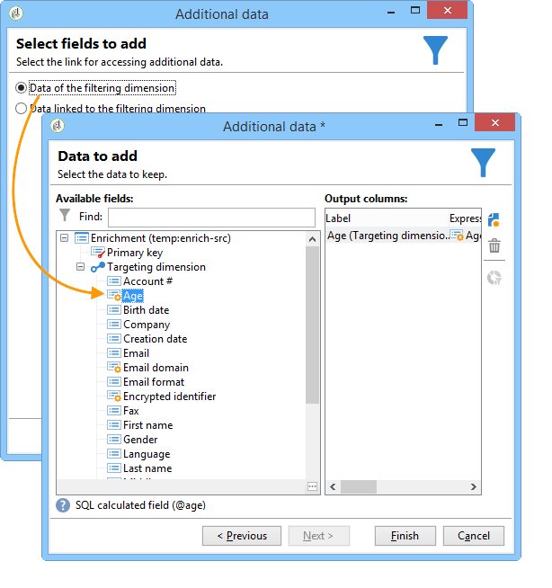
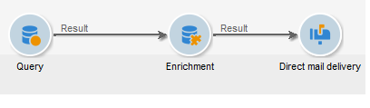

# 擴充{#enrichment}

**[!UICONTROL Enrichment]**&#x200B;活動可讓您將資訊新增至設定檔清單，以及連結至現有表格（建立新的連結）。 也可以定義資料庫中含有設定檔的調解標準。


## 定義 {#definitions}

若要使用擴充活動，您必須熟悉新增資料時可用的各種選項。


**[!UICONTROL Data linked to the filtering dimension]**&#x200B;選項可讓您存取：

* 篩選維度的資料：對工作表資料的訪問
* 連結至篩選維度的資料：對連結到工作表的資料的訪問


**[!UICONTROL A link]**&#x200B;選項可讓您在資料庫的任何表上建立聯接。


連結有四種類型：

* **[!UICONTROL Define a collection]**:可讓您定義表格之間具有1-N基數的連結。
* **[!UICONTROL Define a link whose target is still available]**:可讓您定義表格間具有1-1基數的連結。連接條件必須由目標表中的單個記錄定義。
* **[!UICONTROL Define a link whose target does not necessarily exist in the base]**:可讓您定義表格之間具有0-1基數的連結。連接條件必須由0或1（最大值）定義 記錄。

   此選項在&#x200B;**[!UICONTROL Simple Join]**&#x200B;標籤中設定，可透過&#x200B;**[!UICONTROL Enrichment]**&#x200B;活動的&#x200B;**[!UICONTROL Edit additional data]**&#x200B;連結存取。

* **[!UICONTROL Define a link by searching for a reference among several options]**:此類型的連結會定義對獨特記錄的調解。Adobe Campaign會在目標表格中新增外鍵以儲存對唯一記錄的參考，以建立目標表的連結。

   此選項在&#x200B;**[!UICONTROL Reconciliation and deduplication]**&#x200B;標籤中設定，可透過&#x200B;**[!UICONTROL Enrichment]**&#x200B;活動的&#x200B;**[!UICONTROL Edit additional data]**&#x200B;連結存取。

以下章節也提供詳細說明擴充活動在其上下文中操作的使用案例：

* [使用自訂日期欄位擴充電子郵件](../../workflow/using/email-enrichment-with-custom-date-fields.md).
* [豐富資料](../../workflow/using/enriching-data.md)
* [建立摘要清單](../../workflow/using/creating-a-summary-list.md)

## 添加資訊{#adding-information}

使用&#x200B;**[!UICONTROL Enrichment]**&#x200B;活動將列添加到工作表中：此活動可作為查詢活動的補充。

在[Adding data](../../workflow/using/query.md#adding-data)中詳細說明了其他列的配置。

**[!UICONTROL Primary set]**&#x200B;欄位可讓您選取入站轉變：此活動工作台的資料將被豐富。

按一下&#x200B;**[!UICONTROL Add data]**&#x200B;連結，並選取要新增的資料類型。 提供的資料類型清單取決於平台上安裝的模組和選項。 以最小的設定，您一律可以新增連結至篩選維度和連結的資料。


在下列範例中，出站轉變將富含目標設定檔之年齡的相關資訊。



以滑鼠右鍵按一下擴充活動的入站轉變，以在擴充階段之前檢視資料。


該工作表包含以下資料和相關模式：


在擴充階段輸出中重複此操作。


您可以看到已新增與設定檔年齡相關的資料：


也已擴充相符的結構。

## 管理其他資料{#managing-additional-data}

如果您不想保留先前定義的其他資料，請取消選取&#x200B;**[!UICONTROL Keep all additional data from the main set]**&#x200B;選項。 在這種情況下，只有在擴充活動中選取的其他欄才會新增至傳出的工作表格。 上游活動新增的其他資訊將不會儲存。


擴充階段輸出的資料和架構如下：


## 建立連結{#creating-a-link}

您可以使用擴充活動來建立工作資料與Adobe Campaign資料庫之間的連結：這會是傳入資料之間工作流程的本機連結。

例如，如果您載入檔案的資料，其中包含收件者的帳號、國家/地區和電子郵件，則您必須建立指向國家/地區表格的連結，才能在其設定檔中更新此資訊。

若要這麼做，請套用下列步驟：

1. 收集並載入下列類型的檔案：

   ```
   Account number;Country;Email
   18D65;FRANCE;agnes@gmail.com
   243PP;RUSSIA;paul@gmail.com
   55H87;CROATIA;dave@gmail.com
   56U81;USA;susan@gmail.com
   853PI;ITALY;anna@gmail.com
   890LP;FRANCE;robert@gmail.com
   83TY2;SWITZERLAND;mike@gmail.com
   ```

1. 編輯擴充活動，然後按一下&#x200B;**新增資料……**&#x200B;連結以建立與國家/地區表格的連結。

   

1. 選擇&#x200B;**[!UICONTROL Link definition]**&#x200B;選項，然後按一下&#x200B;**[!UICONTROL Next]**&#x200B;按鈕。 指定要建立的連結類型。 在此示例中，我們希望將檔案收件人的國家/地區與資料庫專用表中可用國家/地區清單中的某個國家/地區進行調解。 選取 **[!UICONTROL Define a link by searching for a reference among several options]** 選項。在&#x200B;**[!UICONTROL Target schema]**&#x200B;欄位中選取國家/地區表。

   

1. 最後，選擇欄位，該欄位將允許將源檔案值連結到資料庫中的值。

   

在此擴充活動的輸出中，臨時架構將包含國家/地區表格的連結：


## 資料協調{#data-reconciliation}

擴充活動可用來設定資料協調，包括資料載入資料庫後。 在這種情況下， **[!UICONTROL Reconciliation]**&#x200B;標籤可讓您定義Adobe Campaign資料庫中的資料與工作表中資料之間的連結。

選擇&#x200B;**[!UICONTROL Identify the targeting document based on work data]**&#x200B;選項，指定要建立連結的架構並定義連接條件：要執行此操作，請在工作資料(**[!UICONTROL Source expression]**)和目標維度(**[!UICONTROL Destination expression]**)中選擇要調解的欄位。

您可以使用一或多個調解標準。


如果指定了多個連接條件，則必須驗證它們，以便將資料連結在一起。

## 插入優惠方案主張{#inserting-an-offer-proposition}

擴充活動可讓您新增選件或連結至傳遞收件者的選件。

如需擴充活動的詳細資訊，請參閱此[區段](../../workflow/using/enrichment.md)。

例如，您可以在傳送前讓收件者查詢的資料更豐富。



設定查詢後（請參閱此[section](../../workflow/using/query.md)）:

1. 新增及開啟擴充活動。
1. 在 **[!UICONTROL Enrichment]** 索引標籤中，選取 **[!UICONTROL Add data]**。
1. 在要添加的資料類型中選擇&#x200B;**[!UICONTROL An offer proposition]**。

   

1. 指定要新增的主張的識別碼及標籤。
1. 指定選件選取項目。 這有兩個可能的選項：

   * **[!UICONTROL Search for the best offer in a category]**:勾選此選項並指定優惠方案引擎呼叫參數（優惠方案空間、類別或主題、聯絡日期、要保留的優惠方案數量）。引擎會自動計算要根據這些參數新增的選件。 建議您同時填寫&#x200B;**[!UICONTROL Category]**&#x200B;或&#x200B;**[!UICONTROL Theme]**&#x200B;欄位，而非同時填寫兩者。

      

   * **[!UICONTROL A predefined offer]**:勾選此選項並指定優惠方案空間、特定優惠方案和聯絡日期，以直接設定您要新增的優惠方案，而不需呼叫優惠方案引擎。

      

1. 然後設定與您選擇的通道相對應的傳送活動。 請參閱[跨通道傳送](../../workflow/using/cross-channel-deliveries.md)。

   可用於預覽的建議數取決於擴充活動中執行的配置，而不是直接在傳送中執行的任何可能配置。

要指定優惠方案主張，您也可以選擇引用優惠方案的連結。 如需詳細資訊，請參閱下列區段[參考選件](#referencing-a-link-to-an-offer)的連結。

## 參考選件{#referencing-a-link-to-an-offer}的連結

您也可以參考擴充活動中選件的連結。

操作步驟：

1. 在活動的&#x200B;**[!UICONTROL Enrichment]**&#x200B;索引標籤中選取&#x200B;**[!UICONTROL Add data]**。
1. 在選擇要添加的資料類型的窗口中，選擇&#x200B;**[!UICONTROL A link]**。
1. 選取您要建立的連結類型及其目標。 在此情況下，目標為選件結構。

   

1. 指定擴充活動（此處為收件者表格）中入站表格資料與選件表格之間的連結。 例如，您可以將優惠方案代碼連結至收件者。

   

1. 然後設定與您選擇的通道相對應的傳送活動。 請參閱[跨通道傳送](../../workflow/using/cross-channel-deliveries.md)。

   >[!NOTE]
   >
   >預覽的可用建議數取決於傳送中執行的配置。

## 儲存優惠方案排名和權重{#storing-offer-rankings-and-weights}

依預設，當使用&#x200B;**excrient**&#x200B;活動來傳送選件時，其排名和權重不會儲存在主張表格中。

預設情況下，**[!UICONTROL Offer engine]**&#x200B;活動會儲存此資訊。

不過，您可以依下列方式儲存此資訊：

1. 在查詢後和傳送活動前放置的擴充活動中，建立對選件引擎的呼叫。 請參閱此[節](../../interaction/using/integrating-an-offer-via-a-workflow.md#specifying-an-offer-or-a-call-to-the-offer-engine)。
1. 在活動的主窗口中，選擇&#x200B;**[!UICONTROL Edit additional data...]**。

   

1. 為排名新增&#x200B;**[!UICONTROL @rank]**&#x200B;欄，為選件加權新增&#x200B;**[!UICONTROL @weight]**&#x200B;欄。

   

1. 確認新增項目並儲存工作流程。

傳遞會自動儲存選件的排名和權重。 此資訊會顯示在傳送的&#x200B;**[!UICONTROL Offers]**&#x200B;標籤中。
