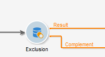

# 排除{#exclusion}

**排除**&#x200B;類型活動會根據主要目標建立目標，從中提取一個或多個其他目標。

若要設定此活動，請輸入其標籤並選取主要收件者集：主集的母體可讓您建構結果。 將排除由主集共用的設定檔以及至少一個登入活動。

>[!NOTE]
>
>如需設定和使用排除活動的詳細資訊，請參閱[排除母體（排除）](targeting-data.md#excluding-a-population--exclusion-)。

如果要利用剩餘母體，請核取&#x200B;**[!UICONTROL Generate complement]**&#x200B;選項。 補充將包含主要傳入人口減去傳出人口。 接著，會將其他輸出轉變新增至活動，如下所示：

## 排除範例 {#exclusion-examples}

以下範例試圖匯編一份18至30歲的收件者名單，同時排除巴黎居民。

1. 插入並開啟&#x200B;**[!UICONTROL Exclusion]** -type活動，然後執行兩個查詢。 第一個查詢會鎖定居住在巴黎的收件者。 第二個查詢目標為18至30歲的人。
1. 輸入主集。 主要集是&#x200B;**18-30歲**&#x200B;查詢。 與第二組相關的元素將從最終結果中排除。
1. 如果要利用排除後保留的資料，請核取&#x200B;**[!UICONTROL Generate complement]**&#x200B;選項。 在這種情況下，補充是由居住在巴黎的18至30歲收件者組成。
1. 核准排除設定，然後插入更新清單活動至結果。 您也可以視需要插入額外清單更新至補充項目。
1. 執行工作流程。 在此範例中，結果是由18至30歲的收件者所組成，但居住在巴黎的收件者則被排除，並傳送至補充項目。

   

## 輸入參數 {#input-parameters}

* tableName
* 綱要

每個入站事件都必須指定由這些參數定義的目標。

## 輸出參數 {#output-parameters}

* tableName
* 綱要
* recCount

這組三個值可識別排除後產生的目標。 **[!UICONTROL tableName]** 是記錄目標標識符的表的名稱， **[!UICONTROL schema]** 是母體（通常為nms:recipient）的模式， **[!UICONTROL recCount]** 是表中的元素數。

與補體相關聯的轉變具有相同的參數。
