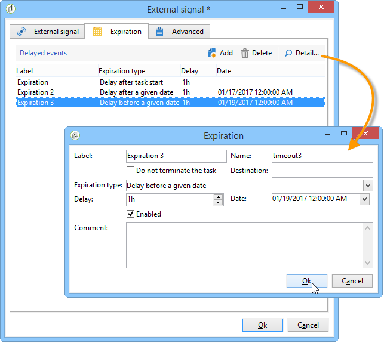

# 外部訊號{#external-signal}

「外 **部信號** 」活動可讓您觸發工作流中一組任務的執行到調度。

當「外部信號」任務被激活時，它將被無限期暫停，或直到指定時段結束。 其轉場是由SOAP呼叫 **PostEvent(sessionToken, workflowId, activity, transition, parameters, complete)來啟動。** 此參 **[!UICONTROL complete]** 數允許任務完成，因此不會對後續呼叫做出反應。

如需PostEvent函式的詳細資訊，請參閱有關SOAP呼叫的線上檔案。

您可以設定此活動，以在未收到任何訊號時定義事件。 若要這麼做，請編輯活動，然後按一下標 **[!UICONTROL Expiration]** 簽。 按一下 **[!UICONTROL Insert]** 按鈕以建立和設定事件。

到期日的設定在到期日中詳 [細說明](../../workflow/using/defining-approvals.md)。

「延 **遲** 」欄位可讓您以選擇的單位指定到期延遲。 請參 [閱等待](../../workflow/using/wait.md)。

每一行代表過期類型，並與轉換一致。

