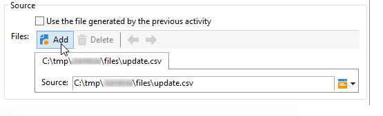

# 檔案傳輸{#file-transfer}

「檔 **案傳輸** 」活動可讓您接收或傳送檔案、測試檔案是否存在，或列出伺服器上的檔案。 使用的通訊協定為Amazon Simple Storage Service(S3)、FTP或SFTP。
有了S3或SFTP連線，您也可以使用Adobe即時客戶資料平台，將區段資料匯入Adobe Campaign。 For more on this, refer to this [documentation](https://docs.adobe.com/content/help/en/experience-platform/rtcdp/destinations/destinations-cat/adobe-destinations/adobe-campaign-destination.html).

## 屬性 {#properties}

使用欄位的下拉式清 **[!UICONTROL Action]** 單來選擇活動的動作。

配置取決於所選的操作。

1. **接收檔案**

   要接收儲存在遠程伺服器上的檔案，請在 **[!UICONTROL File download]** 欄位中選 **[!UICONTROL Action]** 擇。 您必須在相關欄位中指定其URL。

   

   檢 **[!UICONTROL Use an external account]** 查以從樹節點中配置的S3、FTP或SFTP帳戶 **[!UICONTROL Administration > Platform > External accounts]** 中選擇帳戶。 然後指定伺服器上包含要下載的檔案的目錄。

   

1. **檔案傳輸**

   要將檔案發送到伺服器，請在字 **[!UICONTROL File upload]** 段中選 **[!UICONTROL Action]** 擇。 您必須在編輯器的區段中指定 **[!UICONTROL Remote server]** 目標伺服器。 參數與傳入檔案的參數相同。 請參閱上文。

   來源檔案可來自先前的活動。 在這種情況下，必 **[!UICONTROL Use the file generated by the previous activity]** 須選取選項。

   

   這也可能涉及一個或多個其他檔案。 要選擇它們，請取消選中該選項，然後按一下 **[!UICONTROL Insert]**。 指定要傳送之檔案的存取路徑。 若要新增其他檔案，請再按一 **[!UICONTROL Insert]** 下。 現在，每個檔案都有自己的頁籤。

   

   使用箭頭可變更標籤順序。 這與檔案傳送至伺服器的順序有關。

   選 **[!UICONTROL Keep history of files sent]** 項可讓您追蹤傳送的檔案。 此歷史記錄可從目錄訪問。

1. **測試以查看檔案是否存在**

   要測試檔案是否存在，請在欄位中 **[!UICONTROL Test to see if file exists]** 選擇選 **[!UICONTROL Action]** 項。 遠程伺服器的配置與檔案下載的配置相同。 For more information, refer to this [section](#properties).

   

1. **檔案清單**

   若要列出檔案，請從欄 **[!UICONTROL File listing]** 位中選取 **[!UICONTROL Action]** 選項。 遠程伺服器的配置與接收檔案的配置相同。 For more information, refer to this [section](#properties).

   當選 **[!UICONTROL List all files]** 擇動作時可使用的選項 **[!UICONTROL File listing]** ，可讓您在檔案名稱以字元分隔的 **vars.filenames變數中，儲存伺服器上所有檔案**`\n` 。

所有檔案傳輸選項有兩種可能的選項：

* 選 **[!UICONTROL Process missing file]** 項將添加一個過渡，如果在指定目錄中未找到檔案，則激活該過渡。
* 「處 **[!UICONTROL Process errors]** 理錯誤」中詳細 [介紹了該選項](../../workflow/using/monitoring-workflow-execution.md#processing-errors)。

The **[!UICONTROL Advanced parameters...]** link lets you access the following options:

* **[!UICONTROL Delete the source files after transfer]**

   清除遠程伺服器上的檔案。

* **[!UICONTROL Use SSL]**

   允許您在檔案傳輸期間通過SSL協定使用安全連接。

* **[!UICONTROL Display the session logs]**

   可讓您恢復S3、FTP或SFTP傳輸的記錄檔，並將其包含在工作流程記錄檔中。

* **[!UICONTROL Disable passive mode]**

   允許您指定用於資料傳輸的連接埠。

連結 **[!UICONTROL File historization settings...]** 可讓您存取網頁下載中 [詳細的選項](../../workflow/using/web-download.md) (**[!UICONTROL File historization]** 步驟)。

## 輸入參數 {#input-parameters}

* 檔案名

   已傳送檔案的完整名稱。

## 輸出參數 {#output-parameters}

* 檔案名

   如果選取了選項，則接收文 **[!UICONTROL Use the file generated by the previous activity]** 件的完整名稱。

