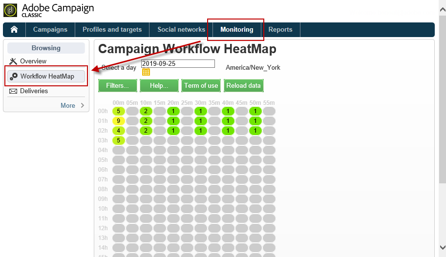

# 工作流程熱度圖 {#workflow-heatmap}

促銷活動工作流程熱圖包含目前執行的所有工作流程的色彩編碼圖形表示法。 它僅適用於&#x200B;**促銷活動管理員**。

探索在[本頁](../../production/using/monitoring-guidelines.md)中監控促銷活動進程的其他方式。

## 開始使用Workflow HeatMap {#about-the-workflow-heatmap}

Workflow HeatMap提供並行工作流數的快速概覽，使Adobe Campaign平台管理員能夠監控實例的負載並據此規劃工作流。

更精確地說，它可協助平台管理員：

* 檢視並瞭解並行的工作流程
* 依期間篩選工作流程，以查看哪些工作流程可能遇到問題
* 依期間篩選活動，以查看哪些活動可能遇到問題
* 輕易尋找個別的工作流程及所有的相關活動 (包括其持續時間)
* 依工作流程類型篩選：[技術工作流程](../../workflow/using/building-a-workflow.md#technical-workflows)或[促銷活動工作流程](../../workflow/using/building-a-workflow.md#campaign-workflows)
* 尋找特定工作流程並加以分析

>[!NOTE]
>
>除了&#x200B;**Workflow Heatmap**&#x200B;之外，您還可以建立工作流程，讓您監控一組工作流程的狀態，並傳送循環訊息給主管。 有關詳細資訊，請參閱[專用部分](../../workflow/using/supervising-workflows.md)。

使用Workflow HeatMap需要對下列概念有充分的瞭解：[Workflows](../../workflow/using/about-workflows.md)、[Activitys](../../workflow/using/about-activities.md)和[Workflow Best Practices](../../workflow/using/workflow-best-practices.md)。

## 自訂工作流程熱圖{#using-the-heatmap}

>[!NOTE]
>
>如果「工作流熱圖」中未顯示任何資料，請按一下&#x200B;**[!UICONTROL Load data]**&#x200B;按鈕。

1. 前往&#x200B;**[!UICONTROL Monitoring]**，然後按一下&#x200B;**[!UICONTROL Workflow HeatMap]**&#x200B;連結以顯示&#x200B;**[!UICONTROL Campaign Workflow HeatMap]**&#x200B;頁面。

   

1. 按一下日曆以選取日。

   依預設，頁面會顯示當天的工作流程活動。 您可以變更它，並選取過去的任何一天。

   >[!NOTE]
   >
   >只有未被&#x200B;**[!UICONTROL Database cleanup]**&#x200B;工作流刪除的工作流才可見。 有關資料庫清理工作流的詳細資訊，請參閱[本節](../../production/using/database-cleanup-workflow.md)。\
   >預設情況下，Workflow HeatMap時區是為當前管理員用戶定義的時區。 例如，如果您與您所使用的行銷使用者不在相同的區域，您可能會想要變更它。

1. 按一下 **[!UICONTROL Filters]** 按鈕。

   

1. 使用滑桿將最短持續時間從0秒設定為1小時。 這可讓您只搜尋執行超過特定秒數或分鐘的工作流程。

   

1. 您也可以從&#x200B;**[!UICONTROL Workflows]**&#x200B;下拉式清單中選擇特定的工作流程。

   

   >[!NOTE]
   >
   >會套用&#x200B;**[!UICONTROL Min duration]**&#x200B;篩選。 如果您找不到特定的工作流程，請將最短持續時間重設為0，如此清單中就會顯示所有工作流程。

1. 您也可以篩選&#x200B;**[!UICONTROL Workflow type]** :

   * **[!UICONTROL Technical]** :只 [會顯示現成可用的技術](../../workflow/using/building-a-workflow.md#technical-workflows) 工作流程 [和資料](../../workflow/using/targeting-data.md#data-management) 管理工作流程。
   * **[!UICONTROL Marketing]** :只會顯示連結至行銷促銷活動的工 [作流程](../../workflow/using/building-a-workflow.md#campaign-workflows)，稱為促銷活動工作流程。

1. 要按名稱搜索特定工作流，還可以使用&#x200B;**[!UICONTROL Workflow name filter]**&#x200B;欄位。

1. 如果您在其間編輯了某些工作流程，請按一下&#x200B;**[!UICONTROL Reload data]**&#x200B;按鈕以重新整理顯示在格線中的資料。

## 解譯工作流熱圖{#reading-the-heatmap}

「促銷活動工作流程熱圖」是自然可讀的格線，從左上至右下方，讓您找到具有綠色到紅色編碼範圍的「作用區」。

* 較深的紅色儲存格會對應同時執行大量工作流程的期間。
* 灰色儲存格會在沒有執行工作流程時對應期間。

要瞭解如何應用顏色代碼以及如何導航熱圖，請按一下&#x200B;**[!UICONTROL Help]**&#x200B;按鈕。

每列代表一天的一小時，而每個儲存格代表該小時的5分鐘。

此格線會顯示每個5分鐘期間同時執行的所有工作流程。

在以下範例中，在上午8點到上午8點05分之間，有三個工作流程正在執行（不論其個別持續時間）:

1. 按一下彩色儲存格，以顯示此期間執行之所有並行工作流程的詳細資訊。

   

   對於每個工作流，都會列出它包含的所有活動及其持續時間。

1. 按一下工作流程ID或名稱，即可直接開啟工作流程。
1. 要返回&#x200B;**[!UICONTROL Campaign Workflow HeatMap]**&#x200B;視圖，請按一下&#x200B;**[!UICONTROL Home]**&#x200B;按鈕。

## 使用案例：使用HeatMap執行{#use-cases--using-the-heatmap-to-take-actions}動作

促銷活動工作流程熱圖可在兩個主要案例中派上用場。

### 減少併發工作流程的數量{#reducing-the-number-of-concurrent-workflows}

身為促銷活動管理員，Workflow HeatMap可協助您瞭解例項的載入情況，並在適當時間規劃現有或新的工作流程。

1. 在&#x200B;**[!UICONTROL Campaign Workflow HeatMap]**&#x200B;視圖中，按一下&#x200B;**[!UICONTROL Filters]**&#x200B;按鈕。
1. 將持續時間設為幾秒或幾分鐘。
1. 借由增加持續時間篩選，排除不重要的最短工作流程。

   

1. 探索結果，瞭解執行個體的負載並採取適當動作：

   * 如果您遇到效能問題，而且在格線中顯示一或多個紅色儲存格，請考慮變更數個工作流程的開始時間。 要求行銷使用者將手動工作流程從繁忙（「熱」）時段移至更多可用時段。 這應該會維持當天的穩定活動水準。
   * 為避免尖峰，避免例項過載，請先查看HeatMap，再規劃新的工作流程，並選擇最佳時間。 考慮網格中與灰色或綠色單元格對應的時隙，以開始新的工作流程。

### 尋找影響效能{#finding-long-running-workflows-that-impact-performance}的長效工作流程

身為促銷活動管理員，Workflow HeatMap可協助您尋找最長的工作流程，以減緩活動。

1. 在&#x200B;**[!UICONTROL Campaign Workflow HeatMap]**&#x200B;視圖中，按一下&#x200B;**[!UICONTROL Filters]**&#x200B;按鈕。
1. 將持續時間設為1小時。

   

1. 透過減少&#x200B;**[!UICONTROL Min duration]**&#x200B;篩選，加入更多結果。
1. 探索結果，找出最長的工作流程，這些工作流程可能會對伺服器和資料庫資源（CPU、RAM、網路、IOPS等）產生更大影響。
1. 採取適當的行動：

   * 建議行銷使用者分割最長的工作流程，以縮短處理時間。
   * 對特定工作流程和特定活動（例如JavaScript、匯入、匯出等）進行更深入的分析，以隔離問題並更輕鬆地解決問題。

## 使用HeatMap改善工作流程規劃{#example--using-the-heatmap-to-improve-workflow-planning}

以下範例說明如何使用Adobe Campaign工作流熱圖來提高規劃效率，以及如何改善效能。

在這種情況下，許多使用者都對工作流程的效能抱怨不已。 您需要檢查哪些因素減緩了活動，以及如何解決問題。

1. 前往&#x200B;**[!UICONTROL Monitoring]**，然後按一下&#x200B;**[!UICONTROL Workflows]**&#x200B;連結以顯示&#x200B;**[!UICONTROL Campaign Workflow HeatMap]**&#x200B;頁面。
1. 將&#x200B;**[!UICONTROL Min duration]**&#x200B;篩選設為5分鐘。
1. 將&#x200B;**[!UICONTROL Workflow type]**&#x200B;篩選器設為&#x200B;**[!UICONTROL Marketing]**。
1. 從HeatMap格線中，觀察以下內容：

   

   * 50個持續時間（超過5分鐘）的促銷活動工作流程在上午10點開始執行。
   * 其中大部分都有擱置狀態（依預設，並行限制設定為20）。
   * 需要每天手動重新啟動待審工作流程。
   * 效能低。

1. 與其說從上午10點開始有50個工作流程，不如將工作流程的開始時間平均分配給一天的其餘時間。
1. 返回&#x200B;**[!UICONTROL Campaign Workflow HeatMap]**&#x200B;頁面，然後按一下&#x200B;**[!UICONTROL Reload data]**&#x200B;按鈕。
1. 現在請注意：

   

   * 上午10時，只有18個長期的宣傳工作流程仍在執行中。
   * 不再有工作流程處於擱置中狀態（並行限制仍設為20）。
   * 工作流程的開始時間會平均分佈在一天中。
   * 不再有使用者抱怨效能問題。
