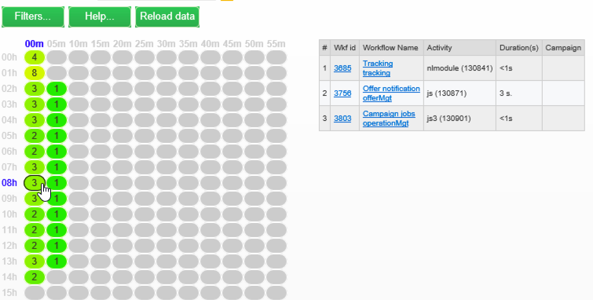

# 工作流程熱度圖 {#workflow-heatmap}

促銷活動工作流程熱度圖包含目前執行之所有工作流程的色彩編碼圖形表示法。 它僅適用於&#x200B;**Campaign管理員**。

在[本頁面](../../production/using/monitoring-guidelines.md)中探索其他監控促銷活動程式的方式。

## 開始使用工作流程熱度圖 {#about-the-workflow-heatmap}

透過提供並行工作流程數目的快速概覽，Adobe Campaign平台管理員可監控執行個體的負載，並據此規劃工作流程。

更準確地說，這可協助平台管理員：

* 檢視並瞭解並行的工作流程
* 依期間篩選工作流程，以查看哪些工作流程可能遇到問題
* 依持續時間篩選活動，以查看哪些活動可能遇到問題
* 輕易尋找個別的工作流程及所有的相關活動 (包括其持續時間)
* 按工作流類型篩選：[技術工作流程](building-a-workflow.md#technical-workflows)或[促銷活動工作流程](building-a-workflow.md#campaign-workflows)
* 尋找特定工作流程並加以分析

>[!NOTE]
>
>除了&#x200B;**工作流程熱度圖**&#x200B;之外，您還可以建立工作流程，讓您監控一組工作流程的狀態並傳送週期性訊息給主管。 有關詳細資訊，請參閱[專用區段](supervising-workflows.md)。

使用「工作流熱度圖」需要熟悉下列概念：[工作流](about-workflows.md)、[活動](about-activities.md)和[工作流最佳實踐](workflow-best-practices.md)。

## 自訂工作流程熱度圖 {#using-the-heatmap}

>[!NOTE]
>
>如果「工作流熱度圖」中未顯示任何資料，請按一下&#x200B;**[!UICONTROL Load data]**&#x200B;按鈕。

1. 前往&#x200B;**[!UICONTROL Monitoring]**，按一下&#x200B;**[!UICONTROL Workflow HeatMap]**&#x200B;連結以顯示&#x200B;**[!UICONTROL Campaign Workflow HeatMap]**&#x200B;頁面。

   

1. 按一下日曆以選取日。

   依預設，頁面會顯示當天的工作流程活動。 您可以變更它，並選取過去的任何日期。

   >[!NOTE]
   >
   >只有未被&#x200B;**[!UICONTROL Database cleanup]**&#x200B;工作流刪除的工作流才可見。 有關資料庫清理工作流的詳細資訊，請參閱[此部分](../../production/using/database-cleanup-workflow.md)。\
   >預設情況下，為當前管理員用戶定義的工作流熱度映射時區。 例如，如果您與您所使用的行銷使用者不在相同區域，則可能會想要加以變更。

1. 按一下 **[!UICONTROL Filters]** 按鈕。

   

1. 使用滑桿將最短持續時間設定為0秒到1小時。 這可讓您只搜尋執行超過特定秒數或分鐘的工作流程。

   

1. 您也可以從&#x200B;**[!UICONTROL Workflows]**&#x200B;下拉式清單中選擇特定的工作流程。

   

   >[!NOTE]
   >
   >已套用&#x200B;**[!UICONTROL Min duration]**&#x200B;篩選器。 如果您找不到特定的工作流程，請將最小持續時間重設為0，讓清單中顯示所有工作流程。

1. 您也可以篩選&#x200B;**[!UICONTROL Workflow type]** :

   * **[!UICONTROL Technical]** :僅 [顯示現成可用的技術](building-a-workflow.md#technical-workflows) 工作流程 [和資料](targeting-data.md#data-management) 管理工作流程。
   * **[!UICONTROL Marketing]** :只會顯示連結至行銷活動的工作流程(稱為行 [銷活動工作流程](building-a-workflow.md#campaign-workflows))。

1. 要按名稱搜索特定的工作流，還可以使用&#x200B;**[!UICONTROL Workflow name filter]**&#x200B;欄位。

1. 如果您在兩者之間的時間編輯了某些工作流程，請按一下&#x200B;**[!UICONTROL Reload data]**&#x200B;按鈕以重新整理顯示在格線中的資料。

## 解譯工作流程熱度圖 {#reading-the-heatmap}

促銷活動工作流程熱度圖是自然可從左上至右下閱讀的格線，可讓您尋找具有綠色至紅色色彩編碼範圍的「熱區」。

* 較深的紅色儲存格對應於同時執行大量工作流程的期間。
* 灰色儲存格對應至沒有執行工作流程的期間。

若要了解如何套用顏色代碼以及如何導覽熱度圖，請按一下&#x200B;**[!UICONTROL Help]**&#x200B;按鈕。

每一列代表一天中的一小時，而每個儲存格代表該小時的5分鐘。

格線會針對每個5分鐘的期間，顯示同時執行的所有工作流程。

在下列範例中，從上午8:05到上午8:05，三個工作流程都在執行中（無論個別持續時間為何）:

1. 按一下彩色儲存格，以顯示此期間執行之所有同時工作流程的詳細資訊。

   

   對於每個工作流程，其包含的所有活動都會列出及其持續時間。

1. 按一下工作流程ID或名稱，直接開啟工作流程。
1. 若要返回&#x200B;**[!UICONTROL Campaign Workflow HeatMap]**&#x200B;檢視，請按一下&#x200B;**[!UICONTROL Home]**&#x200B;按鈕。

## 使用案例：使用熱度圖執行操作 {#use-cases--using-the-heatmap-to-take-actions}

促銷活動工作流程熱度圖有兩個主要用途。

### 減少並行工作流程的數量 {#reducing-the-number-of-concurrent-workflows}

身為Campaign管理員，工作流程熱度圖可協助您了解執行個體的負載，並在適當時間規劃現有或新的工作流程。

1. 在&#x200B;**[!UICONTROL Campaign Workflow HeatMap]**&#x200B;檢視中，按一下&#x200B;**[!UICONTROL Filters]**&#x200B;按鈕。
1. 將持續時間設為幾秒或幾分鐘。
1. 增加持續時間篩選條件，排除沒有顯著性的最短工作流程。

   

1. 探索結果以了解例項上的負載並採取適當動作：

   * 如果您遇到效能問題，且格線中顯示一或多個紅色儲存格，請考慮變更數個工作流程的開始時間。 請行銷使用者手動將工作流程從繁忙（「熱」）時段移至更多可用時段。 這應該會維持一天中穩定的活動水準。
   * 為避免出現峰值並防止實例過載，請在規劃新工作流之前查看熱度圖，並選擇最佳時間。 請考慮格線中與灰色或綠色儲存格對應的時槽，以開始新的工作流程。

### 尋找影響效能的長時間執行的工作流程 {#finding-long-running-workflows-that-impact-performance}

身為Campaign管理員，工作流程熱度圖可協助您尋找可能減緩活動的最長工作流程。

1. 在&#x200B;**[!UICONTROL Campaign Workflow HeatMap]**&#x200B;檢視中，按一下&#x200B;**[!UICONTROL Filters]**&#x200B;按鈕。
1. 將持續時間設為1小時。

   

1. 減少&#x200B;**[!UICONTROL Min duration]**&#x200B;篩選器以包含更多結果。
1. 探索結果以找出最長的工作流，這些工作流可能會對伺服器和資料庫資源（CPU、RAM、網路、IOPS等）產生更大的影響。
1. 採取適當行動：

   * 建議行銷使用者分割最長的工作流程，以縮短處理時間。
   * 開始對特定工作流程和特定活動（例如JavaScript、匯入、匯出等）進行更深入的分析，以隔離問題並更輕鬆地解決問題。

## 使用熱度圖改進工作流規劃 {#example--using-the-heatmap-to-improve-workflow-planning}

以下範例說明使用Adobe Campaign Workflow HeatMap時，如何提高規劃的效率，以及如何改善效能。

在這種情況下，許多使用者都在抱怨工作流程效能。 您需要檢查哪些項目導致活動變慢以及如何解決問題。

1. 前往&#x200B;**[!UICONTROL Monitoring]**，按一下&#x200B;**[!UICONTROL Workflows]**&#x200B;連結以顯示&#x200B;**[!UICONTROL Campaign Workflow HeatMap]**&#x200B;頁面。
1. 將&#x200B;**[!UICONTROL Min duration]**&#x200B;篩選器設為5分鐘。
1. 將&#x200B;**[!UICONTROL Workflow type]**&#x200B;篩選器設為&#x200B;**[!UICONTROL Marketing]** 。
1. 從熱度圖網格中，觀察以下內容：

   

   * 50個持續（超過5分鐘）的行銷活動工作流程在上午10:00執行。
   * 其中大部分都有擱置狀態（預設情況下，並行限制設為20）。
   * 每天需要手動重新啟動待處理的工作流程。
   * 效能低。

1. 不必從上午10:00開始有50個工作流程，而是將工作流程的開始時間平均分配給當天的其餘時間。
1. 返回&#x200B;**[!UICONTROL Campaign Workflow HeatMap]**&#x200B;頁，然後按一下&#x200B;**[!UICONTROL Reload data]**&#x200B;按鈕。
1. 現在，請注意下列事項：

   

   * 上午10時，只有18個持續的行銷活動工作流程仍在執行。
   * 沒有其他工作流程處於擱置狀態（並行限制仍設為20）。
   * 工作流程開始時間會在一整天內平均分配。
   * 沒有更多用戶抱怨效能問題。
