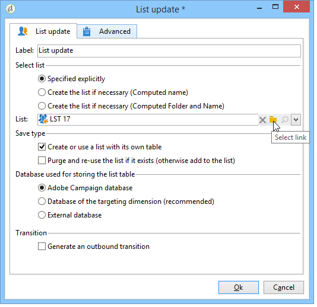

# 如何使用工作流程資料{#how-to-use-workflow-data}

## 更新資料庫{#updating-the-database}

所有收集的資料都可用於更新資料庫或傳送。 例如，您可以豐富訊息內容個人化的可能性（包括訊息中的合約數目、指定去年的平均購物車等） 或詳細定位人口（傳送訊息給合約合約持有人、鎖定線上服務的1,000名最佳訂閱者等）。 此資料也可以匯出或封存在清單中。

### 列出和直接更新{#lists-and-direct-updates}

Adobe Campaign資料庫和現有清單的資料可使用兩個專用活動進行更新：

* **[!UICONTROL List update]**&#x200B;活動可讓您將工作表儲存在資料清單中。

   您可以選取現有清單或建立清單。 在這種情況下，將計算名稱和可能的記錄資料夾。

   

   請參閱[List update](../../workflow/using/list-update.md)。

* **[!UICONTROL Update data]**&#x200B;活動會對資料庫中的欄位執行大量更新。

   有關詳細資訊，請參閱[更新資料](../../workflow/using/update-data.md)。

### 訂閱／取消訂閱管理{#subscription-unsubscription-management}

如需瞭解如何透過工作流程訂閱和取消訂閱資訊服務的收件者，請參閱[訂閱服務](../../workflow/using/subscription-services.md)。

## 透過工作流{#sending-via-a-workflow}傳送

### 傳送活動{#delivery-activity}

傳送活動詳見[傳送](../../workflow/using/delivery.md)。

### 豐富並鎖定遞送{#enriching-and-targeting-deliveries}

傳送可處理工作流程中的資料，以便自訂內容或在目標人口族群選擇的架構中。

例如，在直接郵件傳送的框架內，您可以在抽取檔案中包括從工作流中執行的資料操作中獲取的附加資料：

除了一般的個人化欄位外，您還可以將工作流程階段的個人化欄位新增至傳送內容。 工作流活動中定義的其他資料可以在傳送嚮導中保留並訪問，如下例所示，用於在直接郵件傳送框架中定義輸出檔案的名稱：

工作流表中包含的資料由其名稱標識：它一律由&#x200B;**targetData**&#x200B;連結組成。 有關詳細資訊，請參閱[目標資料](../../workflow/using/data-life-cycle.md#target-data)。

在電子郵件傳送的架構中，個人化欄位也可以使用定位工作流程階段中執行之定位擴充功能的資料，如下列範例所示：

如果在定位活動中指定區段代碼，則會將其新增至工作流程表格的特定欄，並連同個人化欄位一起提供。 若要顯示所有個人化欄位，請按一下可透過個人化按鈕存取的&#x200B;**[!UICONTROL Target extension > Other...]**&#x200B;連結。

