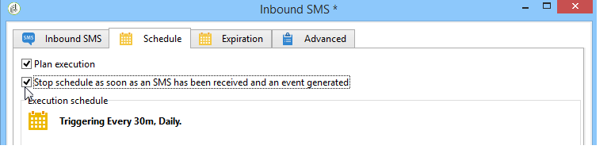

# 傳入簡訊{#inbound-sms}

此 **傳入簡訊** 活動可讓您從外部帳戶下載及處理文字訊息。

## 屬性 {#properties}

的第一個標籤 **傳入簡訊** 活動可讓您輸入SMS訊息的路由引數，並輸入要在接收每則訊息時執行的指令碼。 第二個索引標籤可讓您將排程指派給活動，而第三個索引標籤會定義活動的到期條件。

1. **[!UICONTROL SMS routing]**：選取要用於SMS復原的外部帳戶。 外部帳戶是透過 **[!UICONTROL Administration > Platform > External accounts]** 樹狀結構的節點。
1. **[!UICONTROL Script]**
1. **[!UICONTROL Schedule]**

   

1. **[!UICONTROL Expiration]**

此 **[!UICONTROL Script]**， **[!UICONTROL Schedule]** 和 **[!UICONTROL Expiry]** 詳細標籤，請參閱 [傳入電子郵件](inbound-emails.md).
