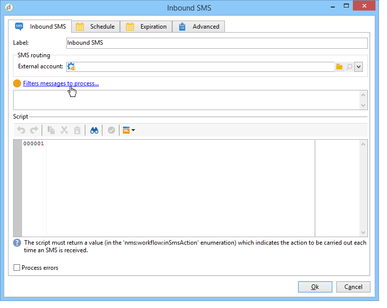

# 傳入簡訊 {#inbound-sms}

**傳入SMS**&#x200B;活動可讓您從外部帳戶下載及處理文字訊息。

## 屬性 {#properties}

**傳入SMS**&#x200B;活動的第一個索引標籤可讓您輸入SMS訊息的路由引數，並輸入要在接收每則訊息時執行的指令碼。 第二個索引標籤可讓您將排程指派給活動，而第三個索引標籤會定義活動的到期條件。

1. **[!UICONTROL SMS routing]**：選取要用於SMS復原的外部帳戶。 外部帳戶是透過樹狀結構的&#x200B;**[!UICONTROL Administration > Platform > External accounts]**&#x200B;節點設定。
1. **[!UICONTROL Script]**
1. **[!UICONTROL Schedule]**

   

1. **[!UICONTROL Expiration]**

[傳入電子郵件](inbound-emails.md)中詳細列出了&#x200B;**[!UICONTROL Script]**、**[!UICONTROL Schedule]**&#x200B;和&#x200B;**[!UICONTROL Expiry]**&#x200B;標籤。
