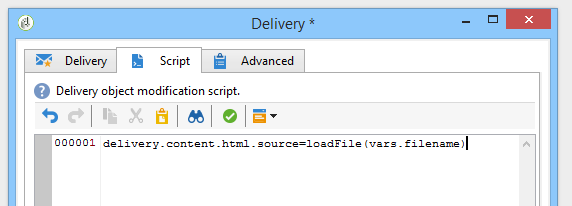

# 載入傳遞內容{#loading-delivery-content}

如果您的傳送內容以Amazon S3、FTP或SFTP伺服器上的HTML檔案提供，則可輕鬆將此內容載入Adobe Campaign傳送。

操作步驟：

1. 如果您尚未定義Adobe Campaign與托管內容檔案的(S)FTP伺服器之間的連線，請在&#x200B;**[!UICONTROL Administration]** > **[!UICONTROL Platform]** > **[!UICONTROL External Accounts]**&#x200B;中建立新的S3、FTP或SFTP外部帳戶。 在此外部帳戶中指定用來建立與S3或(S)FTP伺服器連線的位址和憑證。

   以下是S3外部帳戶的範例：

   

1. 建立新工作流，例如從&#x200B;**[!UICONTROL Profiles and Targets]** > **[!UICONTROL Jobs]** > **[!UICONTROL Targeting workflows]**&#x200B;建立。
1. 將&#x200B;**[!UICONTROL File transfer]**&#x200B;活動新增至工作流程，並指定

   * 用來連線至S3或(S)FTP伺服器的外部帳戶。
   * S3或(S)FTP伺服器上的檔案路徑。

   

1. 新增&#x200B;**[!UICONTROL Delivery]**&#x200B;活動，並將其連線至&#x200B;**[!UICONTROL File transfer]**&#x200B;活動的出站轉變。 請依下列方式設定：

   * 傳送：根據您的需求，它可以是系統中已建立的特定傳送，或是根據現有範本的新傳送。
   * 收件者：在此範例中，會將目標視為傳送本身中指定。
   * 內容：即使內容匯入上一個活動，請選取&#x200B;**[!UICONTROL Specified in the delivery]**。 由於內容是從位於遠端伺服器上的檔案直接匯入，因此在由工作流程處理時沒有識別碼，且無法識別為來自入站事件。
   * 要執行的動作：選取&#x200B;**[!UICONTROL Save]**&#x200B;以儲存傳送，並在執行工作流程後，可從&#x200B;**[!UICONTROL Campaign management]** > **[!UICONTROL Deliveries]**&#x200B;存取傳送。

   

1. 在&#x200B;**[!UICONTROL Delivery]**&#x200B;活動的&#x200B;**[!UICONTROL Script]**&#x200B;標籤中，新增下列命令以載入傳送中匯入檔案的內容：

   ```
   delivery.content.md.source=loadFile(vars.filename)
   ```

   

1. 儲存並執行工作流程。 已在&#x200B;**[!UICONTROL Campaign management]** > **[!UICONTROL Deliveries]**&#x200B;下建立含有載入內容的新傳送。

>[!NOTE]
>
>本頁面](../../platform/using/sftp-server-usage.md)中會詳細說明SFTP伺服器使用的最佳實務和疑難排解。[
