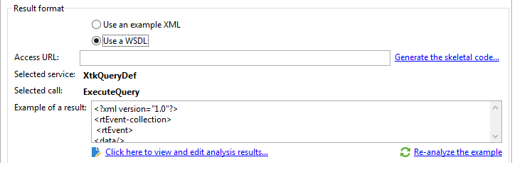

# 載入 (SOAP){#loading-soap}

>[!CAUTION]
>
>此 **載入(SOAP)** 活動僅在您擁有 **FDA （同盟資料存取）** 模組已安裝。 請檢查您的授權合約。

此 **載入(SOAP)** 活動用於 **資料載入(RDBMS)** 活動是指無法直接透過FDA在外部資料庫中收集資料時的情形。

操作如下：

1. 選取使用XML範例或WSDL。

   以下範例來自於訊息中心模組的技術工作流程。

   

1. 對於XML範例，請選取範例檔案。 分析檔案以建立結果範例。

   針對WSDL，輸入相符的存取URL，然後產生骨架代碼。 系統會自動更新並顯示選取的服務與呼叫。

   

1. 選取 **[!UICONTROL Click here to view and edit analysis results]** 以指定每個已識別的欄。

   

   如果您要更新範例，請選取 **[!UICONTROL Re-analyze the example]**.

   您也可以透過以下方式個人化欄資料格式： **[!UICONTROL Advanced parameters]** 連結。 有關格式化匯入資料的詳細資訊，請參閱此 [區段](../../platform/using/executing-import-jobs.md).

1. 您可以使用行號作為識別碼和/或指定SOAP呼叫傳回幾個元素。
1. 根據功能輸入下列索引標籤指令碼：

   * **[!UICONTROL Initialization]**：建立SOAP連線。
   * **[!UICONTROL Iteration]**：執行對SOAP服務的呼叫。 此函式的傳回必須是一個與範例或WSDL的說明相容的XML物件。

     此標籤的程式碼將由Adobe Campaign在回圈中呼叫，直到傳回Null XML物件為止。

   * **[!UICONTROL Finalization]**：關閉連線及/或釋放處理期間建立的其他資源。
