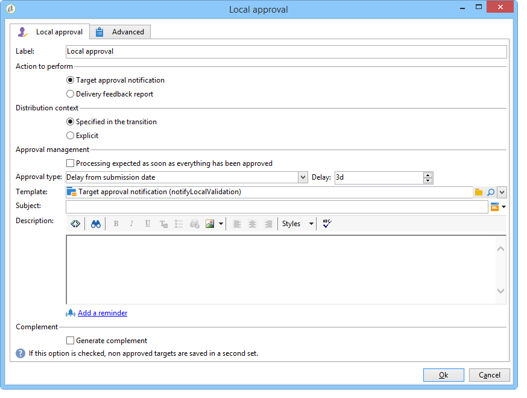

# 本地核准{#local-approval}

整合至目標工作流程後，**[!UICONTROL Local approval]**&#x200B;活動可讓您在傳送傳遞之前設定收件者核准程式。

>[!CAUTION]
>
>若要使用此活動，您必須已購買「分散式行銷」模組（此為「促銷活動」選項）。 請檢查您的授權合約。

如需具有發佈範本的&#x200B;**[!UICONTROL Local approval]**&#x200B;活動範例，請參閱[使用本機核准活動](../../workflow/using/using-the-local-approval-activity.md)。

首先，輸入活動的標籤和&#x200B;**[!UICONTROL Action to execute]**&#x200B;欄位：

* 選取&#x200B;**[!UICONTROL Target approval notification]**&#x200B;選項，在傳送前傳送通知電子郵件給本機主管，要求他們核准指派給他們的收件者。

   

* **增量查詢**:可讓您執行查詢並規劃其執行。請參閱[增量查詢](../../workflow/using/incremental-query.md)區段。

   

## 目標批准通知{#target-approval-notification}

在此情況下，**[!UICONTROL Local approval]**&#x200B;活動會放置在上游定位與傳送之間：

在進行目標批准通知時要輸入的欄位為：

* **[!UICONTROL Distribution context]**:如果您 **[!UICONTROL Specified in the transition]** 使用類型活動來限 **[!UICONTROL Split]** 制目標母體，請選取選項。在這種情況下，分配模板將輸入到拆分活動中。 如果不限制目標母體，請在此處選擇&#x200B;**[!UICONTROL Explicit]**&#x200B;選項，然後在&#x200B;**[!UICONTROL Data distribution]**&#x200B;欄位中輸入分發模板。

   有關建立資料分發模板的詳細資訊，請參閱[限制每個資料分發的子集記錄數](../../workflow/using/split.md#limiting-the-number-of-subset-records-per-data-distribution)。

* **[!UICONTROL Approval management]**

   * 選取用於電子郵件通知的傳送範本和主旨。 預設範本可供使用：**[!UICONTROL Local approval notification]**。 您也可以新增說明，該說明將出現在核准和意見通知的收件者清單上方。
   * 指定與核准截止日期（從核准開始的日期或截止日期）相對應的&#x200B;**[!UICONTROL Approval type]**。 此日期時，工作流程會再次開始，且目標定位中不會考慮尚未核准的收件者。 傳送通知後，活動會排入佇列，讓本機主管可以核准其聯絡人。

      >[!NOTE]
      >
      >依預設，當核准程式啟動時，活動會暫停三天。

      您也可以新增一或多個提醒，通知當地主管截止日期即將到來。 要執行此操作，請按一下&#x200B;**[!UICONTROL Add a reminder]**&#x200B;連結。

* **[!UICONTROL Complementary set]**:選 **[!UICONTROL Generate complement]** 項可讓您產生第二個集，其中包含所有未核准的目標。

   >[!NOTE]
   >
   >預設會停用此選項。

## 傳遞反饋報告{#delivery-feedback-report}

在此情況下， **[!UICONTROL Local approval]**&#x200B;活動會放在傳送之後：

若是傳送意見報表，必須輸入下列欄位：

* 如果傳送是在先前的活動期間輸入，請選取&#x200B;**[!UICONTROL Specified in the transition]**&#x200B;選項。 選取&#x200B;**[!UICONTROL Explicit]**&#x200B;以指定本機核准活動中的傳送。
* 選取傳送範本和通知電子郵件的物件。 預設範本如下：**[!UICONTROL Local approval notification]**。

## 範例：批准工作流傳送{#example--approving-a-workflow-delivery}

此範例說明如何設定工作流程傳送的核准程式。 如需建立傳送工作流程的詳細資訊，請參閱[範例：傳送工作流程](../../workflow/using/delivery.md#example--delivery-workflow)區段。

運算子可透過下列兩種方式之一核准傳送：使用電子郵件中連結的網頁，或透過主控台。

* 網路核准

   傳送給管理員群組運算子的電子郵件可讓您核准傳送目標。 訊息會使用定義的文字，而JavaScript運算式會取代為計算值（在此例中為&#39;574&#39;）

   若要核准傳送，請按一下相關連結並登入Adobe Campaign主控台。

   

   進行選擇，然後按一下&#x200B;**[!UICONTROL Submit]**&#x200B;按鈕。

   

* 透過主控台核准

   在樹結構中，**[!UICONTROL Administration > Production > Objects created automatically > Approvals pending]**&#x200B;節點包含要由當前連接的操作員批准的任務清單。 清單應顯示一行。 按兩下此行以響應。 將顯示以下窗口：

選擇&#x200B;**Yes**，然後按一下&#x200B;**[!UICONTROL Approve]**。 系統會傳送訊息通知您回應已記錄。

返回工作流程畫面：大約10秒後，圖表顯示如下：

工作流程已執行&#x200B;**[!UICONTROL Delivery control]**&#x200B;任務，在此例中，這表示要開始先前建立的傳送。 工作流程已完成，未發生錯誤。
